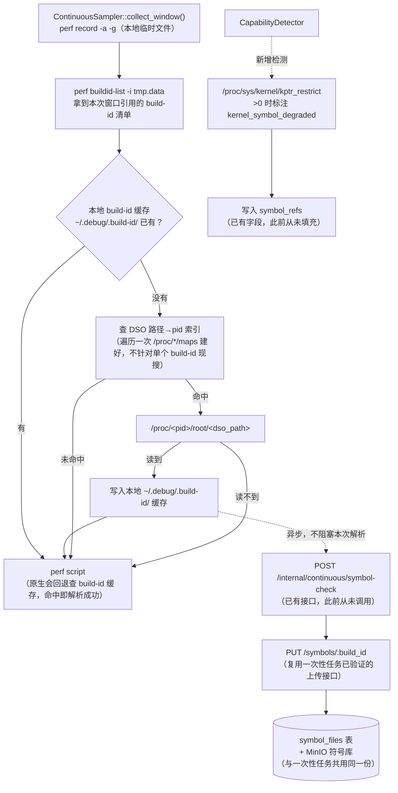

# 持续采集符号化设计

> 解决"持续采集（native continuous profiling）火焰图大量函数显示 `[unknown]`"的问题。
> 与 [`symbolization-design.md`](./symbolization-design.md)（一次性 perf 任务符号化）的关系：**问题同源，架构不同，方案不能照搬**，见第 2 节。

## Summary

持续采集（`drop/common/ContinuousSampler.cpp` 常驻 sampler + `apiserver/server/continuous.go`）是一条与一次性任务完全独立实现的链路，从建成起就**从未接入**一次性任务已经验证过的符号库机制（`symbol_files`/`task_build_ids` 表、`SymbolCollector.cpp`、`analysis/symbolizer.py`）。服务端其实已经为这件事预留了字段和接口（`profile_batches.symbol_refs`、`POST /internal/continuous/symbol-check`），但 Agent 侧从未调用，一直是摆设。

本设计不新建数据库表、不新建服务端接口，核心改动集中在 Agent（C++）侧：在调用 `perf script` **之前**，把能拿到的二进制预热进本地 build-id 缓存，从根上减少解析失败；再顺带把新发现的符号异步上传到已有的服务端符号库，把预留的诊断字段真正用起来。

---

## 1. 问题现状

### 1.1 现象

持续采集的火焰图/TopN 里，大量帧显示为 `[unknown]`，尤其集中在容器化目标进程和权限受限的内核栈上。

### 1.2 根因：和一次性任务同源，但发生的位置不同

一次性任务的符号化问题（见 `symbolization-design.md` §1.2）根因是"采集在 `drop_agent` 容器，解析在 `analysis` 容器，符号没有传输机制"。持续采集表面上是同一类问题（本地看不到目标二进制），但**解析发生的位置完全不同**：

| | 一次性任务 | 持续采集 |
|---|---|---|
| `perf record` 位置 | `drop_agent` 容器 | `drop_agent` 容器 |
| `perf script`（解析）位置 | **`analysis` 容器，事后异地** | **`drop_agent` 容器，当场本地** |
| `perf.data` 去向 | 上传保留，服务端可重新解析 | 解析完立刻 `::remove()`，无法二次解析 |
| 用户态符号来源 | 服务端 build-id 符号库（`analysis/symbolizer.py` 拉取后装入 `~/.debug`） | 无——只能靠 Agent 主机当场能读到什么 |
| 内核符号来源 | 任务级 `/proc/kallsyms` 快照，随任务上传 | 无快照，`perf script` 当场读 Agent 主机的 `/proc/kallsyms` |

**关键推论**：一次性任务的方案是"先攒符号，再解析"（符号库建好之后 `analysis` 才跑 `perf script`）。持续采集是"边采边解析"，`perf.data` 转完文字就删了——**即使照搬"上传到服务端符号库"这一步，也不会让当次已经解析失败、写死成 `[unknown]` 的文字变回函数名**，因为压根没有"事后重新解析"这个动作。真正能当场生效的修复，必须发生在**这次 `perf script` 调用之前**。

### 1.3 已经搭好但从未接线的诊断基础设施

迁移 `005_continuous_metadata.sql` 给 `profile_batches`/`profile_windows` 加了 `symbol_refs jsonb` 字段，`apiserver/server/continuous_symbol.go` 也实现了 `POST /internal/continuous/symbol-check`——注释明确写着是为了让前端诊断"缺失符号、浅栈、unknown frame 的原因"。但 `ContinuousSampler.cpp` 的 `build_batch_json()` 从未填充 `symbol_refs`，也从未调用这个接口，导致 `continuousAggregateSymbolStatus()` 永远只能返回 `"not_applicable"`。**这次的方案会把这段已经写好的代码真正用起来，而不是新建一套。**

---

## 2. 设计目标

**目标**

- 容器化目标进程的用户态符号能就地解析成功（对应根因中"能修的"部分）
- 内核符号缺失时能明确诊断出原因（`kptr_restrict`/权限），而不是沉默地全部 `[unknown]`
- 复用一次性任务已验证过的服务端符号库和已经搭好但未接线的 `symbol_refs`/`symbol-check` 基础设施，**不新建数据库表、不新建服务端接口**
- 对应导师第 3 条评审要求（"持续 profiling 会带来什么问题、怎么解决"）——这是一个可以直接拿来回答的工程案例

**非目标**

- 不追求 stripped 二进制、JIT（Java 等）workload 的符号恢复——和一次性任务的"非目标"一致，无源可查的不勉强
- 不做服务端事后重新解析（架构上持续采集就是"边采边解析"，见 §1.2，重新设计成"存原始地址、事后解析"是另一个量级的改动，本设计不覆盖）
- 不修改 `analysis/` 端任何代码——持续采集从未经过 Python 分析服务，本设计同样不引入这条依赖

---

## 3. 总体架构

**关键点**：本地缓存预热（左侧 A→F）解决"这次解析能不能成功"；服务端上报（虚线 E→L）解决"下次/其他 Agent 能不能更快命中、以及能不能诊断出原因"，两者不是同一件事，缺一不可。

---

## 4. 任务拆分

### 任务 1（核心修复，优先级最高）—— 本地 build-id 缓存预热

- **文件**：`drop/common/ContinuousSampler.cpp`，`collect_window()`（约 316-343 行）
- **改动**：`perf script` 之前先跑 `perf buildid-list -i <tmp>.data`；对每个条目检查本地 `~/.debug/.build-id/<id[:2]>/<id[2:]>/elf` 是否已存在；不存在则查"DSO 路径 → 可读 pid"索引，命中就通过 `/proc/<pid>/root/<dso_path>` 读取并写入本地缓存

**技术方案依据（业界参考，非自创）**：跨容器读文件，Linux 只有两种标准手段——`/proc/<pid>/root` 魔法符号链接（内核自动按目标 pid 的挂载命名空间解析路径），或 `setns()` 手动切换命名空间（更重，需要 `CAP_SYS_ADMIN`）。容器可观测性工具（Falco、sysdig，以及本设计参考过的 Parca Agent、CPA）几乎都选前者。

关键在于"怎么定位该用哪个 pid"——这里最初设计过一版**反向搜索**（拿着 build-id 去遍历全部存活进程逐个尝试），读过 Parca Agent 和 CPA 的代码后发现这不是业界做法：

- **Parca Agent**：靠 eBPF 事件感知"某 pid 刚建立新的可执行内存映射"，事件本身自带 pid，pid 与二进制路径是配对到达的，从不需要反向搜索
- **CPA**：`libgunwinder` 同样按 pid 逐个解析它自己的映射，不是反向搜

Mini-Drop 没有 eBPF 映射事件驱动，没法完全照搬"事件配对"，但可以退化成等价的**正向枚举**：不针对某个 build-id 现搜，而是先遍历一次当前存活进程各自的 `/proc/<pid>/maps`，一次性建出"DSO 路径 → 可读 pid"的索引（复杂度 O(进程数)），再拿每个 build-id 对应的路径去查这张索引（O(build-id 数)）。相比最初"每个 build-id 都反向扫一遍全部存活进程"（O(build-id 数 × 进程数)），这版效率明显更好，也更贴近参考项目的实际思路。

- **需要重构**：`SymbolCollector.cpp` 里的 `parse_buildid_list()`/`resolve_readable_path()` 目前是文件内私有函数，需要提出来做共享（建议新建 `drop/common/BuildId.h`），避免和一次性任务的实现各写一份
- **效果**：解决"容器化目标 DSO 路径在 Agent 主机不可见"这一大头成因，**当场生效，不依赖任何网络往返**
- **风险**：每窗口多一次 `perf buildid-list` 调用 + 一次遍历 `/proc/*/maps` 建索引，10s 窗口/60s 上传节奏下的开销需实测；短生命周期进程如果建索引那一刻已经退出，仍定位不到 `/proc/<pid>/root`

**子项 1.1 —— Agent 本地三态尝试缓存（参考 Parca Agent 的 retry LRU 设计）**

上面的预热逻辑有一个隐藏浪费：如果某个 build-id 这次没读到（比如背后是匿名内存映射、根本没有文件；或者目标进程已经退出，`/proc/<pid>/root` 早就没了），这个失败结果不会被记住，**下一个窗口还会对同一个 build-id 再尝试一次**，白费一次 `perf buildid-list` 解析 + 一次文件系统探测。

这一层缓存和 §7 数据模型里的 `symbol_files.status` 不是一回事，要分清楚：

| | `symbol_files.status`（服务端） | 这里新增的尝试缓存（Agent 本地） |
|---|---|---|
| 存在哪 | 数据库，所有 Agent 共享 | 单个 Agent 进程内存，重启即清空 |
| 标记什么 | 这个 build-id 的二进制文件本身处于什么阶段（上传中/就绪/失败） | **这台 Agent** 这次运行期间，对这个 build-id 试没试过、结果如何 |
| 目的 | 让其他 Agent/后续查询知道符号是否可用 | 纯粹避免同一个 Agent 对已知读不到的 build-id 反复做无用功 |

具体实现：`ContinuousSampler.cpp` 内维护 `std::unordered_map<std::string, AttemptState>`（`AttemptState` 含状态枚举 + 过期时间戳），在任务 1 的预热步骤开始前先查表：

1. **已知成功** —— 本地 `~/.debug/.build-id/` 已有文件，直接跳过（这条其实已经靠文件系统 `stat` 天然实现，不需要额外记录）
2. **临时失败，带过期时间**（如 5 分钟）—— 本窗口内没能定位到承载该 build-id 的活跃 pid，之后可能有别的进程映射同一二进制，值得过期后重试
3. **永久失败，不设过期**（直到 Agent 重启）—— 确认是匿名内存映射（无背后文件）或 ELF 无法解析，这类情况再等也不会变好，标记后不再重试

**效果**：减少无意义的重复系统调用/`perf buildid-list` 解析；**风险**：需要评估内存占用上限（长期运行的 Agent 可能积累大量 build-id 条目），可参考 Parca 用 LRU 限制表大小。

**子项 1.2 —— 解析失败时展示 `0x<addr> [模块名]`，而不是裸 `[unknown]`（参考 CPA 的降级展示）**

这条不是"解决" unknown 的方案，任务 1/2 做完之后依然会有解析不了的残留情况（stripped 二进制、JIT 代码、build-id 上报和采集之间二进制已被替换等），这条解决的是**这些残留失败情况该展示成什么样**，前提仍然遵守 `symbolization-design.md` 已定的原则——"宁可标记未解析，不做半解析，禁止蒙一个最近的符号"：只展示确定知道、不用猜的信息（地址是确定的，DSO 归属是确定的），不猜函数名。

**已读代码确认现状比预期更差**：

- **`perf` 路径**（`parse_frame_name()`，`ContinuousSampler.cpp:202-219`）：`perf script` 原始输出对无法解析的帧格式是 `<addr> [unknown] (<dso路径>)`，但当前实现在 213-215 行用 `name.find(" (")` 把括号连同其中的 DSO 路径**整段砍掉**，只保留 `[unknown]` 四个字——DSO 信息其实拿到了，只是被这行代码丢弃了。**现状甚至不如 Mini-Drop 自己一次性任务链路的 `stackcollapse-perf.pl` 兜底**（那条好歹保留了模块名，见 `symbolization-design.md` §1.1 里 `[libseccomp.so.2.5.3]` 之类的例子）。
- **`bpftrace` 路径**（`parse_bpftrace_stack_output()`，`ContinuousSampler.cpp:400-491`）：bpftrace 自己打印栈帧本来就不带 DSO 路径，解析失败时是裸十六进制地址，**没有模块名可保留**——要做到同样效果需要额外拿地址去匹配 `/proc/<pid>/maps` 定位所在模块，工作量比 perf 路径大，本次不覆盖，记为已知限制。

**改动范围（仅 `perf` 路径）**：`parse_frame_name()` 改为解析失败时不再砍掉括号内容，而是拼成 `0x<addr> [<dso_basename>]`（`dso_basename` 取 DSO 路径的文件名部分，不展示完整路径避免行过长）。

**效果**：残留解析失败的帧至少能看出"是哪个模块"，比裸 `[unknown]` 提供更多排查线索；地址也为将来事后用 `addr2line`/`objdump -d` 人工核对留了钩子。

**风险**：只覆盖了 `perf` 路径，`bpftrace` 路径的裸地址问题依然存在，不要在验收时把这条和"彻底解决 unknown"混为一谈。

### 任务 2（联动服务端，复用已有接口）—— 上报新发现的符号

- **文件**：同样在 `ContinuousSampler.cpp`，任务 1 成功读到本地此前未见过的二进制之后
- **改动**：调用 `POST /internal/continuous/symbol-check` + `PUT /symbols/:build_id`——这两个接口在 `apiserver/server/continuous_symbol.go`/`apiserver/server/symbol.go` 里已经实现好，此前从未被调用过
- **需要先确认（只读）**：`continuous_symbol.go` 现有请求体是否已支持不带单个 task_id 的批量 build_id 上报（持续采集没有 `tid` 概念，需要一个替代键，比如 `session_id`），可能要小改
- **效果**：填充 `symbol_refs`，让 `SymbolStatus` 从死的 `"not_applicable"` 变成真实状态；服务端符号库积累后，同一二进制在其他窗口/其他 Agent 上能更快命中缓存
- **风险**：这两个接口当初是为一次性任务设计的，字段/鉴权假设是否完全适配持续采集场景需要先读代码确认，不能直接假设能用

### 任务 3（诊断，非修复）—— kptr_restrict 检测

- **文件**：`drop/common/CapabilityDetector.cpp`
- **改动**：读取 `/proc/sys/kernel/kptr_restrict`，纳入能力报告；>0 时在批次里标注 `kernel_symbol_degraded`，写入 `symbol_refs`
- **效果**：内核帧大面积 `[unknown]` 时能诊断出"权限不够"而不是沉默
- **风险**：这条本身修不了（需要提升 Agent 权限 `CAP_SYSLOG`，属于部署/运维范畴），代码层面只能做到检测+告警，不能当成"修复"汇报

### 任务 4（可选，配合任务 2，优先级最低）—— 持续采集也做 kallsyms 快照

- **改动**：复用 `WorkerThread.cpp` 里已验证过的 `SnapshotKallsyms`/`EnsureKernelSymbolUploaded`，建议重构成 `common/` 共享函数供两条链路使用；每个 `ContinuousSession` 启动时或定期做一次
- **风险**：涉及重构一次性任务里已经验证通过的文件，按铁律要单独走一遍确认，且价值有限——持续采集的内核解析本来就是本机当场读 `/proc/kallsyms`，快照上传主要用于事后审计，不直接改善当次解析结果

---

## 5. 文件清单

### 新建

| 文件 | 职责 |
|---|---|
| `drop/common/BuildId.h`（如任务 1 需要拆分共享逻辑） | `parse_buildid_list`/`resolve_readable_path` 的共享声明，供 `SymbolCollector.cpp` 和 `ContinuousSampler.cpp` 共用 |

### 修改

| 文件 | 改动 |
|---|---|
| `drop/common/ContinuousSampler.cpp` | `collect_window()` 加本地 build-id 缓存预热（任务 1）；成功读到新二进制后异步上报服务端（任务 2） |
| `drop/common/SymbolCollector.cpp` | 把 `parse_buildid_list`/`resolve_readable_path` 提取为共享函数（配合任务 1） |
| `drop/common/CapabilityDetector.cpp` | 新增 `kptr_restrict` 检测（任务 3） |
| `apiserver/server/continuous_symbol.go` | 视任务 2 调查结果，可能需要支持无 `tid` 场景的批量上报（待确认，不一定要改） |

**不涉及**：数据库迁移（复用已有 `symbol_files`/`task_build_ids`/`symbol_refs`）、服务端新接口（复用已有 `/symbols/check`、`/symbols/:build_id`、`/internal/continuous/symbol-check`）、`analysis/` 任何文件。

---

## 6. 风险汇总

| 风险 | 说明 | 缓解 |
|---|---|---|
| 每窗口多一次 `perf buildid-list` 的开销 | 10s 窗口节奏下未实测 | 先测单窗口耗时，必要时降级为每 N 个窗口做一次而非每窗口都做 |
| 短生命周期进程定位不到 `/proc/<pid>/root` | 进程在窗口内退出后该路径消失 | 接受这部分仍然 unknown，明确记入已知限制，不作为本次目标 |
| `continuous_symbol.go` 现有接口假设可能不适配 | 该接口是为一次性任务设计，字段可能默认要求 `tid` | 动手前先读代码确认，需要改动的话按铁律单独走一遍确认再改 |
| kptr_restrict 检测只能诊断、不能修复 | 修复需要提升 Agent 权限，属运维范畴 | 汇报时明确标注这是"诊断"而非"修复"，避免混淆验收标准 |
| 与组员当前持续采集分支的改动冲突 | `ContinuousSampler.cpp`/`continuous.go` 系列按分工属于组员负责的模块 | 动手前先确认组员当前进度，避免冲突 |

---

## 7. 验收标准

| 任务 | 验收方式 |
|---|---|
| 任务 1 | 对一个容器化目标进程做持续采集，火焰图中该进程原本 `[unknown]` 的用户态帧变为真实函数名；对比同一目标改动前后的 unknown 帧占比 |
| 任务 2 | 服务端 `profile_batches.symbol_refs` 不再是空/`not_applicable`，能看到真实的 build-id 上报记录；同一二进制第二次出现在窗口中时命中本地缓存，不再触发新上传 |
| 任务 3 | 在 `kptr_restrict > 0` 的环境下，`symbol_refs`/日志中能看到 `kernel_symbol_degraded` 标注，而不是沉默的内核帧全 unknown |

---

## 8. 问题清单与解决难度汇总

### 能彻底解决（架构性根因，代码能修）

| 问题 | 对应任务 | 难度 | 说明 |
|---|---|---|---|
| 容器化目标 DSO 路径在 Agent 主机不可见 | 任务1 | 中低 | 核心逻辑（`perf buildid-list` 解析 + `/proc/<pid>/root` 穿透）已经在 `SymbolCollector.cpp` 里验证过一遍，这次是复用+提取共享，不是从零写；主要工作量在把窗口内已解析出的 pid 列表和 build-id 关联起来。风险可控，收益最大 |
| `parse_frame_name` 丢弃 DSO 信息 | 子项1.2 | 低 | 就是几行字符串处理，把已经拿到但被砍掉的括号内容留下来 |
| Agent 本地重复尝试解析已知失败的 build-id | 子项1.1 | 低 | 加一个内存表+过期判断，纯本地逻辑，不涉及数据库/接口 |

### 能部分缓解，不能彻底解决

| 问题 | 对应任务 | 难度 | 说明 |
|---|---|---|---|
| 用户态符号未接入服务端符号库、`symbol_refs` 从未填充 | 任务2 | 中 | 接口（`/internal/continuous/symbol-check`、`PUT /symbols/:build_id`）已经写好，但是为一次性任务设计的，持续采集没有 `tid` 概念，字段可能要小改；还要设计"什么时候触发上报"（不能每窗口全量 check，要按新发现的 build-id 增量上报），目前只有思路，没有细化到具体改动 |
| 内核符号因 `kptr_restrict`/权限读不出 | 任务3 | 低（检测）/ 无法修复（真正解决） | 检测本身很简单（读一个 `/proc/sys/kernel/kptr_restrict` 文件），但"修复"意味着给 Agent 提权（`CAP_SYSLOG`/root），这是部署配置问题，不是代码能改的——代码层面只能做到"诊断出原因"，不能当成"修复"来验收 |
| kallsyms 快照过期（长时间 session 中模块加载/卸载导致内核符号表随时间变化，与内核版本不兼容是两回事，见 §1.3 附近讨论） | 任务4 | 中偏高 | 涉及重构 `WorkerThread.cpp` 里已经验证过的 `SnapshotKallsyms` 逻辑成共享函数，还要加定期哈希检测触发重传（借鉴 CPA 思路），改动面积比其他任务大，且要碰已验证过的文件，按规矩要单独走一遍确认。目前设计文档里优先级本来就排最低 |
| `bpftrace` 路径完全没有模块名信息 | 未纳入现有任务 | 高 | bpftrace 自己不带 DSO 路径，要做到和 perf 路径同等效果需要额外拿地址去匹配 `/proc/<pid>/maps` 定位模块，这是新增功能不是小改，明确标注为已知限制、本次范围不覆盖 |

### 本质无解（不是 bug，架构上就是这样）

| 问题 | 难度 |
|---|---|
| stripped 二进制 | 无解——符号表编译时就被删了，本地读到文件也没用，服务端符号库也补不出来 |
| JIT 代码（Java 等） | 无解（现有方案范围内）——没有静态 ELF/build-id 概念，除非另外接 `perf-<pid>.map` 之类机制，这是完全独立的一块工作，不在这次设计里 |
| 短生命周期进程（窗口内已退出） | 大部分无解——任务1能覆盖"窗口内被采样到过的进程"，但如果进程在被采样之前就已经退出，`/proc/<pid>/root` 早就不存在了，任何方案都补救不了 |

**结论**：任务1 + 子项1.1/1.2 是"低成本高收益"的核心，应优先做；任务2 次之，接口是现成的但要花时间对齐持续采集的场景；任务3 只能做到诊断、任务4 改动面大优先级最低；`bpftrace` 路径和三类本质无解的问题，建议明确写进验收标准里排除在外，避免被当成"没做完"来追责。

## 9. 归属与实施建议

`ContinuousSampler.cpp`/`continuous.go` 系列按当前分工属于**组员**负责的持续采集模块（见项目记忆 `project_profiling_collab`）。本文档只是设计方案，动手前需要与组员确认当前该文件的改动进度，避免冲突；具体哪个任务由谁落地、以什么顺序做，由用户自己决定。

优先级：任务 1 > 任务 2 > 任务 3 > 任务 4。任务 1 独立生效、成本最低、收益最大，建议第一个做；任务 4 价值有限且涉及重构已验证代码，优先级最低，视时间富余情况再做。

---

## 10. 执行进度记录

按 [[feedback_task_report_format]] 的约定，每个任务开工前记录"存在什么问题 / 要实现什么功能 / 解决方案"，完成后记录"改了什么文件 / 实现什么功能 / 风险 / 风险怎么解决 / 验收步骤"。任务编号对应 TaskCreate 里的 #14-19。

### #14 新建 `drop/common/BuildId.h` 共享 build-id 逻辑

**执行前**
- 存在什么问题：`parse_buildid_list`/`resolve_readable_path` 目前锁在 `SymbolCollector.cpp` 内部（文件私有），持续采集需要复用其中的解析逻辑，但不能直接复用 `resolve_readable_path`——它是按"已知目标 pid"设计的，持续采集是系统级 `-a` 采集，没有单一目标 pid。
- 要实现什么功能：提供一份一次性任务和持续采集共用的 build-id 解析/本地缓存基础能力。
- 解决方案：新建头文件，把 `parse_buildid_list` 原样挪过来；新增本地 build-id 缓存查/写函数；新增 `build_dso_path_index()`（遍历一次 `/proc/*/maps` 建出 DSO 路径→pid 索引，O(进程数)）和 `resolve_via_pid(dsoPath, pid, &outData)`（用索引查到的 pid 走 `/proc/<pid>/root/<path>` 读取）——参考 Parca Agent（eBPF 映射事件自带 pid，配对到达）、CPA（`libgunwinder` 按 pid 逐个解析自身映射）的思路：不针对单个 build-id 反向搜索全部进程，而是先建索引再查表，避免 O(build-id 数 × 进程数) 的重复扫描。

**执行后**
- 改了什么代码文件：新建 `drop/common/BuildId.h`（声明）+ `drop/common/BuildId.cpp`（实现），提供 `BuildIdEntry`、`parse_buildid_list`、`build_id_cached_locally`、`cache_build_id_locally`、`build_dso_path_index`、`resolve_via_pid` 六个共享能力。
- 实现了什么功能：`build_dso_path_index()` 遍历 `/proc/*/maps` 建出"DSO 路径→pid"索引；`resolve_via_pid` 用索引查到的 pid 尝试字面路径和 `/proc/<pid>/root/<path>`；`cache_build_id_locally` 用"写临时文件再 `rename`"的方式把解析到的二进制拷进 `~/.debug/.build-id/<id[:2]>/<id[2:]>/elf`，`rename` 是原子操作，避免并发预热同一 build-id 时读到写一半的文件。
- 风险：①`make_dirs`/`getenv("HOME")` 没有单元测试覆盖，纯新写代码从未编译过（本机无 C++ 工具链）；②`build_dso_path_index()` 遍历全部 `/proc/*/maps` 的实际耗时未实测，进程数很多的宿主机上可能比预期慢；③读取权限依赖 Agent 本身以特权模式运行（读别的进程的 `/proc/<pid>/maps`/`/proc/<pid>/root` 需要权限），如果 Agent 权限不够，`build_dso_path_index` 会静默拿到空索引而不是报错。
- 风险怎么解决：①②需要在 VM/Docker 环境里先做 `docker compose build drop_agent` 验证能编译，再实测一次 `build_dso_path_index()` 耗时（可以在 `warm_build_id_cache` 里临时加日志打印耗时）；③目前是已知限制，权限不够时预热直接跳过、不影响其他逻辑，后续可以在 `CapabilityDetector` 里一并检测（不在本次范围）。
- 验收步骤：①`docker compose build drop_agent` 编译通过；②手动验证 `~/.debug/.build-id/` 下确实出现了新缓存的 ELF 文件，且 `readelf -h` 能正常解析（证明拷贝没有截断/损坏）；③对一个容器化目标进程做一次持续采集，对比改动前后同一目标的 unknown 帧占比是否下降。

### #15 `SymbolCollector.cpp` 改为复用 `BuildId.h`

**执行前**
- 存在什么问题：如果不改，`parse_buildid_list` 会在两个文件里各存一份，后续修 bug 容易漏改另一处。
- 要实现什么功能：让 `SymbolCollector.cpp` 改用共享实现，消除重复代码。
- 解决方案：删除文件内定义，改为 `#include "BuildId.h"`；`resolve_readable_path(dsoPath, targetPid)` 不改动，继续留在原地服务一次性任务场景。

**执行后**
- 改了什么代码文件：`drop/common/SymbolCollector.cpp`——删除文件内 `SymbolEntry`/`parse_buildid_list` 的私有定义，改为 `#include "common/BuildId.h"` 并把 `vector<SymbolEntry>` 替换成 `vector<BuildIdEntry>`；顺带移除了变成无用的 `<sstream>` include（原本只有 `parse_buildid_list` 用到 `istringstream`）。
- 实现了什么功能：一次性任务和持续采集现在共用同一份 `parse_buildid_list` 实现，不再各写一份。
- 风险：`resolve_readable_path(dsoPath, targetPid)` 特意没有改动，继续留在 `SymbolCollector.cpp` 内部（不是共享函数）——如果以后有人不知道这个区别，可能会误以为它也该搬进 `BuildId.h`。
- 风险怎么解决：已经在 `BuildId.h` 头部注释和 `SymbolCollector.cpp` 里都写了区分说明（`resolve_readable_path` 是"已知目标 pid"场景专用，`resolve_via_pid` 才是持续采集"索引查到的 pid"场景用），后续如果要合并需要先确认语义等价。
- 验收步骤：`docker compose build drop_agent` 编译通过（能验证 `BuildIdEntry`/`parse_buildid_list` 的类型和调用签名对得上）；重新跑一遍一次性任务的符号上传链路（`docs/symbolization-design.md` §9.2 的验收流程），确认改动没有引入回归。

### #16 `ContinuousSampler.cpp` 子项1.1：本地三态尝试缓存

**执行前**
- 存在什么问题：预热逻辑如果每个窗口都对已知读不到的 build-id 重新尝试一次，会浪费系统调用和 `perf buildid-list` 解析开销。
- 要实现什么功能：记住"这个 build-id 试过、结果如何"，避免重复无用功。
- 解决方案：维护 `unordered_map<build_id, AttemptState>`，三态：本地缓存命中（靠文件系统天然判断，不需要额外记录）、临时失败（带过期时间可重试）、永久失败（不设过期，直到进程重启）；预热前先查表，命中永久失败或未过期的临时失败就跳过。

**执行后**
- 改了什么代码文件：`drop/common/ContinuousSampler.cpp`——新增 `BuildIdAttemptState`(枚举)/`BuildIdAttempt`(结构体)/`g_buildIdAttempts`(全局表) 及四个操作函数 `should_skip_build_id_attempt`/`record_build_id_transient_fail`/`record_build_id_permanent_fail`/`clear_build_id_attempt`。
- 实现了什么功能：三态判定——本地缓存命中靠文件系统天然判断（不额外记录）；查不到承载该 build-id 的存活进程、或读取失败，记为"临时失败"（5 分钟后允许重试）；读到内容但不是合法 ELF（ELF magic 校验不通过），记为"永久失败"（不设过期，直到 Agent 进程重启）。
- 风险：加了 `std::mutex` 保护全局表——原因是读代码发现 `collect_window` 同时被 `PerfEventSampler::Loop`（直接调用）和 `DualTrackContinuousSampler::Loop`（经 `std::async` 调用）两条路径引用，**没能确认这两者是否会在同一进程里并发跑**，为安全起见加锁，但没有实测加锁本身的开销/是否真的存在并发场景。
- 风险怎么解决：这个不确定性已经在代码注释里明确写出来（不是隐藏假设）；后续如果确认 `PerfEventSampler` 是死代码（未被任何地方实例化），可以考虑去掉锁简化，但目前保留是更安全的默认选择。
- 验收步骤：连续观察同一个"读不到"的 build-id 在日志/`symbol_refs` 里是否只在预热失败后的 5 分钟内不再重复出现相关系统调用（可以临时加日志打印"跳过尝试 build_id=xxx"来验证生效）。

### #17 `ContinuousSampler.cpp` 任务1核心：`collect_window` 接入本地预热

**执行前**
- 存在什么问题：容器化目标进程的 DSO 路径在 Agent 主机的命名空间里不可见，`perf script` 现场解析不出符号，火焰图大量 unknown。
- 要实现什么功能：在 `perf script` 解析之前，主动把能拿到的二进制预热进本地 build-id 缓存，让 `perf script` 自带的缓存回退机制命中。
- 解决方案：`perf record` 后先跑 `perf buildid-list` 拿到 entries；调用 `build_dso_path_index()` 建一次索引；逐个 entry 查 #16 的尝试表和本地缓存，未命中的查索引拿到 pid，调用 `resolve_via_pid` 尝试读取，成功写入本地缓存、失败记入尝试表，再调用 `perf script`。

**执行后**
- 改了什么代码文件：`drop/common/ContinuousSampler.cpp`——新增 `looks_like_elf`(ELF magic 校验) 和 `warm_build_id_cache(perf, dataPath)`；在 `collect_window()` 里，`perf record` 成功之后、`perf script` 调用之前插入了一行 `warm_build_id_cache(perf, dataPath);`。
- 实现了什么功能：`warm_build_id_cache` 跑 `perf buildid-list` 拿到本次录制引用的 build-id 清单，过滤掉已经本地缓存或命中三态缓存(#16)跳过条件的条目，只在还有剩余条目时才调用一次 `build_dso_path_index()` 建索引，查表拿到 pid 后用 `resolve_via_pid` 读取、校验 ELF 合法后写入本地 build-id 缓存——让紧接着的 `perf script` 自身的缓存回退机制命中，解析出更多用户态符号。
- 风险：①每个窗口多了一次 `perf buildid-list` 子进程调用 + 一次可能的 `/proc/*/maps` 全量遍历，10 秒窗口/60 秒上传节奏下的实际开销从未测量过；②如果同一个 build-id 在两次 `collect_window` 调用之间被并发处理（见 #16 的线程风险），`cache_build_id_locally` 内部虽然用了"临时文件+rename"保证单次写入原子，但两次并发预热会各自重复做一遍解析工作（不会写坏文件，但浪费一次系统调用）；③完全没有实际编译/运行验证过，纯静态审查代码。
- 风险怎么解决：①需要在 VM 上实测一个窗口周期的总耗时变化，如果开销明显，可以考虑把 `warm_build_id_cache` 降级为不是每个窗口都做（比如隔几个窗口做一次）；②这属于"重复浪费"而非"结果错误"，暂不处理，验证到确实是问题再优化；③下一步必须做 `docker compose build drop_agent`，这是本次改动能不能用的第一道门槛。
- 验收步骤：`docker compose build drop_agent` 编译通过 → 针对一个容器化目标进程（比如故意在 Docker 容器里跑一个测试程序）做一次持续采集 → 对比火焰图里该进程的用户态帧，改动前应为 `[unknown]`（或裸模块名），改动后应显示真实函数名；同时确认 `main.burnCPU.func1` 这类已知能正确解析的目标（回归基准，参考 `symbolization-design.md` §9.2）没有受影响。

### #18 `ContinuousSampler.cpp` 子项1.2：`parse_frame_name` 展示修复

**执行前**
- 存在什么问题：现有代码在符号解析失败时，会把 `perf script` 输出里括号内的 DSO 路径整段砍掉，只剩裸 `[unknown]`，即便模块信息原始输出里其实是有的（已确认现状代码 `ContinuousSampler.cpp:213-215`）。
- 要实现什么功能：解析失败的帧至少展示"哪个模块"和精确地址，而不是完全不透明的 `[unknown]`。
- 解决方案：修改 `parse_frame_name`，检测到解析失败占位符时保留括号内容，取 DSO 路径的文件名部分，拼成 `0x<addr> [dso_basename]`；只改 `perf` 路径，`bpftrace` 路径不动。

**执行后**
- 改了什么代码文件：`drop/common/ContinuousSampler.cpp`——`parse_frame_name()` 改动：解析括号内容时不再直接丢弃，先取出 DSO 路径存进局部变量 `dso`；只有当最终符号名恰好等于 `"[unknown]"` 且 `dso` 非空时，才返回 `"0x" + 地址 + " [" + dso文件名部分 + "]"`；其余情况（解析成功、或没有括号可解析）行为和之前完全一致。
- 实现了什么功能：`perf` 路径解析失败的帧，从裸 `[unknown]` 变成 `0x<地址> [<模块名>]`，符合"只展示确定信息、不猜函数名"的原则；`bpftrace` 路径未改动（bpftrace 本身输出不带 DSO 路径，维持已知限制）。
- 风险：①这是纯文本处理改动，逻辑本身简单，但同样未经编译验证；②`name.rfind(')')` 假设括号内容里不会再出现嵌套的 `)`——如果 perf 未来版本的输出格式变化（比如符号名本身包含右括号，理论上 C++ 模板名有可能），`dso` 提取会出错，不过这种情况下最坏结果只是模块名截断，不会崩溃或返回错误结果。
- 风险怎么解决：①和其他 C++ 改动一起，靠 `docker compose build drop_agent` 验证；②如果后续发现截断问题，可以改成更严格的括号配对计数解析，目前先用简单版本，遇到问题再加固。
- 验收步骤：对一个确认包含无法解析用户态帧的目标做一次采集，检查生成的火焰图/折叠栈里，原本的裸 `[unknown]` 是否变成了 `0x<地址> [<模块名>]` 格式；确认解析成功的帧（如 `main.burnCPU.func1`）显示不受影响。

### #19 `CMakeLists.txt` 注册 `BuildId.cpp`（如需要）

**执行前**
- 存在什么问题：如果 `BuildId.h` 配套实现文件（`.cpp`）未注册进构建系统，编译会找不到符号。
- 要实现什么功能：让新文件参与 `drop_agent`/`drop_server` 的编译。
- 解决方案：视 `BuildId` 是否需要 `.cpp`（如果全部实现为 inline/header-only 则不需要这一步），需要的话把 `BuildId.cpp` 加入 `CMakeLists.txt` 的 `COMMON_SRCS` 列表。

**执行后**
- 改了什么代码文件：`drop/CMakeLists.txt`——`COMMON_SRCS` 列表里 `common/Utils.cpp` 之后、`common/SymbolCollector.cpp` 之前插入一行 `common/BuildId.cpp`（`BuildId` 采用声明+实现分离，不是纯头文件，需要这一步）。
- 实现了什么功能：`BuildId.cpp` 参与 `drop_agent`/`drop_server` 两个可执行文件的编译（`COMMON_SRCS` 同时被两者链接，虽然目前只有 `ContinuousSampler.cpp`/`SymbolCollector.cpp` 用到 `BuildId.h`，但两者都在 `COMMON_SRCS` 里，位置放对了不会有编译期问题）。
- 风险：这一步本身很难出错（就是加一行文件路径），真正的风险是前面 5 项改动本身能不能编译过，这条任务不能单独验证，要跟其他改动一起过一遍完整构建。
- 风险怎么解决：无需单独处理，随 `docker compose build drop_agent` 一起验证。
- 验收步骤：`docker compose build drop_agent` 和 `docker compose build drop_server` 都编译成功（不仅是链了 `BuildId.cpp`，还要确认没有因为两个可执行文件的其他源文件冲突导致的重复符号等问题）。
