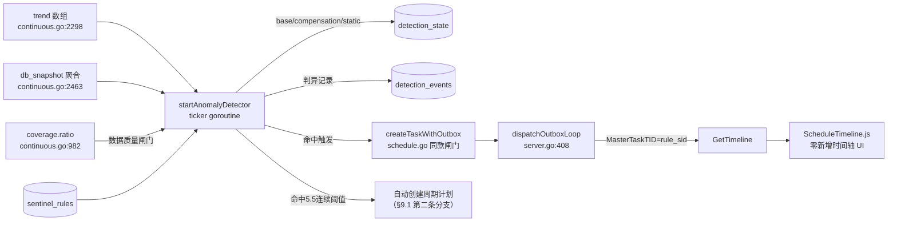

# 检测→触发深度诊断：紧扣产品定位的设计方案

> 本文与 `docs/detection-trigger-pipeline-design.md`（独立思考版）并存，代表另一条设计路线：
> 本文刻意紧扣 `docs/periodic-deep-diagnosis-positioning.md`（下称"定位文档"）本身的框架——
> 判异算法采用其 §13.3 调研出的 SysOM 三层阈值模型，并逐条落实其 §9 列出的差异化功能清单。
> 两份文档的代码事实基础相同（均已用 file:line 核对），差异在判异算法选型和功能覆盖范围，
> 供后续对照取舍。

## 1. 定位继承：这条链路挂在架构图的哪里

定位文档 §3 画的架构是：

```text
持续观测 ──发现异常后可触发──▶ 深度诊断
                                ├── 立即执行：单次采样
                                └── 定时执行：周期性采样
```

本文设计的就是这根箭头本身——「发现异常后可触发」目前在代码里完全不存在（`apiserver/server/`
全目录搜索确认没有任何 threshold/alert/anomaly 判定逻辑）。触发之后走哪条分支由异常的持续性
决定：

- 单次尖峰（几秒到几十秒内消退）→ 触发**立即执行**的单次深度诊断
- 同一目标反复出现同类异常 → 触发时**顺带创建/复用**一条周期性采样计划，把"反复出现"的场景
  正式转成定时诊断（呼应定位文档 §4"持续采集发现大致异常时段后，需要定时进行更深诊断"）

本文聚焦第一条分支（触发单次深度诊断）的完整设计，第二条分支在 §9.1 一并给出。

## 2. 信号→规则映射表（mini-drop 版 SysOM 映射）

对照定位文档 §13.3 的 SysOM 映射表，给出 mini-drop 的具体版本：

| 巡检信号 | 数据来源（已核实的现有接口） | 触发规则 | 映射诊断 TaskKind | 目标场景 |
|---|---|---|---|---|
| 调度延迟 P99 | `queryNativeContinuousHistogram`（`apiserver/server/continuous.go:2298-2392`，`signal_type=sched_latency`）的 `trend[].p99` | 超过三层阈值（§4） | `ebpf_sched` | CPU 争抢导致的瞬时调度尖峰 |
| 块 IO 延迟 P99 | 同上，`signal_type=io_latency` | 同上 | `ebpf_io` | 磁盘/存储层瞬时抖动 |
| 系统调用 IO 延迟 P99 | 同上，`signal_type=io_syscall_latency` | 同上 | `ebpf_io` | 应用层 IO 系统调用阻塞 |
| 慢 SQL digest 总延迟 | `queryNativeContinuousDBSnapshot`（`continuous.go:2463-2596`）的 digest 聚合 `total_latency_us` | 同上 | `script_diagnostic`（数据库诊断脚本）或 `perf_cpu`（应用侧联动） | 慢查询劣化 |
| 锁等待秒数 | 同上，`lock_wait[].wait_seconds` | 单次超过 static 下限即触发（锁等待没有"缓慢爬升"的合理场景） | 同上 | 长事务阻塞、死锁前兆 |

与 SysOM 原始设计的一处关键差异：SysOM 只做「内存使用率异常 → memgraph」一个显式映射
（定位文档 §13.3 第 1 点"触发条件极简"）。本文延续这个"显式稀疏映射，不做通用智能引擎"的原则，
但因为 mini-drop 目前有 5 类结构化信号可用，映射表相应扩到 5 行——每一行仍然是手工写死的
"一个信号 → 一条规则 → 一种诊断"，不是让检测器自己去猜该对什么信号做什么诊断。

## 3. 数据质量前置闸门

判异之前先查 `continuousTimelineCoverage`（`continuous.go:982-1043`）算出的 `coverage.ratio`，
低于阈值（默认 0.9）的窗口不参与 base 计算、也不用来判断——采样本来就有缺口时，观测值失真，
不该被当成真实异常。这一条两份文档都需要，是共同的地基，不是本文独有设计。

## 4. 判异算法：SysOM 三层阈值模型（mini-drop 实例化）

### 4.1 为什么这次选三层模型而不是中位数+MAD

上一份独立文档选了中位数+MAD，理由是参数更少、对长尾分布更稳健。这次刻意换回定位文档
§13.3 调研出的 SysOM 三层模型，是因为它多解决了中位数+MAD 没有专门处理的一类问题：
**"绝对值太小的抖动不该报"**——MAD 方案里这个诉求被塞进一个统一的静态下限，而 SysOM 把它
拆成独立的 `static` 层，与"相对基线偏离多少"（`base`）、"正常波动本身有多大"（`compensation`）
三件事解耦，三层各自独立可调，运维侧调参时语义更清晰（"这个信号平时抖动大，调 compensation"
和"这个信号绝对值太小没意义，调 static"是两件事，不用共享一个参数）。这是工程可维护性上的
取舍，不是说 MAD 在统计上更差。

### 4.2 三层的具体计算方式（用 mini-drop 真实数据结构实例化）

以 `sched_latency` 的 `p99` 为例，输入是 `trend` 数组（§2 表格里的数据来源）：

**base（基线滑动窗口）**：

```text
base = median(trend[-N:].p99)   # 默认 N=100 个窗口
```

用中位数而不是均值来算 base 本身——这一点吸收了上一份文档的稳健性论证，三层模型的"稳健性"
诉求放在 base 的聚合方式上解决，跟 compensation/static 的分层解耦并不冲突。

**compensation（补偿）**：

```text
iqr = P75(trend[-N:].p99) - P25(trend[-N:].p99)   # 四分位距，衡量正常波动幅度
compensation = C * iqr      # 默认 C=3
```

用 IQR 而不是标准差衡量"正常波动有多大"，同样是稳健统计量，避免少数历史尖峰把
compensation 本身撑得过大导致以后更难触发（这是三层模型如果直接抄 SysOM 用标准差会踩的坑，
本文在实例化时做了这一处修正）。

**static（静态最小值）**：

```text
static_floor = 每个 signal+metric 一个人工配置的绝对下限
              （如 sched_latency.p99 = 5ms，io_latency.p99 = 20ms，lock_wait.wait_seconds = 2s）
```

**触发条件**：

```text
观测值 > base + compensation   且   观测值 > static_floor
```

两个条件都要满足：只满足第一个可能是"从 0.1ms 变到 0.3ms"这种绝对值无意义的抖动；只满足
第二个可能是这台机器平时该指标就一直偏高，不构成"异常"。

### 4.3 与上一份文档判异方案的对照

| | 独立版（中位数+MAD） | 本文（SysOM 三层） |
|---|---|---|
| 参数数量 | 1 个（K，判异灵敏度） | 3 个（N、C、static_floor），每信号需单独配 static_floor |
| "绝对值太小不报"如何处理 | 塞进统一静态下限，与相对偏离共享判断逻辑 | 独立分层，语义更清晰 |
| 调参心智负担 | 更低 | 更高，但更贴近运维"分别调不同问题"的直觉 |
| 与定位文档的关系 | 未采用其调研结论 | 直接实例化其 §13.3 调研结论 |

两条路线都能工作，取舍是"参数少但耦合" vs "参数多但语义清晰、且有定位文档的调研背书"。

## 5. §9 差异化功能逐条实现方案

定位文档 §9 列的 7 条，逐条给出基于现有代码的落地方式：

**5.1 自动与上一窗口比较**
触发时刻算出的 `base`（§4.2）本身就是"上一批窗口的滚动基线"，触发时把
`观测值 vs base` 的差值写进 `DetectionEvent`（§7.3），前端在触发通知/诊断报告页直接展示，
不需要用户手动点"设为基线"。

**5.2 与昨天同一时刻比较**
额外维护一个按 `(target, signal, metric, hour_of_day)` 分桶的"昨天同时段"缓存
（`DetectionState.yesterday_baseline`，§7.2），每天定期用前一天该小时段的 `trend` 数据刷新。
触发时同时给出 `vs 滚动基线` 和 `vs 昨天同时段` 两个对比维度。

**5.3 发布前基线**
不新造机制——直接复用现有 `ScheduleTimeline.js`/`GetTimeline` 已有的"设为基线"星标功能
（`ScheduleTimeline.js:315-328`）。检测规则新增一个可选字段 `pinned_baseline_tid`：设置后，
§4.2 的 `base` 计算不用滚动窗口，改为固定读这个被星标窗口的指标值——即"发布前手动标一个基线，
之后所有判异都对着这个基线比"，语义上就是发布前基线。

**5.4 标出新增/消失/变热/变冷的热点**
仅对 CPU 类诊断（`perf_cpu`）触发时才适用（延迟类信号是标量指标，没有"热点函数"这个维度）。
触发生成诊断任务后，若目标此前有可比较的历史任务，自动调用现有的 `GetTaskDiff`
（`apiserver/server/task.go`，逻辑详见 `diffTopFunctions`）把本次结果和上一次自动 diff 一遍，
`up`/`down`/`compare_only`/`baseline_only` 四个方向直接对应"变热/变冷/新增/消失"，无需新写
diff 逻辑。

**5.5 连续多个窗口异常时提示性能回归**
`DetectionState`（§7.2）新增 `consecutive_fired_count` 字段：本次触发时检查上一条
`DetectionEvent` 是否也是 `fired` 且时间间隔在合理范围内（如两个采集周期内），是则计数
+1，否则清零。计数达到阈值（默认 3）时，本次 `DetectionEvent.severity` 从 `warning` 升级为
`regression`，前端用不同视觉样式展示——这是"性能回归提示"，区别于单次尖峰。

**5.6 计划失败、目标进程消失时明确告警**
定位文档 §11.3 自己核实过，目前"有状态徽章 + `DropAgentNotice`
（`web_frontend/src/pages/HostDetailPage.js:430`），但无「进程消失」专项告警"。本文补上这一格：
检测规则触发时（或周期任务触发前，复用 `executeScheduledTask` 同款检查点）新增一次目标进程
存活探测，探测不到时写一条 `status=target_process_gone` 的 `DetectionEvent`（而不是静默跳过），
`DropAgentNotice` 增加读取这类事件并展示的分支。

**5.7 按 exe 或服务跟随进程重启**
持续采集已经有 `ContinuousSession.SelectorExe` 这个概念（按 exe 名而非固定 PID 追踪）。
检测规则的目标描述同样存 `selector_exe`（而不是 `target_pid`），触发时动态解析当前运行的
PID 再创建诊断任务——具体的"exe 名 → 当前 PID"解析逻辑复用持续采集 agent 侧已有的进程发现
机制（而不是重新实现一套），检测规则只是多了一个消费方。

## 6. 触发动作与保真度策略（呼应"触发换深度"定位）

定位文档 §13.4 的核心论点：业内持续采集本身也是低频（19Hz），靠"全量保留+事后 diff"补深度，
这套时间聚合打法覆盖不了"只持续 1 秒的瞬时尖峰"。本文的检测规则因此明确只针对**短时、瞬时**
异常设计（§4 的 `trend` 数组窗口本身就是分钟级粒度，判异针对的就是这类短促偏离），触发出的
诊断任务：

- 时长短（默认 60 秒量级），不是新建周期性任务（除非命中 §9.1 提到的"反复出现"分支）
- 频率从持续采集的 19Hz 临时拉到 99Hz + DWARF 完整调用栈——这是"瞬时尖峰需要更细时间分辨率"
  的直接体现，不是笼统地"什么都采更细"
- 明确不追求覆盖"缓慢漂移的回归"这类场景——那类场景定位文档自己也认为持续采集+事后 diff
  已经够用（§13.4），检测规则的 static_floor + compensation 双重门槛本身也会天然过滤掉缓慢
  爬升不触发

## 7. 三个硬约束校验（对齐定位文档 §12.3）

| 约束 | 本设计如何满足 |
|---|---|
| **稀疏** | 触发出的是单次短时任务（§6），不是常驻周期任务；且 §4 的双重阈值（base+compensation 且 static）本身就会抑制触发频率，加上 §7.2 的冷却期（默认 15 分钟）双重保险 |
| **错峰或复用** | 触发时对同一持续采集 session 的 agent **临时调速**（如果 backend 支持热调整采样频率），而不是并行起第二个 profiler；两个 profiler 同时挂 PMU 中断会互相干扰，开销不是简单加总（定位文档 §12.2 已论证）。backend 不支持热调速时，直接跳过触发并记录 `skipped_no_hot_reload` 事件，不强行叠加 |
| **离线化** | 触发出的任务走的是与手动/定时任务完全相同的既有分析管线——符号化、火焰图渲染、diff（§5.4）全部异步进行，检测循环本身只做"判异 + 建任务"两件轻量的事，不在判异路径上做任何昂贵计算 |

## 8. 触发溯源设计（对齐 SysOM 三段式）

定位文档 §13.3 提炼的 SysOM 溯源模式是 `trigger_item` + `trigger_report_id` +
`__sysom_diagnosis_source` 三段（记录"因为什么触发"+"哪份报告命中的"+"谁发起的"），加上
`clientToken` 做幂等。mini-drop 版本直接映射，且幂等这一段不用新造机制：

| SysOM 字段 | mini-drop 字段 | 实现方式 |
|---|---|---|
| `trigger_item` | `trigger_signal` + `trigger_metric` | 写入 `HotmethodTask` 新增的 `TriggerContext` json 字段 |
| `trigger_report_id` | `trigger_rule_id` | 指向触发它的 `sentinel_rules.sid` |
| `__sysom_diagnosis_source` | `trigger_source="detector"` | 与手动创建（无此字段）、定时创建（`trigger_source="schedule"`）区分 |
| `clientToken` 幂等 | 复用 `Idempotency-Key` | `task_service.go:42` 已有的 `(uid, idempotency_key)` 唯一索引机制（`apiserver/model/model.go:92-95`），检测器按 `rule_sid + 判异窗口起点` 拼一个确定性 key，同一次异常不会因为循环重跑而重复建任务，不用另开一套去重逻辑 |

`TriggerContext` 的完整结构：

```json
{ "trigger_source": "detector", "trigger_rule_id": "sr-xxx",
  "trigger_signal": "sched_latency", "trigger_metric": "p99",
  "observed_value": 41.0, "base": 3.2, "compensation": 2.1, "static_floor": 5.0,
  "vs_yesterday": { "yesterday_value": 3.5, "delta_percent": 1071.4 },
  "consecutive_fired_count": 1 }
```

## 9. 数据模型

### 9.1 `sentinel_rules`（哨兵规则）

| 字段 | 说明 |
|---|---|
| `sid` | 主键 |
| `name` / `target_ip` / `selector_exe`（可空，§5.7） | 监控目标 |
| `signal` / `metric` | 对应 §2 映射表的行 |
| `compensation_factor`（默认3，对应 C） / `static_floor` / `baseline_window`（默认100，对应 N） | 三层阈值参数 |
| `pinned_baseline_tid`（可空，§5.3） | 发布前基线星标窗口 |
| `cooldown_seconds`（默认900） | 冷却期 |
| `promote_to_schedule_after`（可空，§9.1，命中 N 次后自动建周期计划的阈值） | — |
| `enabled` / `uid` / `user_name` | — |

### 9.2 `detection_state`（滚动基线 + 连续计数缓存）

按 `rule_sid` 存一条：`recent_values`（滑动窗口原始值）、`yesterday_baseline`（§5.2 按小时分桶）、
`consecutive_fired_count`（§5.5）、`last_fired_at`（冷却期判断）。

### 9.3 `detection_events`（触发审计，类比 `model.ScheduleTrigger`）

`rule_sid` / `evaluated_at` / `observed_value` / `base` / `compensation` / `static_floor` /
`status`（`fired` / `skipped_cooldown` / `skipped_low_coverage` / `skipped_no_hot_reload` /
`target_process_gone`）/ `severity`（`warning` / `regression`）/ `child_tid`。

## 10. 系统集成点



`startAnomalyDetector` 沿用 `server.go` 已有的 ticker 循环写法（如 `startTaskPoller`，
`server.go:298-305`），在 `NewAPIServer` 里加一行 `go s.startAnomalyDetector()` 接入，跑在
apiserver 同一进程，不新开容器。

## 11. 分阶段落地路径与验收标准

对齐定位文档 §14 的三层，检测→触发作为第 4 层：

| 阶段 | 范围 | 验收标准 |
|---|---|---|
| （§14 已有）第1-2层 | 文案命名 + `WINDOW_PRESETS` 修正为稀疏高保真 | 定位文档已给出，不重复 |
| 第3层：手动差异化 | §9.3/§9.4（发布前基线星标、diff 展示）不依赖检测器也能先做 | 用户能手动触发一次 diff 并看到红/绿标注 |
| **第4层 MVP** | 仅 `sched_latency`，三层阈值但 `compensation=0`（先用静态阈值验证链路），手动开关规则 | 人为制造调度延迟尖峰，`detection_events` 出现 `fired` 记录，诊断任务在时间轴可见并带 `TriggerContext` |
| 第4层迭代1 | 补上完整三层阈值（compensation 生效）+ 冷却期 | 连续制造异常验证冷却期生效；正常波动不再触发 |
| 第4层迭代2 | §5.1/§5.2/§5.5（上一窗口/昨天同时段对比 + 连续回归提示） | 触发通知能看到两个对比维度和 severity 升级 |
| 第4层迭代3 | §5.6/§5.7（进程消失告警 + 按 exe 跟随重启） | 手动杀掉目标进程后触发窗口能看到 `target_process_gone` 事件，而不是空跑 |
| 第4层迭代4 | §5.4（CPU diff 自动标注）+ §9.1 第二条分支（连续命中自动升级为周期计划） | — |

验收标准与定位文档 §14 保持一致的判断方式：检测→触发链路是否合格，看能不能做到
"不需要人手动点一次按钮，就从异常出现到拿到一份带触发原因的高保真诊断报告"。
