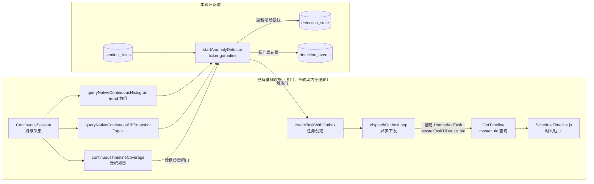

# 检测→触发深度诊断：流水线设计

> 本文设计 mini-drop 目前完全缺失的一条能力：持续采集发现异常后，自动触发一次高保真深度诊断，
> 而不是像现在这样一切都要人工手动创建。这是一份独立设计，不复用
> `docs/periodic-deep-diagnosis-positioning.md` 的结构或结论，只在事实核对上引用了它发现的现状。

## 1. 目标与非目标

**目标**：

- 持续采集正在跑的信号里，出现"明显偏离平时水平"的情况时，系统自己拉起一次短时高保真诊断，
  而不是等人碰巧在看仪表盘、或者定时任务碰巧赌中那个时间点。
- 每一次自动触发都要可追溯——诊断结果页能看到"为什么触发、当时观测值多少、平时基线多少"，
  而不是一个突然冒出来的任务。
- 复用现有的任务创建、时间轴查询、前端展示基础设施，新增代码量控制在"一个后台检测循环 + 两张小表"
  这个量级，不重新发明一套诊断系统。

**非目标（明确排除，不是"以后再说"式的模糊留白）**：

- 不做通用异常检测平台。只服务"持续采集信号 → 触发深度诊断"这一件事，不支持用户自定义任意 SQL/规则引擎。
- v1 不含 CPU profile 的自动比对触发。原因见 §3.4。
- 不做实时告警/寻呼（PagerDuty 式的人工介入通知）。触发的产出是一份诊断报告，不是一条呼叫用户手机的告警。
- 不做机器学习模型。全部判异逻辑是可解释的统计规则，值班的人能一眼看懂"为什么这次触发了"。

## 2. 现状：这条链路目前完全不存在

在设计之前先把地基钉死，避免设计建立在想象的现状上。以下每一条都是我直接读代码核对过的：

- `apiserver/server/` 全目录搜索 `threshold`/`alert`/`anomaly`/`score`/`reliab` 相关逻辑，
  除了下面 §3 列的"可复用信号"本身，没有找到任何异常判定代码。
- 两处"diff"功能——`GetTaskDiff`（单次/周期任务对比，`apiserver/server/task.go`）和
  Native Continuous Profiling 的 `profiles.diff`（`apiserver/server/profile.go`）——都只是
  "用户手动选两个窗口，算个百分比/绝对值差，按固定阈值滤掉噪声"，没有统计显著性检验，
  也不会自己触发任何东西。
- 深度诊断（无论单次还是周期性）目前只有一个入口：用户在前端点"新建任务"。周期性任务靠
  `robfig/cron` 定时触发（`apiserver/server/schedule.go`），触发条件是时间到了，不是数据异常。
- 没有"系统"身份的既定写法。定时任务创建子任务时，`UID`/`UserName` 是把 schedule
  创建者的身份原样传下去（`schedule.go:159-160`）；没有任何代码路径用过一个代表"自动化系统"的
  身份去创建任务。检测器如果要自动创建任务，这是一个需要在本设计里显式定义的新东西（见 §5.1）。

## 3. 可复用的信号与代码基础

判异算法的成本很大程度上取决于"喂给它的数据是不是现成的"。逐个信号看能不能直接拿来用。

### 3.1 延迟类 histogram：`io_latency` / `io_syscall_latency` / `sched_latency`

`queryNativeContinuousHistogram`（`apiserver/server/continuous.go:2298-2392`）已经产出一个
`trend` 数组，每个窗口自带：

```json
{ "window_start": "...", "window_end": "...", "event_count": 1234,
  "p50": 0.8, "p95": 12.3, "p99": 41.0, "backend": "bpftrace", "unavailable": false }
```

这就是检测器要的原始序列——不需要碰采集端、不需要改 ingest，直接查这个函数拿到的数据结构就能喂进判异算法。三个信号共用同一套函数，只是 `signalType` 参数不同。

### 3.2 数据库快照：`db_snapshot`

`queryNativeContinuousDBSnapshot`（`continuous.go:2463-2596`）产出两类结构化数据：

- SQL digest 按 `total_latency_us` 降序的 Top-N（`avg_latency_us = TotalLatencyUs/CallCount`）
- `lock_wait` 列表，按 `wait_seconds` 降序

同样现成，同样零阈值——目前是纯排名展示，谁在前端点开就看到 Top-N，没有"这次是不是比平时糟"的判断。

### 3.3 数据质量：`continuousTimelineCoverage`

`continuous.go:982-1043` 是一个纯函数，输入窗口列表和时间范围，输出：

```json
{ "coverage": { "ratio": 0.94, "covered_seconds": ..., "gap_seconds": ... },
  "gaps": [{ "start": "...", "end": "...", "duration_seconds": ..., "type": "internal" }] }
```

这不是异常信号本身，但是检测器判异之前必须先查的**前置闸门**：采样本来就有缺口的窗口，
不该被拿来跟基线比，否则会把"没采到"误判成"变好了/变差了"。

### 3.4 为什么 v1 不含 CPU profile 自动比对

CPU profile 的对比现在是"火焰图 diff"——按函数名对齐两棵调用树，算每个函数的百分比差值
（`diffTopFunctions`，`task.go`；`diffTopN`，`profile.go:1023-1054`）。要把这个变成"自动判异"，
意味着每一轮检测都要：

1. 决定拿哪个历史窗口当基线（火焰图不像标量指标，没有"滚动中位数"这种简单聚合方式）
2. 给"两棵树差多少算异常"下一个可解释的量化标准——按单个函数百分比差算，还是按整体树形结构算，
   都不是一两行代码能定的事
3. 每轮都要拉两份 profile 数据做树比对，比标量指标的开销高一个量级

这三件事本身都够单独立项。v1 硬塞进去只会让第一版既做不完整，又拖慢上线。所以明确排除，
放进 §8 的迭代3，等 §3.1/§3.2 这条链路先跑稳、验证"检测→触发"这个机制本身是否有效之后再评估。

## 4. 判异算法设计

### 4.1 为什么是"滚动中位数 + MAD"，不是 z-score

延迟类指标（P95/P99、锁等待秒数）的分布天然长尾右偏：平时大多数窗口的 P99 在低位徘徊，
偶尔冒出几个大值。如果用均值 + 标准差算 z-score，这几个大值本身就会把均值和标准差拽高，
造成"异常值污染了自己的判定基准"——统计学里管这叫 z-score 对离群点不稳健。

中位数不受少数极端值影响，MAD（median absolute deviation，中位数绝对偏差）同理。用这一对
做稳健估计是处理长尾分布的标准做法，不需要假设数据服从正态分布，这一点比 z-score 更贴近
延迟指标的真实分布形状。

也不打算照抄 SysOM 巡检技能里"滑动窗口 base + compensation 补偿 + 静态最小值"的三层规则
（参见 `docs/periodic-deep-diagnosis-positioning.md` §13.3 对该实现的还原）。那套规则是为了
兼顾"缓慢温和的负载增长不该report"和"绝对值太小的抖动不该report"两个诉求，本质上是给
中位数+MAD 的思路又叠了两层人工调的安全阀。mini-drop 第一版没必要一次性把这套复杂度全搬过来：

```
score = |current - rolling_median| / (1.4826 * rolling_MAD)
触发条件：score > K（默认 K = 5，约等于 5 个"稳健标准差"）
        且 rolling_MAD 不为 0（避免除零；MAD=0 时退化为绝对阈值判断）
        且 current 超过一个信号自身的静态下限（避免"从 0.1ms 变到 0.3ms"这种绝对值无意义的抖动报警）
```

`1.4826` 是把 MAD 换算成等效标准差的标准换算常数（正态分布下 MAD ≈ 0.6745σ）。这一条静态下限
就是保留了 SysOM 那套设计里"补偿绝对值太小时不报"的核心考量，但只留一层，不叠三层。

### 4.2 滚动基线怎么维护

不为每次判异重新扫描历史数据——那样开销随窗口数线性增长，持续采集这种量级扛不住。
维护一个增量更新的滚动窗口（比如最近 N=100 个窗口的中位数/MAD 缓存），每来一个新窗口：

1. 加入滑动窗口（超出 N 个丢最旧的）
2. 重算中位数和 MAD（N=100 量级，重算成本可以忽略，不需要复杂的增量中位数算法）
3. 用**加入新数据之前**的基线去判断这个新窗口是不是异常，再把它纳入基线——避免异常值本身
   污染了刚生成的基线（这是判异逻辑里最容易踩的坑：拿包含了异常点的窗口去判断这个异常点本身）

### 4.3 数据质量闸门

判异之前先查 §3.3 的 `coverage.ratio`，低于阈值（默认 0.9）的窗口直接跳过，既不纳入基线也不参与判断。

## 5. 触发动作设计

### 5.1 触发出的是什么任务

- **单次、短时**（默认 60s 量级），不是新建一个周期性 schedule。异常触发的意义在于"抓住这一刻"，
  不需要之后反复采集同一目标。
- **临时调高保真度**：复用已有的 `perf_cpu` / `ebpf_io` / `ebpf_sched` 等 `TaskKind`
  （`apiserver/server/task_kind.go`），但按信号类型分别映射（`sched_latency` 异常 → 触发
  `ebpf_sched`，`io_latency`/`io_syscall_latency` 异常 → 触发 `ebpf_io`），并把 `Frequency`
  调到 99Hz（对比持续采集默认的 19Hz）——这一点是我按开销做的判断，不是照搬哪个文档：
  持续采集本身已经在跑同一台机器的同一类信号，触发诊断的价值恰恰在"更细的时间分辨率"，
  用 19Hz 再采一遍等于什么增量信息都拿不到。
- **不与持续采集叠加运行**：不在同一进程里再挂一个 profiler。两个 profiler 同时注册采样
  信号/PMU 中断会互相干扰，开销不是简单加总。做法是触发时对同一个持续采集 session 的
  agent 端**临时调速**（如果对应 backend 支持热调整采样频率），窗口结束后调回 19Hz；
  暂不支持热调速的 backend，则退化为"跳过这次触发，只记录一条 `DetectionEvent` 说明原因"，
  而不是强行叠加两个采集器——宁可漏报，不要因为触发本身把目标机器的开销打上去。
- **单飞/去重**：完全照搬 `executeScheduledTask` 里已经验证过的两道闸门——
  `canStartCollection(CollectionSourceScheduled)` 磁盘预算检查 + 按
  `target_ip + task_kind` 查询活跃任务做重叠检查（`schedule.go:112-134`）。检测器复用同一套
  检查，不重新发明。

### 5.2 溯源

`HotmethodTask` 目前没有字段能表达"这是被谁/为什么触发的"。新增一个 `TriggerContext`
（json 字段，参考 `ResourceBudget` 这种已有的 `json.RawMessage` 字段写法）：

```json
{ "trigger_source": "detector", "rule_id": "sr-xxx",
  "signal": "sched_latency", "metric": "p99",
  "observed_value": 41.0, "baseline_median": 3.2, "baseline_mad": 0.8,
  "score": 24.6 }
```

诊断结果页读到这个字段就能渲染"触发原因"区块——不是事后靠猜，是结构化记录下来的。

## 6. 数据模型改动

### 6.1 `sentinel_rules`（哨兵规则）

类比 `model.ScheduleTask`，但触发方式是条件而非 cron 表达式：

| 字段 | 说明 |
|---|---|
| `sid` | 主键，格式与 `ScheduleTask.SID` 一致 |
| `name` | 规则名 |
| `target_ip` | 监控目标 |
| `signal` | `io_latency` / `io_syscall_latency` / `sched_latency` / `db_snapshot` |
| `metric` | `p50`/`p95`/`p99`（histogram）或 `total_latency_us`/`wait_seconds`（db_snapshot） |
| `k_factor` | 判异灵敏度（默认5，对应 §4.1 的 K） |
| `floor_value` | 静态下限（对应 §4.1 的绝对值兜底） |
| `cooldown_seconds` | 冷却期（默认 900） |
| `enabled` | 开关 |
| `uid` / `user_name` | 创建者（触发出的任务复用这个身份，与 schedule 的做法保持一致） |

### 6.2 `detection_state`（滚动基线缓存）

按 `(rule_sid)` 维度存一条记录（一个规则只盯一个信号+指标，不需要更细的 key）：

| 字段 | 说明 |
|---|---|
| `rule_sid` | 关联 `sentinel_rules.sid` |
| `recent_values` | 最近 N 个窗口值（json 数组，滑动窗口） |
| `rolling_median` / `rolling_mad` | 缓存的当前基线，避免每轮重算整个数组时还要重新排序（可选优化，v1 直接从 `recent_values` 现算也可接受） |
| `last_fired_at` | 上次触发时间，冷却期判断用 |
| `updated_at` | — |

### 6.3 `detection_events`（触发审计）

类比 `model.ScheduleTrigger`，记录每一次判异结果（不只是触发成功的，跳过的也记，方便排查
"为什么这次该触发没触发"）：

| 字段 | 说明 |
|---|---|
| `id` | 主键 |
| `rule_sid` | — |
| `evaluated_at` | 判异发生时间 |
| `signal` / `metric` / `observed_value` / `baseline_median` / `baseline_mad` / `score` | 判异现场快照 |
| `status` | `fired` / `skipped_cooldown` / `skipped_low_coverage` / `skipped_overlap` / `skipped_low_disk` |
| `child_tid` | 触发成功时指向创建出的 `HotmethodTask.TID`（同时也是 `MasterTaskTID` 的值） |

**关键复用点**：触发出的 `HotmethodTask.MasterTaskTID` 直接设为 `rule_sid`。
`GetTimeline?master_tid=...`（`apiserver/server/task.go`）的查询逻辑是
`WHERE master_task_tid = ?`，完全不关心这个 master 是 `ScheduleTask` 还是 `SentinelRule`——
这意味着触发出来的诊断历史可以直接用现有的 `GetTimeline` 接口和刚重构完的
`web_frontend/src/components/ScheduleTimeline.js` 组件查看，**前端零新增时间轴代码**，
只需要一个新的"哨兵规则列表"入口页面（类比现有 Schedule 列表）指向同一个时间轴组件。

## 7. 系统集成点



`startAnomalyDetector` 的实现完全照搬 `server.go` 里已有的后台循环写法（如
`startTaskPoller`，`server.go:298-305`）：

```go
func (s *APIServer) startAnomalyDetector() {
    ticker := time.NewTicker(30 * time.Second)
    defer ticker.Stop()
    for range ticker.C {
        s.evaluateSentinelRules()
    }
}
```

在 `NewAPIServer`（`server.go:101-135` 那一串 `go s.startXxx()` 旁边）加一行
`go s.startAnomalyDetector()` 即可接入，不需要新的容器/进程（`docker-compose.yml` 里没有为
现有的任何后台循环单开容器，这个也一样跑在 apiserver 同一个进程里）。

## 8. 风险与降级

| 风险 | 应对 |
|---|---|
| 误报打扰用户，浪费一次高保真采集开销 | §4.1 的静态下限 + §4.3 数据质量闸门 + §6.1 可调的 `k_factor`，规则默认给保守值（K=5），宁可漏报 |
| 持续异常导致反复触发，刷屏 | §6.1 `cooldown_seconds`，冷却期内不重复触发（同 `detection_events.status = skipped_cooldown`） |
| 触发的高保真采集本身叠加在已经异常（高负载）的目标上，放大问题 | §5.1：优先临时调速复用同一采集器，不支持热调速的 backend 直接跳过不触发，绝不叠加第二个 profiler |
| 磁盘/并发预算被检测器触发的任务挤爆 | 复用 §5.1 提到的 `canStartCollection` 闸门，与人工/定时任务共用同一个预算池，不单独开口子 |
| 检测器本身的 bug 导致误触发风暴 | `detection_events` 全量记录判异现场（包括跳过的），出问题可以直接查表复盘，而不是靠日志翻找 |
| Agent 侧不支持热调速 | 明确接受这是 v1 的能力边界，记录 `skipped` 事件说明原因，不强行绕过 |

## 9. 分阶段落地路径

| 阶段 | 范围 | 验收标准 |
|---|---|---|
| MVP | 仅 `sched_latency` 一个信号，固定绝对阈值（不做滚动 MAD），手动创建/开关 `sentinel_rules`，触发出的任务能在时间轴看到 | 人为制造一次调度延迟尖峰，能在 `detection_events` 里看到一条 `fired` 记录，且对应诊断任务正常跑完 |
| 迭代1 | 接入 §4 的滚动中位数+MAD 动态基线 + 冷却期 | 连续制造多次同类异常，验证冷却期内不重复触发；基线随正常波动自适应，不需要每次手调阈值 |
| 迭代2 | 接入 `db_snapshot`（慢 digest / 锁等待） | 人为制造一次慢查询/长锁等待，验证能正确映射到诊断任务 |
| 迭代3 | 评估是否值得接入 CPU profile 自动比对（§3.4 的开放问题） | 先出一份独立的可行性评估，不直接开工 |

整条链路是否算落地成功，看能不能做到一件事：**从"持续采集看到异常"到"拿到一份带触发原因的
高保真诊断报告"，中间不需要人手动点一次按钮。**

## 10. 优化方向清单（2026-08-24 对照 MVP 代码现状核对）

MVP（§9 第一行）已落地，但只覆盖 `sched_latency`/`io_latency`/`io_syscall_latency` 三个信号、
固定阈值判异。下面六条是逐个读 `apiserver/server/detection.go`、`apiserver/model/detection.go`、
`apiserver/server/sentinel_rule.go` 现状后找出的缺口，按"能不能真正抓住数据库偶发问题"这条
评审维度排序，取代原 §9 迭代1/2 的粗粒度描述。

### 10.1 补齐 `db_snapshot` 判异（唯一完全空白的信号，优先级最高）

> **状态：已实现（2026-08-24）。** `evaluateDBSnapshotRule`（detection.go），`Metric` 支持
> `lock_wait`（静态下限）/`digest`（环比上一等长窗口，复用 `KFactor` 字段）。命中只写
> `DetectionEvent{status: fired_no_action}`，不建诊断任务——`TaskKindScriptDiagnostic`
> 现状是"仅声明契约，Runner 未接入"（task_kind.go:199-205），建出来的任务永远跑不完，
> 不做一个"能触发但触发了也没用"的假功能。**补上这一步的设计方案见
> `docs/db-script-diagnostic-design.md`（借鉴 Percona pt-stalk 的固定诊断配方思路，尚未
> 实施）。**

`evaluateSentinelRule`（detection.go:79-82）查不到 `db_snapshot` 的 TaskKind 映射直接
`return`——数据库锁等待/慢查询这类"凌晨偶发、事后不可复现、最需要自动报警"的场景，恰恰是
哨兵目前完全覆盖不到的一类。判异方式不能照抄 histogram 类信号的分位数思路：
- 锁等待：没有"分位数"概念，更接近"单次超过静态下限即触发"（长事务阻塞不需要看基线，
  超过几秒本身就是问题）。
- 慢 SQL digest：适合"某条 digest 的总耗时环比上一窗口暴涨"，而不是绝对阈值——不同 digest
  正常耗时水位天差地别，共用一个 `floor_value` 没有意义。

对应 `queryNativeContinuousDBSnapshot`（continuous.go:2463-2596）现成的数据结构（§3.2），
接入方式是新增一组判异分支，不需要改数据源。

### 10.2 固定阈值升级为滚动基线（`RecentValues` 列已建未用）

> **状态：已实现（2026-08-24）。** `detectionUpdateBaseline`/`detectionMedianMAD`
> （detection.go），`SentinelRule.KFactor` 已接入判异流程，`DetectionEvent.status =
> skipped_low_deviation` 对应"超过静态下限但未偏离滚动基线"这一分支。测试覆盖已补齐两个
> 方向（`TestDetectionSkipsLowDeviationFromBaseline`/`TestDetectionFiresWhenDeviatesFromBaseline`）。

`FloorValue` 现在是运维手填的绝对值，同一阈值在不同负载水位下会一边误报一边漏报。不用
一步到位做 §4.1 提到的"三层阈值模型"（`detection-trigger-design-positioning.md` §13.3 的
独立提案，本文档不采用），先落地本文档 §4.1/§4.2 已经设计好但尚未写代码的"滚动中位数+MAD"，
把 `model.SentinelRule.RecentValues`/`DetectionState` 的滚动窗口真正用起来。

### 10.3 单点触发太敏感（只看最新一个窗口）

> **状态：已实现（2026-08-24）。** `detectionPersistentEnough`（detection.go），
> `SentinelRule.PersistenceWindows`/`PersistenceMinHits` 两个字段已接入，
> `DetectionEvent.status = skipped_low_persistence` 对应这一分支。

`evaluateSentinelRule` 里 `latest := trend[len(trend)-1]`——只要最新一个窗口（默认10s量级）
超阈值就触发，不判断是不是持续性异常。一次网络抖动、一次 GC 停顿都可能造成单点误触发。
`detectionCoverageMinRatio`（采样覆盖率闸门）和 `CooldownSeconds`（冷却期）都是防"重复触发
刷屏"，没有一层专门过滤"这一个点本身是不是噪声"。方案：加一条"最近 N 个窗口里至少 K 个
超阈值才算命中"的持续性判断，作为触发前的第五道闸门。

### 10.4 `DetectionEvent` 表只增不删

`sentinel_rule.go:123` 明确写"只停止未来判异，不级联删除 detection_events：审计记录要留痕"——
这个设计初衷是对的，但翻遍代码没有找到任何清理逻辑，长期运行这张表会无限增长。
`continuous.go`（约1296-1373行）已经有现成的 `retentionHours` + `cutoff` 批量删除模式，
`DetectionEvent` 照抄这个模式（比如默认保留90天，超期批量删除）即可，不需要重新设计。

### 10.5 触发时的采集器选择太单一

`sched_latency` 异常只触发 `ebpf_sched`，`io_latency` 只触发 `ebpf_io`——但调度延迟往往是
CPU 争抢导致的，只抓调度事件可能看不到根因（"调度确实变慢了"这个事实知道了，但"谁在抢CPU"
没抓到）。可以考虑触发时同时带一个短时 CPU 火焰图采集辅助定位根因。这一条改动量最大（涉及
同时创建两个诊断任务、前端展示两份关联结果），建议放最后单独评估要不要做，不与前四条一起排期。

### 10.6 判异循环失败时的可观测性缺失

`detectionHasActiveTask` 查询失败时保守返回 `true`（当作"有活跃任务"，跳过触发）——这个保守
方向是对的，但如果数据库持续故障，规则会静默永远不触发，没有任何信号提示"哨兵已经失效"。
方案：加一个"规则连续 N 次评估失败"的自检，写进日志或专门的健康检查端点，工作量小、可以
和 10.4 一起顺手做。

### 10.7 排期建议

| 优先级 | 条目 | 状态 | 理由 |
|---|---|---|---|
| 高 | 10.1 db_snapshot 判异、10.2 滚动基线、10.3 持续性判断 | **已完成（2026-08-24）** | 直接影响"哨兵能不能真正抓住数据库偶发问题"这个评审维度 |
| 中 | 10.4 事件保留清理、10.6 失败自检 | 进行中 | 运维健壮性，工作量小，可顺手做 |
| 低（需单独评估） | 10.5 联动 CPU 火焰图采集 | 待评估 | 改动量最大，建议先验证前几条落地后的效果，再决定要不要做 |

> 注：本节不包含"哨兵触发升级为周期性采集"这个方向——已在
> `docs/detection-periodic-promotion-design.md` 单独设计、评估后判断暂不实施，理由见该文档
> 开头的状态说明，这里不重复。

## 11. 验收步骤（对应 §10.1-10.3，2026-08-24）

哨兵目前覆盖四个信号：`sched_latency`/`io_latency`/`io_syscall_latency`（滚动基线+持续性
判断+静态下限，命中建一次性诊断任务）、`db_snapshot`（锁等待/慢SQL环比，命中只写审计事件，
不建任务，见 §10.1）。验收分两层，缺一不能算通过。

### 11.1 第一层：单元测试（验证判异逻辑本身没写错）

```bash
go test ./apiserver/server/... -run TestDetection -v
```

覆盖范围：
- 4 个信号各自的"触发"与"不触发"两面。
- 4 道闸门各自独立验证：采样覆盖率不足跳过（`skipped_low_coverage`）、冷却期内跳过
  （`skipped_cooldown`）、持续性不足跳过（`skipped_low_persistence`）、偏离基线不足跳过
  （`skipped_low_deviation`）。
- `db_snapshot` 的两个子分支（锁等待、慢SQL环比）各自的触发/不触发。

本机（Windows）因 `disk_guard.go` 用了 Linux-only 的 `syscall.Statfs`（既有平台限制，与
本次改动无关）无法原生跑，需要在 Linux 构建环境执行。

### 11.2 第二层：真实环境人工验证（验证"真的能抓到异常"）

第一层只证明代码逻辑没 bug，回答不了"对生产真的有用吗"，必须实际造异常验证：

1. **调度延迟**：`stress-ng --cpu $(nproc) --timeout 120s` 制造 CPU 争抢，配合一条阈值
   设置得比正常水平低的 `sched_latency` 规则。
2. **IO 延迟**：`fio` 或 `dd if=/dev/zero of=testfile bs=1M count=1000 oflag=direct`
   制造块 IO 压力。
3. **数据库**：手动开一个长事务不提交（制造锁等待），或跑一条故意不走索引的慢查询
   （制造 digest 环比暴涨）。

每种场景造完后查 `GET /api/v1/sentinel-rules/events?rule_sid=<对应规则sid>`，确认：
- 事件状态是 `fired`（延迟类）或 `fired_no_action`（`db_snapshot`），不是被某道闸门跳过。
- 延迟类信号：`child_tid` 非空，能在 `GetTimeline?master_tid=<rule_sid>` 看到对应诊断
  任务，任务正常跑完出结果。
- 异常消退后，后续判异不再触发。

4. **负向验证同样必须做**：正常运行期间（不制造异常）观察数小时，确认 `detection_events`
   里没有意外的 `fired`/`fired_no_action`——如果正常波动也频繁触发，说明阈值/`k_factor`
   设置有问题，是误报，不算"有效"。

三者（单元测试、正向人工验证、负向人工验证）都通过才算 §10.1-10.3 验收完成。
