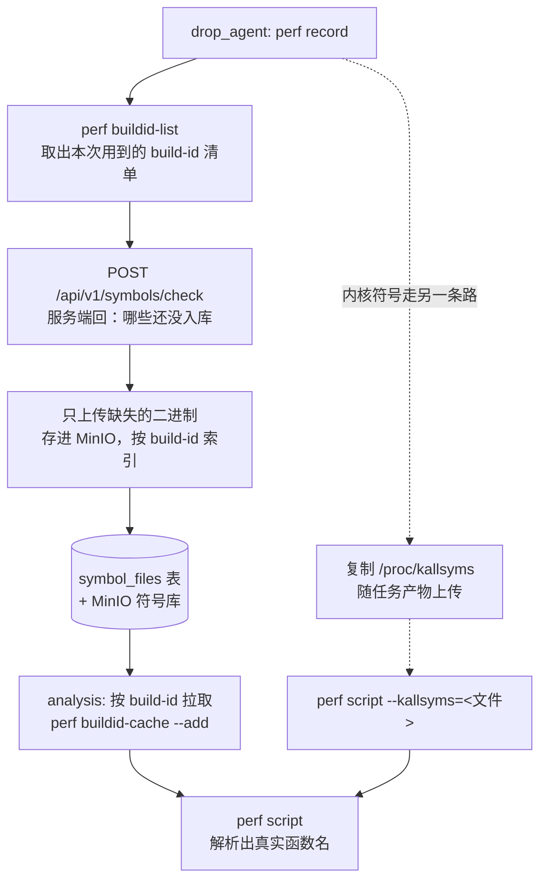

# 符号化改造设计

> 解决 Mini-Drop 当前"火焰图和 TopN 里全是模块名、没有函数名"的问题。
> 参考对象：SysOM-AI（阿里，arXiv 2603.29235）的中心化符号解析架构。

## Summary

当前 perf CPU 采集链路能正确抓到调用栈，但**几乎无法把地址翻译成函数名**。根因不是代码 bug，而是架构上缺了一环：采集发生在 `drop_agent` 容器，符号解析发生在 `analysis` 容器，而符号信息没有任何机制从前者传到后者。

本设计分三阶段补上这一环，前两阶段不新建任何文件、一周内可完成并解决绝大部分问题；第三阶段引入 Build ID 符号库，实现跨任务去重。

---

## 1. 问题现状

### 1.1 现象

一次系统级 perf 采集的 TopN 结果（20 行）：

| 显示内容 | 数量 | 说明 |
|---|---|---|
| `[[kernel.kallsyms]]` | 439 次，73.4% | 内核符号未解析 |
| `[libseccomp.so.2.5.3]` `[libc.so.6]` `[runc]` `[containerd]` 等 | 约 26% | 用户态符号未解析 |
| `SHA256_Init` `CRYPTO_clear_free` `CRYPTO_zalloc` | 3 行，合计 0.51% | **唯一真正解析出来的函数名** |

带方括号的条目是 `stackcollapse-perf.pl` 的兜底显示：当 `perf script` 输出的符号为 `[unknown]` 时，退而用模块名代替。**即 99.5% 的采样没有解析出符号。**

### 1.2 根因

`perf.data` **不是自包含产物**——它存的是内存地址、DSO 路径和 Build ID，**不含符号信息本身**。要翻译成函数名，必须能读到当时那些二进制文件。

而当前流程是：

- `perf record` 在 `drop_agent` 容器执行（`drop/common/Perf.cpp`）
- `perf script` 在 `analysis` 容器执行（`analysis/flamegraph.py:69`）

`analysis` 是独立的 Python 环境，里面没有 `runc`、`containerd`、`libseccomp` 这些文件，自然查不到符号。

**反证**：`SHA256_Init` 等三个函数之所以解析成功，是因为 `analysis` 镜像自己装了 openssl，libcrypto 的路径恰好匹配。**机制是通的，缺的是文件。**

### 1.3 定性

把分析放在独立容器**这个架构决策本身是正确的**——职责分离，分析属于 CPU/内存密集型工作，不应跑在被测机器上。SysOM-AI 做了完全相同的选择。差别在于它建了 Build ID 符号库这座桥，而 Mini-Drop 没建。

**结论：架构方向没错，缺的是配套机制。不需要推倒重来。**

---

## 2. 参考来源

### 2.1 借鉴 SysOM-AI 的三点

| SysOM-AI 的做法 | 在 Mini-Drop 的对应 |
|---|---|
| 节点只做栈回溯，中心做符号化 | 保持现有分工，补上符号传输链 |
| Build ID 作为符号表主键 | 内容指纹天然去重，同一二进制全集群只存一份 |
| 宁可标记未解析，不做半解析 | 符号缺失时保留方括号形式，禁止"蒙一个最近的符号" |

第三条来自该论文 §5.3 的一个案例：某节点符号表稀疏，导致一个符号看似覆盖 18MB 地址范围，范围内所有地址被归到同一函数，**火焰图上出现一个吃掉 50%+ 采样的虚构递归热点**。换成完整符号表后被正确拆成几十个函数。

**教训：半吊子的符号化不是"部分正确"，而是会把人引向错误结论。**

### 2.2 明确不借鉴的两点

- **对数复杂度的部分符号表查找**——SysOM-AI 面对 17 万 Build ID、上万节点，单机符号文件 600MB~1GB 会 OOM，才需要这套。Mini-Drop 量级差几个数量级，一张数据库表加 MinIO 足够，上这套属于过度设计。
- **自适应 FP/DWARF 混合回溯**——它解决的是**回溯**问题（怎么把栈抓完整），而 perf 已经把回溯做好了：当前截图中栈的层次结构是完整的，只是没有名字。**Mini-Drop 缺的 99.5% 纯粹是符号化，回溯环节无需改动。**

---

## 3. 设计目标

**目标**

- 自有服务（apiserver、pprof_demo、drop_agent 自身等）的 CPU 火焰图能显示真实函数名
- 内核符号能正确解析
- 同一个二进制在多次任务、多个 Agent 之间只需上传一次
- 符号缺失时明确可见，不产生误导性结果

**非目标**

- 不追求宿主机全量进程（含第三方容器）的完整符号化
- 不支持 stripped 二进制的符号恢复（无 debuginfo 来源时接受解析失败）
- 不实现 debuginfod 等外部符号服务对接

---

## 4. 总体架构



**关键点：内核符号和用户态符号是两条完全不同的路径。**

| | 内核符号 | 用户态符号 |
|---|---|---|
| 符号来源 | `/proc/kallsyms`（运行时生成，非文件） | 二进制自身的符号表 |
| 占当前采样 | 73.4% | 约 26% |
| 解法 | 随任务上传 kallsyms 快照 | Build ID 索引的符号库 |
| 工作量 | 半天 | 1~2 周 |

**内核符号这一半投入产出比高一个数量级，应优先完成。**

---

## 5. 分阶段实施

### 阶段一：内核符号（半天，解决 73.4%）

- **Agent**：`perf record` 结束后，复制 `/proc/kallsyms` 到任务工作目录，作为产物上传至 `<tid>/kallsyms`
- **Analysis**：下载该产物，给 `perf script` 增加 `--kallsyms=<本地路径>`
- **不新建文件**，仅修改 `drop/agent/main.cpp` 与 `analysis/flamegraph.py`

### 阶段二：用 `perf archive` 跑通机制（2~3 天）

先不做去重，目的是**验证"把符号运过去就能解析"这个前提成立**。

- **Agent**：采集后执行 `perf archive perf.data`，产出 `perf.data.tar.bz2`（包含该 perf.data 引用到的所有 DSO），一并上传
- **Analysis**：解压到 perf 的 build-id 缓存目录后再执行 `perf script`

```bash
# Agent 侧
perf archive perf.data

# Analysis 侧
mkdir -p ~/.debug && tar xf perf.data.tar.bz2 -C ~/.debug
perf script -i perf.data
```

- **同样不新建文件**

**若本阶段验证失败，阶段三没有意义，需先排查根因。**

### 阶段三：Build ID 符号库（1~2 周）

正式版，引入跨任务去重。文件清单与数据模型见下节。

---

## 6. 文件清单（阶段三）

### 新建

| 文件 | 职责 |
|---|---|
| `apiserver/model/migrations/002_symbol_store.sql` | 建 `symbol_files`、`task_build_ids` 两张表 |
| `apiserver/model/symbol.go` | 两张表的 GORM 模型 |
| `apiserver/server/symbol.go` | 两个 Agent 面向的接口：查缺失、上传 |
| `drop/common/SymbolCollector.h` / `.cpp` | 提取 build-id 清单、按需上传缺失二进制 |
| `analysis/symbolizer.py` | 按 build-id 从 MinIO 拉符号、灌进 perf 缓存 |

### 修改

| 文件 | 改动 |
|---|---|
| `drop/agent/main.cpp` | Upload 阶段（约 557 行）后追加符号上传步骤 |
| `analysis/flamegraph.py` | `run_perf_script()` 前先准备符号缓存 |
| `apiserver/server/server.go` | 注册两条新路由 |
| `apiserver/model/migration.go` | 挂载 002 迁移 |

---

## 7. 数据模型与接口契约

### 7.1 数据模型

```sql
CREATE TABLE symbol_files (
    build_id     TEXT PRIMARY KEY,             -- 内容指纹，天然去重
    file_name    TEXT NOT NULL,
    object_key   TEXT NOT NULL,                -- MinIO 位置
    size_bytes   BIGINT NOT NULL,
    sha256       TEXT NOT NULL,
    status       SMALLINT NOT NULL DEFAULT 0,  -- 0 上传中 / 1 就绪 / 2 失败
    created_at   TIMESTAMPTZ NOT NULL DEFAULT now(),
    last_used_at TIMESTAMPTZ                   -- 供后续清理策略使用
);

CREATE INDEX idx_symbol_files_status ON symbol_files (status);

CREATE TABLE task_build_ids (
    tid       TEXT NOT NULL,
    build_id  TEXT NOT NULL,
    dso_path  TEXT NOT NULL,
    PRIMARY KEY (tid, build_id)
);
```

`task_build_ids` 的作用是让 Analysis 直接查"这个任务需要哪些符号"，无需重新解析 perf.data。

### 7.2 接口

只需两个，均为 Agent 使用：

```
POST /api/v1/symbols/check
  请求  { "build_ids": ["abc123...", "def456..."] }
  响应  { "missing": ["def456..."] }

PUT  /api/v1/symbols/{build_id}
  请求体为 ELF 文件本体
  响应  { "build_id": "...", "status": "ready" }
```

**Analysis 侧不新增接口**——它本就直接查 PostgreSQL、直接读 MinIO，符号沿用同一路径，与现有模式保持一致。

### 7.3 Agent 侧关键命令

```bash
perf buildid-list -i perf.data
# 输出格式：<build-id> <dso 路径>，逐行解析即可
```

---

## 8. 设计缺陷与风险

### 高：会直接卡住的三条

**1. 跨容器文件不可见**
`perf buildid-list` 给出的是**目标进程视角**的路径。`runc`、`containerd` 等属于宿主机或其他容器，`drop_agent` 文件系统中可能不存在，读不到就无法上传。

> 缓解：给 Agent 挂宿主机根目录只读；或按第 3 节"非目标"明确限定范围，只保证自有服务可符号化。

**2. stripped 二进制上传后仍无符号**
生产二进制常被 strip，符号表已被删除，上传也解析不出来。

> 现状：自有 Go 二进制默认带符号表，这部分不受影响；第三方 stripped 二进制接受失败。

**3. 符号上传与分析的竞态**
若符号异步上传，分析可能在符号到齐前启动，结果仍是方括号。

> 需要在任务状态中增加"符号就绪"标志，或允许分析在符号缺失时重试。

### 中：需要考虑但不阻塞

**4. 并非所有二进制都有 Build ID** —— 需编译时带 `--build-id`，GCC 默认开启但不绝对。缺失时只能退化按路径处理或跳过。

**5. 符号库无限增长** —— 每个新版本二进制都是新 Build ID，无回收机制会持续膨胀。`last_used_at` 字段为此预留，需配套清理策略（如 90 天未引用则删除）。

**6. 并发上传同一 Build ID** —— 多个 Agent 可能同时上传 `libc.so.6`，主键冲突需按幂等处理（忽略而非报错）。

**7. Analysis 侧缓存易失** —— 每次任务重新拉取符号会拖慢分析。`~/.debug` 缓存可复用，但容器重启即失效，建议挂载持久卷。

**8. 上传通道的安全面** —— "上传任意二进制到中心存储"理论上可被滥用为数据外泄通道。需限制文件大小上限并校验必须为合法 ELF。

**9. kallsyms 与内核版本错配** —— 多机部署时若 Agent 与 Analysis 所在内核不同，kallsyms 会对不上。应记录内核版本并在解析前校验。

---

## 9. 验收标准

| 阶段 | 验收方式 |
|---|---|
| 一 | 对任意进程采集一次，TopN 中 `[[kernel.kallsyms]]` 消失，替换为具体内核函数名 |
| 二 | 对 `pprof_demo` 采集一次，TopN 中出现 `main.burnCPU` 等真实 Go 函数名 |
| 三 | 连续两次对同一目标采集，第二次的 `symbols/check` 返回空 `missing` 列表（证明去重生效） |

### 9.1 阶段一实际验收结果（2026-08-12）

**结论：通过。** 整机（`target_pid=0`，`perf record -a`）采集一次 15 秒 CPU 样本，前端 TopN 表格中不再出现任何 `[[kernel.kallsyms]]` 条目，内核帧全部替换为真实函数名，例如 `pv_native_safe_halt`（98.3%，虚拟机空闲占比高属正常）、`do_user_addr_fault`、`_raw_spin_unlock_irqrestore`、`dput`、`do_writepages`、`rcu_do_batch`、`__alloc_pages`、`__pte_offset_map_lock`、`seq_putc`、`rb_next`、`__d_lookup`。

TopN 中仍存在的方括号条目（`[libseccomp.so.2.5.3]` `[perl]` `[runc]` `[containerd-shim-runc-v2]` `[apiserver]` `[containerd]` `[dockerd]` `[libc.so.6]` `[perf-6064.map]`）均为**用户态符号未解析**，属于阶段二/三范围，不是阶段一遗留问题。

**验收过程中发现并修复一处遗漏**：最初实现只把 `kallsyms_path` 接进了 `generate_flamegraph()`（生成 SVG 的路径），漏接了 `get_folded_stacks()`（生成 TopN/建议/`folded.txt` 的路径）——`get_folded_stacks()` 的函数签名当时根本没有 `kallsyms_path` 参数。现象是同一次分析里 `perf script` 被调用两次，一次带 `--kallsyms=`（SVG 用，正确）、一次不带（TopN 用，仍解析失败），最终建议引擎插入的还是 `[[kernel.kallsyms]]`。修复：给 `get_folded_stacks()` 加 `kallsyms_path` 参数并透传给 `_detect_and_fold()`，调用点同步传入 `local_kallsyms`。

**教训**：给一个"内核符号"需求接线时，实际有两条独立的消费路径（SVG 生成 / TopN 生成），各自调用一次 `perf script`，参数必须两处都接，只测 SVG 或只测 TopN 都无法发现另一条路径的遗漏。

### 9.2 阶段二实际验收结果（2026-08-13）

**结论：通过。** 用 `pprof_demo`（`main.go` 中 `burnCPU()` 启 8 个 goroutine 死循环烧 CPU，制造持续、可核对的用户态负载）作为验证目标，针对其宿主机 PID 采集一次 15 秒 CPU 样本，前端 TopN：

```
main.burnCPU.func1                    1,907 次   99.6%
irqentry_exit_to_user_mode                6 次   0.31%
profile_signal_perm                       1 次   0.05%
compress/flate.(*deflateFast).encode      1 次   0.05%
```

`main.burnCPU.func1` 是验收标准指定的目标函数（`.func1` 为其内部匿名 goroutine 闭包），99.6% 占比确认解析生效；`compress/flate.(*deflateFast).encode` 是另一个独立解析成功的 Go 标准库函数，排除孤例巧合；`irqentry_exit_to_user_mode`、`profile_signal_perm` 为真实内核函数，确认阶段一未被这次改动带出回归。

**验收过程中发现并修复一处与符号化无关的预置 bug**：`analysis/flamegraph.py` 的 `PERF_SCRIPT_FIELDS` 固定要求 `perf script` 打印 `cpu` 字段，但 `perf record -p <pid>`（针对具体进程）默认不记录采样的 CPU 归属，仅 `-a`（整机模式）才有。此前所有验证都恰好用整机模式，从未暴露；一旦针对具体 PID 采集，`perf script` 直接以 exit 255 崩溃，分析全链路失败，与符号包本身无关。修复：`PERF_SCRIPT_FIELDS` 去掉 `cpu` 字段（下游折叠栈解析、TopN、建议均不依赖该列）。

**发现一个已知特性，非阻塞性 bug**：符号包（`.build-id/<xx>/<rest>/elf`）的自定义 tar 打包/解压机制本身是正确的——软链接是相对路径、指向 `.debug` 内部自包含结构，实测解压后文件完整（8.8MB 有效 ELF 内容），排除了最初怀疑的"软链接跨容器失效"。真正的现象是：**Agent 自身的 `$HOME/.debug` build-id 缓存需要"热身"**——`perf record` 对一个从未见过的目标二进制首次采集时，其内部自动建缓存的过程可能跟不上，打出的符号包会漏掉该二进制；同一目标被多次采集后，Agent 本地缓存积累完整，后续符号包才会包含它。首次尝试（`target_pid=56751`）TopN 仍显示 `[pprof-demo]`，未替换任何后端逻辑、仅等待并重新采集一次后即变为 `main.burnCPU.func1`，印证了这一特性而非随机故障。**影响**：对一个全新目标的第一次采集，用户态符号可能不完整；同一目标重复采集会自愈。暂不阻塞验收，但应记入已知限制，避免被误判为间歇性 bug 而重复排查。

---

## 10. 前置验证实验（动手前必做）

约二十分钟，用于确认第 8 节"高风险第 1 条"是否会成为拦路虎：

1. 在 `drop_agent` 容器内对 `pprof_demo` 执行一次 `perf record`
2. **就地**执行 `perf script`，检查能否输出函数名
3. 若能，执行 `perf archive`，将产出包复制到 `analysis` 容器解压后再次 `perf script`，检查是否仍能输出函数名

**若第 2 步在 Agent 容器内就无法解析**，说明问题不在"符号有没有传过去"，而在 Agent 容器看不到目标二进制，整套方案需要改换思路（优先考虑挂载宿主机根目录）。

---

## 11. 实施建议

优先完成阶段一、二（合计不足一周，不新建任何文件，风险极低），可解决绝大部分问题。阶段三的 1~2 周投入，应在阶段二验证通过、且确实需要跨任务去重时才启动。
