# Drop 性能诊断系统架构与复刻指南

> 本文面向需要理解或重建 Drop 类性能诊断平台的工程团队。内容围绕模块功能、模块间联系、状态变化和数据流向展开；少量源码路径仅用于帮助定位关键入口。

## 快速导航

| 章节 | 重点 |
|---|---|
| 1～2 | 系统拓扑、模块职责、核心对象、协议和状态机 |
| 3 | Agent 接入、任务下发、采集、存储、分析、展示等主数据流 |
| 4 | 离线、超时、失败、重试、取消和恢复等异常流 |
| 5～8 | C++ 核心、Go API、Python 分析、React Web 内部模块 |
| 9～10 | 数据库、对象存储、配置和部署 |
| 11～13 | 安全、可观测性、测试和分阶段实施 |
| 附录 | 接口示例、配置模板、源码定位和术语 |

---

## 1. 系统目标与整体架构

### 1.1 系统解决的问题

Drop 是一个分布式、按需执行的性能诊断平台。用户选择目标机器、容器或进程，并指定采样方式、持续时间和分析参数；平台将任务交给目标节点上的 Agent，Agent 调用系统采样工具生成原始文件，分析模块把原始文件转换为火焰图、热点函数、调用图、内存问题或优化建议，Web 最终展示任务过程与诊断结果。

系统需要同时解决五类问题：

1. **远程调度**：控制面如何可靠地把任务交给目标节点；
2. **受控执行**：Agent 如何安全运行 perf、async-profiler、pprof、eBPF、py-spy 等工具；
3. **大文件传递**：原始采样文件如何跨模块传递而不阻塞 RPC；
4. **异步分析**：采集完成后如何自动触发分析、重试并记录结果；
5. **可解释状态**：用户如何知道任务当前在哪一步、为何失败、是否可以重试。

### 1.2 四个运行模块

| 模块 | 运行形态 | 核心职责 | 主要输入 | 主要输出 |
|---|---|---|---|---|
| 核心采集模块 | C++ `drop_server` + `drop_agent` | Agent 注册、心跳、任务队列、采样执行、结果上报 | gRPC 请求、任务描述、目标进程 | 任务状态、原始制品、资源数据 |
| API 编排模块 | Go HTTP 服务 | 身份、权限、任务建模、REST API、gRPC 调度、预签名 URL | HTTP 请求、用户身份、任务参数 | 数据库记录、gRPC 任务、HTTP/SSE 响应 |
| 离线分析模块 | Python 常驻 worker + Go 堆分析子进程 | 领取待分析任务、下载原始数据、解析、生成报告 | 数据库任务、对象存储文件 | 火焰图、TopN、调用图、建议、分析状态 |
| Web 展示模块 | React 单页应用 | 任务创建、列表、状态跟踪、结果可视化 | REST/SSE 数据、分析产物 | 用户操作、图表、火焰图、诊断建议 |

数据库和对象存储是四个模块之间的共享基础设施：

- PostgreSQL 保存任务、Agent、状态、权限、计划任务和产物元数据；
- COS/MinIO 保存体积较大的原始采样文件与分析结果；
- gRPC 承载控制消息；
- HTTP/SSE 承载用户操作和状态展示。

### 1.3 运行时拓扑

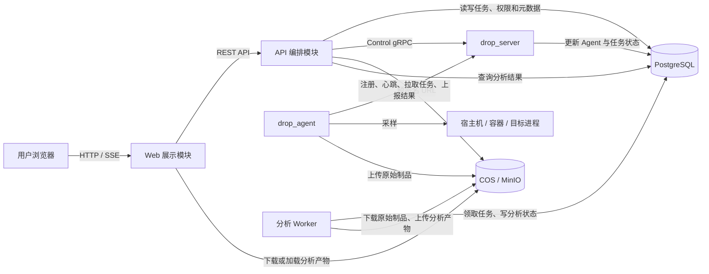
```mermaid
flowchart LR
    U["用户浏览器"] -->|"HTTP / SSE"| W["Web 展示模块"]
    W -->|"REST API"| A["API 编排模块"]

    A -->|"读写任务、权限和元数据"| PG[("PostgreSQL")]
    A -->|"Control gRPC"| S["drop_server"]
    A -->|"预签名 URL"| OS[("COS / MinIO")]

    AG["drop_agent"] -->|"注册、心跳、拉取任务、上报结果"| S
    AG -->|"采样"| T["宿主机 / 容器 / 目标进程"]
    AG -->|"上传原始制品"| OS

    S -->|"更新 Agent 与任务状态"| PG
    AN["分析 Worker"] -->|"领取任务、写分析状态"| PG
    AN -->|"下载原始制品、上传分析产物"| OS

    A -->|"查询分析结果"| PG
    W -->|"下载或加载分析产物"| OS
```

### 1.4 依赖方向

系统应保持单向、可替换的依赖：

```text
Web ──HTTP──> API ──gRPC──> drop_server <──gRPC── drop_agent
                   │              │                  │
                   ├──SQL─────────┴──────────────────┤
                   │                                 │
                   └──对象存储 <── Analyzer <────────┘
```

约束如下：

- Web 只依赖 HTTP/SSE 契约，不引用后端实现；
- API 只通过 gRPC 调度采集模块；
- Agent 与 Analyzer 不直接通信，通过对象存储和数据库状态交接；
- 大文件不通过 HTTP handler 或 gRPC 消息传输；
- 任务类型、状态、错误码和 Proto 字段只有一个权威定义；
- 用户权限必须在 API 和制品下载入口重新校验；
- 任一模块重启后，任务记录仍能从数据库恢复。

### 1.5 模块通信矩阵

| 调用方 | 被调用方 | 协议 | 数据 | 同步性 |
|---|---|---|---|---|
| Web | API | HTTPS/JSON | 身份、任务参数、查询条件 | 同步 |
| Web | API | SSE | 状态事件、AI 建议 | 流式 |
| API | drop_server | gRPC | TaskDesc、Agent 统计请求 | 同步调用，任务异步执行 |
| drop_agent | drop_server | gRPC | 注册、心跳、任务拉取、结果 | 周期性/异步 |
| API/Server/Analyzer | PostgreSQL | SQL | 元数据、状态、权限、租约 | 事务 |
| Agent | 对象存储 | HTTPS | 原始采样文件 | 异步上传 |
| Analyzer | 对象存储 | HTTPS | 原始文件下载、分析产物上传 | 异步 |
| Web | 对象存储 | HTTPS | 经授权的结果文件 | 短期预签名 |

---

## 2. 核心领域对象、协议与状态机

### 2.1 Agent

Agent 表示一个可执行采样任务的目标节点。核心属性包括：

| 字段 | 含义 |
|---|---|
| `agent_id` | 稳定身份，不使用临时 IP 代替 |
| `target` | Server 调度任务使用的目标标识 |
| `ip/hostname` | 展示和诊断信息 |
| `version` | Agent 版本与协议版本 |
| `platform` | OS、架构、内核、容器运行时 |
| `capabilities` | 可用采样器、版本和不可用原因 |
| `labels` | 环境、集群、业务、资源组等标签 |
| `last_seen_at` | 最后心跳时间 |
| `status` | online、degraded、offline、disabled |
| `resource_budget` | 最大并发、CPU、内存和磁盘预算 |

Agent 的在线状态由 Server 根据心跳时间计算。数据库中的状态用于查询和审计，内存中的注册表用于快速调度。

### 2.2 Task

Task 是串联用户请求、调度、采集、存储、分析和展示的主对象。

```text
Task
├── identity: task_id / request_id / creator
├── target: agent / host / container / pid
├── kind: perf / async-profiler / pprof / eBPF / ...
├── parameters: duration / frequency / event / filters
├── collection_status
├── analysis_status
├── parent_task_id / child_task_ids
├── error_code / error_message
└── timestamps
```

建议将用户参数保存为经过 JSON Schema 校验的 `JSONB`，同时把经常查询的字段提升为独立列。

### 2.3 TaskAttempt

一次 Task 可能经历多次执行。TaskAttempt 用于区分：

- 首次下发；
- Agent 未收到后的重新下发；
- 用户手动重试；
- 采样成功但结果上报失败后的恢复；
- 综合任务中的子任务执行。

每次尝试记录 `attempt_id`、Agent、开始/结束时间、Runner 版本、退出码、错误码、资源消耗和制品列表。这样重试不会覆盖之前的诊断证据。

### 2.4 Artifact

Artifact 表示任务产生的文件：

| 类型 | 产生方 | 示例 |
|---|---|---|
| RAW | Agent | perf.data、collapsed stack、hprof、pprof、memray |
| INTERMEDIATE | Analyzer | folded stack、解析后的 JSON、索引 |
| RESULT | Analyzer | flamegraph.json.gz、top.json、callgraph、报告 |
| LOG | Agent/Analyzer | 受限长度的任务日志 |
| MANIFEST | Agent/Analyzer | 文件大小、hash、版本和关联信息 |

Artifact 元数据保存在数据库，文件正文保存在对象存储。数据库中只保存 object key，不保存长期可访问 URL。

### 2.5 AnalysisJob

AnalysisJob 表示一次异步分析：

- 关联一个 Task 和一种分析流水线；
- 记录 pending、running、success、failed；
- 使用 `lease_owner` 和 `lease_expires_at` 管理 worker 所有权；
- 记录 attempt、analyzer_version、输入制品和输出制品；
- 支持有限重试和 dead-letter。

### 2.6 TaskEvent

TaskEvent 是可审计的状态事件：

```text
TASK_CREATED
DISPATCH_QUEUED
TASK_DELIVERED
RUNNER_STARTED
RAW_ARTIFACT_UPLOADED
COLLECTION_SUCCEEDED
ANALYSIS_STARTED
RESULT_ARTIFACT_UPLOADED
ANALYSIS_SUCCEEDED
TASK_FAILED
TASK_CANCELED
```

事件应包含递增 sequence、task_id、attempt_id、来源模块、时间和脱敏 payload。Web 的实时状态可以从事件流构建。

### 2.7 gRPC 服务

核心控制协议由四类服务组成：

| 服务 | 典型方法 | 方向 | 功能 |
|---|---|---|---|
| InitAgent | `Init` | Agent → Server | 首次注册、获取配置和临时访问参数 |
| HealthCheck | `Do` | Agent → Server | 心跳、状态同步、接收轻量指令 |
| Hotmethod | `Collect` / `NotifyResult` | Agent ↔ Server | 拉取采样任务、上报执行结果 |
| Control | `CreateTask` / `StatAgent` / `FetchData` | API → Server | 创建任务、查询 Agent 资源、调试取数 |

建议所有 RPC 都携带：

- request_id、task_id、attempt_id；
- 调用方版本和协议版本；
- deadline；
- 结构化错误码；
- 可安全重放的幂等键。

### 2.8 TaskDesc

TaskDesc 是 API、Server 和 Agent 共同理解的任务描述。可以按领域拆分：

```proto
message TaskDesc {
  int64 task_id = 1;
  TaskKind kind = 2;
  string target = 3;
  int64 deadline_unix_ms = 4;
  ResourceBudget budget = 5;

  oneof payload {
    PerfTask perf = 10;
    AsyncProfilerTask async_profiler = 11;
    PprofTask pprof = 12;
    EbpfTask ebpf = 13;
    JavaHeapTask java_heap = 14;
    ScriptTask script = 15;
  }
}
```

设计原则：

- 通用字段和采样器字段分离；
- 使用 `oneof` 避免无关字段同时存在；
- 持续时间、频率和文件上限由 Server/Agent再次校验；
- 删除字段时保留 `reserved` 字段号；
- 前端表单、API DTO 和 Agent Runner 从同一份 TaskKind 元数据生成。

### 2.9 采集状态机

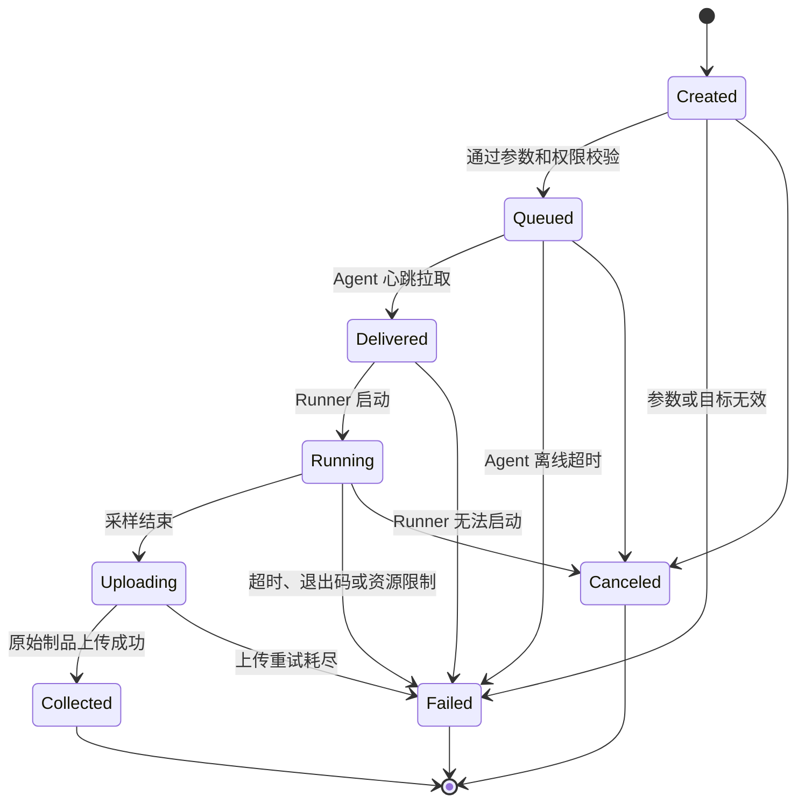
```mermaid
stateDiagram-v2
    [*] --> Created
    Created --> Queued: 通过参数和权限校验
    Queued --> Delivered: Agent 心跳拉取
    Delivered --> Running: Runner 启动
    Running --> Uploading: 采样结束
    Uploading --> Collected: 原始制品上传成功
    Created --> Failed: 参数或目标无效
    Queued --> Failed: Agent 离线超时
    Delivered --> Failed: Runner 无法启动
    Running --> Failed: 超时、退出码或资源限制
    Uploading --> Failed: 上传重试耗尽
    Created --> Canceled
    Queued --> Canceled
    Running --> Canceled
    Collected --> [*]
    Failed --> [*]
    Canceled --> [*]
```

### 2.10 分析状态机

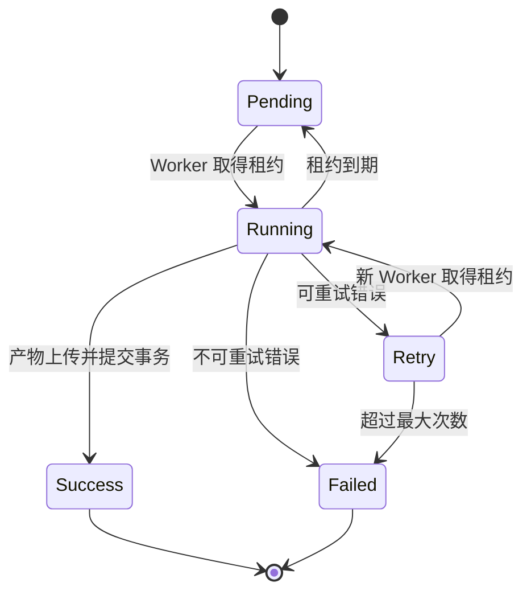
```mermaid
stateDiagram-v2
    [*] --> Pending
    Pending --> Running: Worker 取得租约
    Running --> Success: 产物上传并提交事务
    Running --> Retry: 可重试错误
    Retry --> Running: 新 Worker 取得租约
    Running --> Failed: 不可重试错误
    Retry --> Failed: 超过最大次数
    Running --> Pending: 租约到期
    Success --> [*]
    Failed --> [*]
```

采集状态与分析状态必须独立。采集成功只表示原始数据已安全保存；分析成功才表示结果可展示。

### 2.11 TaskKind 能力模型

TaskKind 不只是数字枚举，还应包含：

```yaml
id: 0
name: PERF_CPU
display_name: CPU 火焰图
runner: perf
analysis_pipeline: perf_flamegraph
supported_os: [linux]
supported_arch: [amd64, arm64]
requires_capabilities: [perfmon]
supports_container: true
default_duration_seconds: 30
max_duration_seconds: 300
max_concurrency_per_agent: 1
parameter_schema: perf-cpu.schema.json
```

API 根据用户权限和 Agent capability 返回可创建的 TaskKind；Web 不自行维护一份数字含义表。

---

## 3. 核心数据流

### 3.0 数据流总览

| 流程 | 触发 | 主要状态变化 | 持久化/文件 | 失败去向 |
|---|---|---|---|---|
| Agent 初始化 | Agent 启动 | registering → online | agents、AgentEvent | 证书/版本错误时拒绝，网络错误退避 |
| Agent 心跳 | 周期定时器 | online ↔ degraded/offline | last_seen、资源快照 | 超过阈值触发离线与任务对账 |
| 创建与调度 | 用户提交 | created → queued → delivered | Task、Event、Outbox | 校验失败终止；暂时故障有限重试 |
| 采集执行 | Agent 收到任务 | delivered → running → uploading | TaskAttempt、本地工作目录 | Runner 错误、超时或取消 |
| 制品上报 | 原始文件生成 | uploading → collected | RAW Artifact、manifest | 保留有限时间并恢复上传/上报 |
| 离线分析 | AnalysisJob pending | pending → running → success | RESULT Artifact、AnalysisJob | retry、lease 回收或 failed |
| Web 展示 | 用户打开详情 | 读取双状态和 Event | 查询 DB、短期下载 URL | 刷新授权、降级展示或错误边界 |

每条流都通过 task_id 关联；涉及实际执行时再增加 attempt_id，涉及分析时增加 analysis_job_id。

### 3.1 Agent 初始化与注册

**触发条件：** Agent 进程启动或配置刷新。

**参与模块：** Agent、drop_server、PostgreSQL、对象存储授权服务。

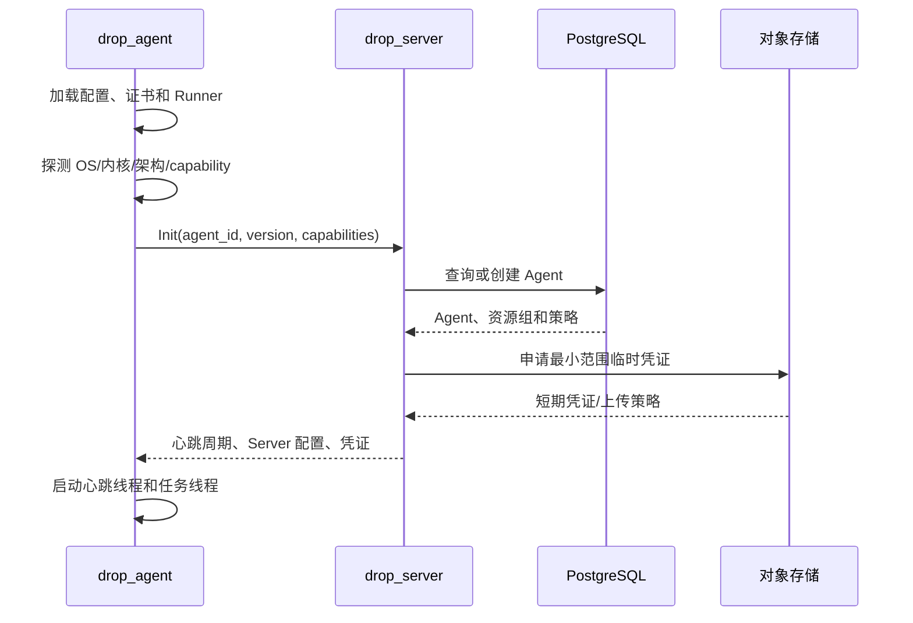
```mermaid
sequenceDiagram
    participant AG as drop_agent
    participant S as drop_server
    participant DB as PostgreSQL
    participant OS as 对象存储

    AG->>AG: 加载配置、证书和 Runner
    AG->>AG: 探测 OS/内核/架构/capability
    AG->>S: Init(agent_id, version, capabilities)
    S->>DB: 查询或创建 Agent
    DB-->>S: Agent、资源组和策略
    S->>OS: 申请最小范围临时凭证
    OS-->>S: 短期凭证/上传策略
    S-->>AG: 心跳周期、Server 配置、凭证
    AG->>AG: 启动心跳线程和任务线程
```

**输入：**

- Agent 身份和 mTLS 证书；
- 版本、平台和 capability；
- 目标节点标签；
- 本地资源上限。

**状态变化：**

`unregistered → registering → online`。注册失败时保持本地退避，不进入任务执行状态。

**持久化：**

- Agent 基础信息和 capability 写入 `agents`；
- 注册事件写入 `agent_events` 或统一事件表；
- 临时凭证不落普通日志。

**失败分支：**

- 证书无效：立即拒绝，不自动降级为明文；
- 协议不兼容：返回最低支持版本；
- 数据库不可用：Server 不确认注册；
- 对象存储不可用：可以允许 Agent online，但 capability 标记为不可执行上传型任务。

**实现定位：**

- `drop/agent/main.cpp`：Agent 启动与通道初始化；
- `drop/server/InitAgentInfoService.cpp`：注册服务；
- `drop/agent/Config.cpp`：Agent 配置和 Server 连接。

### 3.2 Agent 心跳与任务拉取

**触发条件：** 心跳定时器到期。

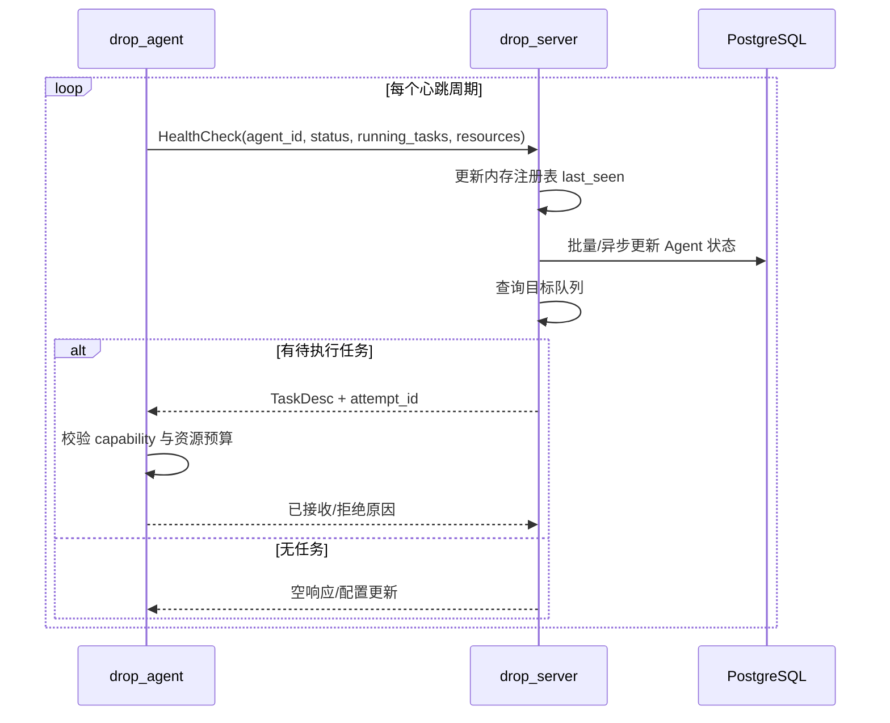
```mermaid
sequenceDiagram
    participant AG as drop_agent
    participant S as drop_server
    participant DB as PostgreSQL

    loop 每个心跳周期
        AG->>S: HealthCheck(agent_id, status, running_tasks, resources)
        S->>S: 更新内存注册表 last_seen
        S->>DB: 批量/异步更新 Agent 状态
        S->>S: 查询目标队列
        alt 有待执行任务
            S-->>AG: TaskDesc + attempt_id
            AG->>AG: 校验 capability 与资源预算
            AG-->>S: 已接收/拒绝原因
        else 无任务
            S-->>AG: 空响应/配置更新
        end
    end
```

心跳同时承担三项功能：

1. 在线状态证明；
2. Agent 资源和运行任务同步；
3. 从 Server 主动拉取任务。

这种模式不要求控制面主动连接每台内网机器。任务延迟主要由心跳周期决定。

Server 应定期扫描：

- `now - last_seen_at > offline_threshold`：Agent offline；
- queued 任务超过 deadline：任务失败；
- running 任务超过最大持续时间 + grace：进入超时处理；
- Agent 报告的 running_tasks 与 Server 记录不一致：触发对账。

### 3.3 用户创建任务与调度

**触发条件：** Web 提交任务创建请求。

**参与模块：** Web、API、PostgreSQL、drop_server、Agent。

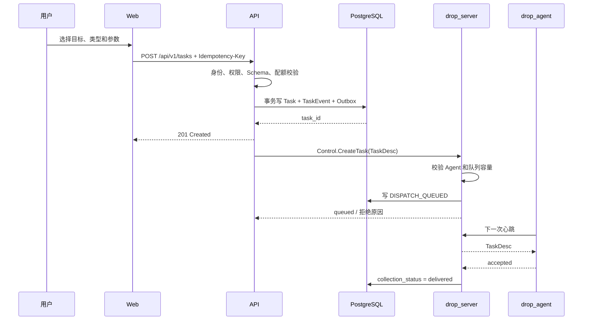
```mermaid
sequenceDiagram
    participant U as 用户
    participant W as Web
    participant A as API
    participant DB as PostgreSQL
    participant S as drop_server
    participant AG as drop_agent

    U->>W: 选择目标、类型和参数
    W->>A: POST /api/v1/tasks + Idempotency-Key
    A->>A: 身份、权限、Schema、配额校验
    A->>DB: 事务写 Task + TaskEvent + Outbox
    DB-->>A: task_id
    A-->>W: 201 Created

    A->>S: Control.CreateTask(TaskDesc)
    S->>S: 校验 Agent 和队列容量
    S->>DB: 写 DISPATCH_QUEUED
    S-->>A: queued / 拒绝原因

    AG->>S: 下一次心跳
    S-->>AG: TaskDesc
    AG-->>S: accepted
    S->>DB: collection_status = delivered
```

**API 校验顺序：**

1. 用户身份；
2. 目标 Agent 可见性；
3. TaskKind 是否启用；
4. Agent capability；
5. 参数 Schema；
6. 时长、频率和文件大小上限；
7. 用户/Agent 并发配额；
8. 幂等键。

**事务边界：**

Task、初始事件和 outbox 必须在同一事务创建。HTTP 成功表示任务已经持久化，而不是采样已经开始。

**输出：**

- API 立即返回 task_id；
- 调度结果通过状态事件更新；
- Web 进入详情页或任务列表，等待后续状态。

### 3.4 Agent 执行采样

**触发条件：** Agent 接收到 TaskDesc 并通过本地校验。

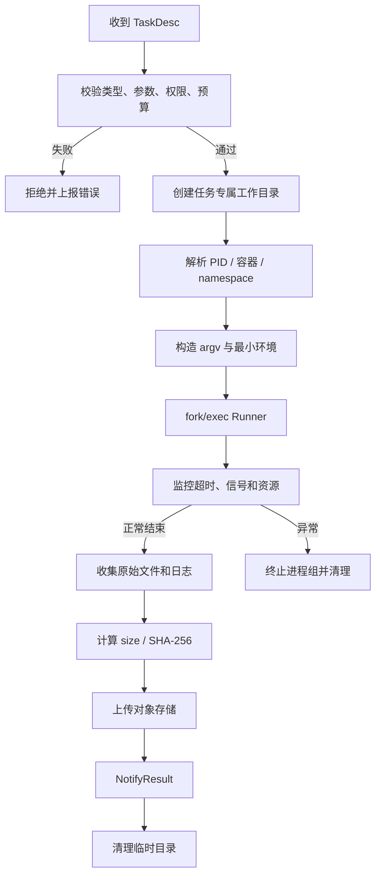
```mermaid
flowchart TD
    R["收到 TaskDesc"] --> V["校验类型、参数、权限、预算"]
    V -->|失败| RJ["拒绝并上报错误"]
    V -->|通过| D["创建任务专属工作目录"]
    D --> P["解析 PID / 容器 / namespace"]
    P --> C["构造 argv 与最小环境"]
    C --> E["fork/exec Runner"]
    E --> M["监控超时、信号和资源"]
    M -->|正常结束| F["收集原始文件和日志"]
    M -->|异常| K["终止进程组并清理"]
    F --> H["计算 size / SHA-256"]
    H --> U["上传对象存储"]
    U --> N["NotifyResult"]
    N --> X["清理临时目录"]
```

Runner 统一生命周期：

1. `Prepare`：解析目标、检查工具、创建目录；
2. `Validate`：二次校验参数与权限；
3. `Start`：以 argv 数组启动工具；
4. `Monitor`：超时、取消、资源预算；
5. `Collect`：收集标准输出和文件；
6. `Upload`：上传并生成 manifest；
7. `Report`：上报状态和制品元数据；
8. `Cleanup`：终止残留进程并删除临时数据。

### 3.5 原始制品上传与结果上报

**触发条件：** Runner 正常结束并生成可分析文件。

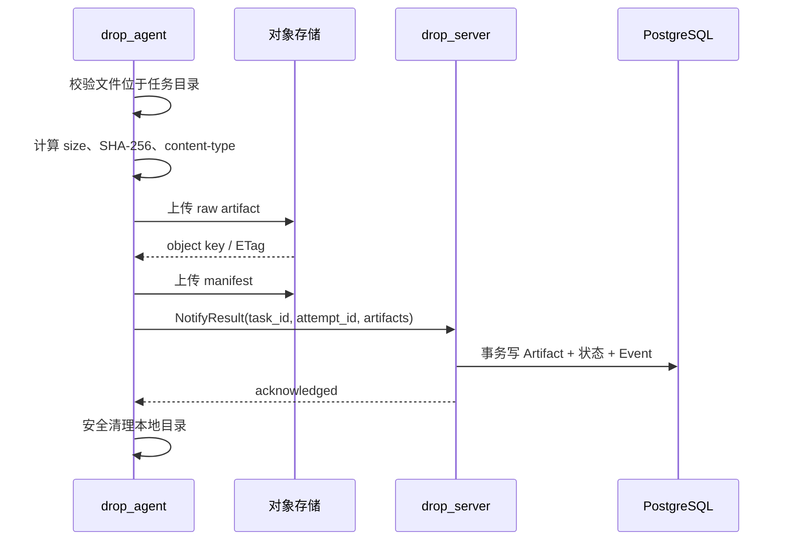
```mermaid
sequenceDiagram
    participant AG as drop_agent
    participant OS as 对象存储
    participant S as drop_server
    participant DB as PostgreSQL

    AG->>AG: 校验文件位于任务目录
    AG->>AG: 计算 size、SHA-256、content-type
    AG->>OS: 上传 raw artifact
    OS-->>AG: object key / ETag
    AG->>OS: 上传 manifest
    AG->>S: NotifyResult(task_id, attempt_id, artifacts)
    S->>DB: 事务写 Artifact + 状态 + Event
    S-->>AG: acknowledged
    AG->>AG: 安全清理本地目录
```

推荐 object key：

```text
tenant/<tenant-id>/tasks/<task-id>/attempts/<attempt-id>/
├── raw/<artifact-name>
├── logs/runner.log
└── manifest.json
```

manifest 至少包含：

- task_id、attempt_id、TaskKind；
- Agent、Runner 和工具版本；
- 文件名、object key、大小、hash；
- 开始/结束时间；
- 采样参数的脱敏摘要；
- 上传完成时间。

若文件上传成功但 NotifyResult 失败，Agent 只重试结果上报，不重复采样。Server 通过 task_id + attempt_id + artifact hash 保证幂等。

### 3.6 分析任务领取与处理

**触发条件：** 采集状态进入 collected，AnalysisJob 进入 pending。

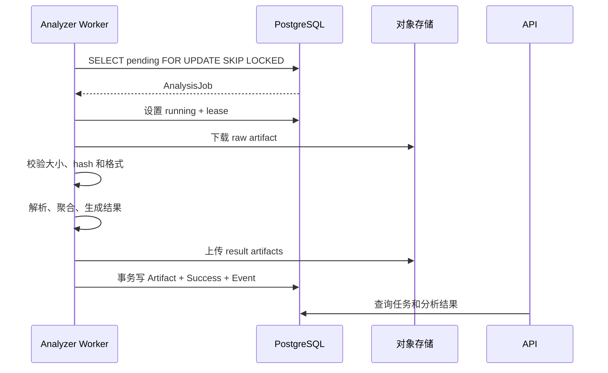
```mermaid
sequenceDiagram
    participant AN as Analyzer Worker
    participant DB as PostgreSQL
    participant OS as 对象存储
    participant API as API

    AN->>DB: SELECT pending FOR UPDATE SKIP LOCKED
    DB-->>AN: AnalysisJob
    AN->>DB: 设置 running + lease
    AN->>OS: 下载 raw artifact
    AN->>AN: 校验大小、hash 和格式
    AN->>AN: 解析、聚合、生成结果
    AN->>OS: 上传 result artifacts
    AN->>DB: 事务写 Artifact + Success + Event
    API->>DB: 查询任务和分析结果
```

**分析输入：**

- TaskKind 和参数；
- 原始 Artifact manifest；
- 对象存储文件；
- Analyzer 版本和规则版本。

**处理阶段：**

1. 领取租约；
2. 下载到任务专属临时目录；
3. 校验 hash、大小、压缩格式；
4. 选择分析 pipeline；
5. 解析为统一调用栈/事件模型；
6. 聚合 TopN、线程、调用关系；
7. 生成火焰图、调用图和建议；
8. 上传产物；
9. 事务更新状态；
10. 删除临时文件。

worker 在处理中定期续租。租约到期后，其他 worker 可以重新领取；旧 worker 提交时必须校验 owner，避免覆盖新结果。

### 3.7 Web 查询与结果展示

**触发条件：** 用户打开任务列表或详情页。

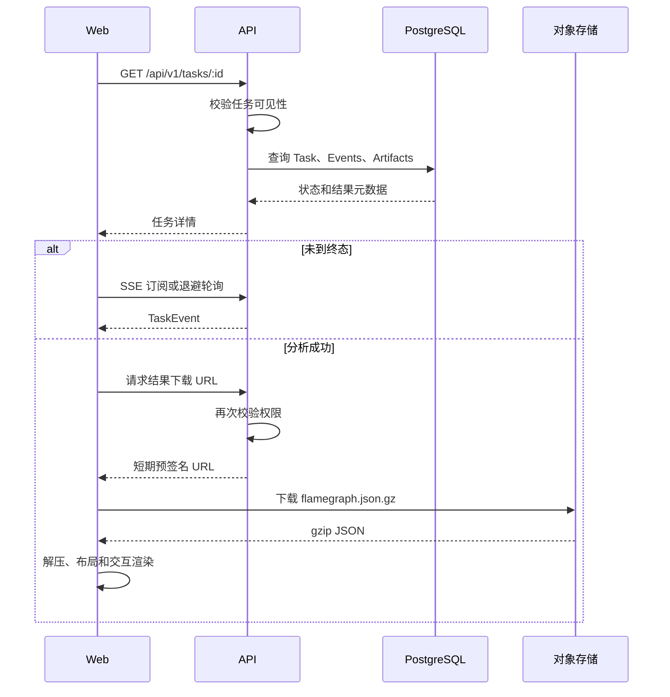
```mermaid
sequenceDiagram
    participant W as Web
    participant A as API
    participant DB as PostgreSQL
    participant OS as 对象存储

    W->>A: GET /api/v1/tasks/:id
    A->>A: 校验任务可见性
    A->>DB: 查询 Task、Events、Artifacts
    DB-->>A: 状态和结果元数据
    A-->>W: 任务详情

    alt 未到终态
        W->>A: SSE 订阅或退避轮询
        A-->>W: TaskEvent
    else 分析成功
        W->>A: 请求结果下载 URL
        A->>A: 再次校验权限
        A-->>W: 短期预签名 URL
        W->>OS: 下载 flamegraph.json.gz
        OS-->>W: gzip JSON
        W->>W: 解压、布局和交互渲染
    end
```

Web 应区分：

- 任务已创建但尚未下发；
- Agent 已接收；
- 采集中；
- 原始数据已保存、等待分析；
- 分析中；
- 采集失败；
- 分析失败；
- 全部成功。

终态后停止轮询。大火焰图的解压和布局放入 Web Worker，并设置节点数和深度上限。

### 3.8 复合任务

复合任务是控制面的编排对象，不直接作为一个无法解释的 Agent Runner。

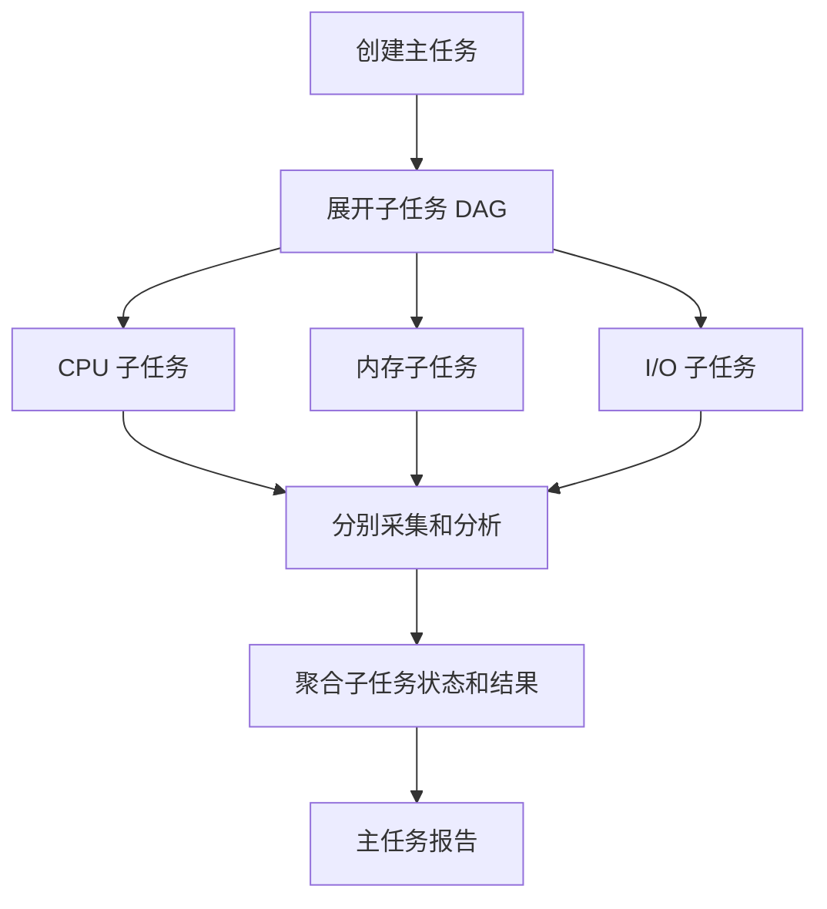
```mermaid
flowchart TD
    M["创建主任务"] --> P["展开子任务 DAG"]
    P --> S1["CPU 子任务"]
    P --> S2["内存子任务"]
    P --> S3["I/O 子任务"]
    S1 --> A["分别采集和分析"]
    S2 --> A
    S3 --> A
    A --> G["聚合子任务状态和结果"]
    G --> R["主任务报告"]
```

主任务保存：

- 子任务列表和依赖关系；
- 每个子任务的必选/可选属性；
- 聚合进度；
- 部分成功策略；
- 总体超时；
- 汇总建议。

### 3.9 计划任务

计划任务包含一个不可变的任务模板和触发策略：

1. Cron 计算下一次触发时间；
2. leader 取得触发锁；
3. 创建普通 Task；
4. 记录 schedule record 与 task_id；
5. 普通任务沿主流程执行；
6. 下次触发不依赖上一次进程内状态。

必须使用唯一键 `schedule_id + scheduled_at` 防止多实例重复创建。

### 3.10 诊断建议与 AI 流

规则建议和 AI 建议都应建立在已经授权的分析结果之上：

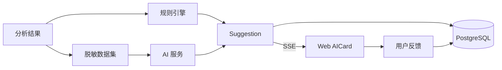
```mermaid
flowchart LR
    AR["分析结果"] --> RR["规则引擎"]
    AR --> DS["脱敏数据集"]
    DS --> AI["AI 服务"]
    RR --> SG["Suggestion"]
    AI --> SG
    SG --> DB[("PostgreSQL")]
    SG -->|"SSE"| W["Web AICard"]
    W --> FB["用户反馈"]
    FB --> DB
```

模型输出必须经过 Markdown/HTML 清洗，建议记录生成引擎、规则/模型版本、输入摘要、生成时间和用户反馈。

---

## 4. 异常流、重试与恢复

### 4.1 Agent 离线

**检测：** Server 发现 `now - last_seen_at` 超过阈值。

**处理：**

- Agent 状态切换为 offline；
- 新任务按产品策略立即拒绝或短期排队；
- queued 任务带 deadline，超时进入 failed；
- running 任务进入 uncertain，等待 Agent 恢复对账；
- 生成 AGENT_OFFLINE 事件和告警。

Agent 恢复后上报本地 running/completed attempt。Server 根据 attempt_id 对账，不重新执行已经完成的采样。

### 4.2 任务无法下发

常见原因：

- Agent 不存在或不可见；
- capability 不支持；
- Agent 队列已满；
- 版本不兼容；
- gRPC 超时；
- Server 重启导致内存队列丢失。

调度失败必须写入独立状态和错误码。可重试错误进入有限重试；不可重试错误立即终止。调度队列应持久化，或者由数据库 outbox 重建。

### 4.3 Runner 启动失败

Agent 在创建子进程前完成：

- 工具存在且 hash 正确；
- PID/容器目标仍存在；
- 权限和 capability 可用；
- 工作目录可写；
- 本地磁盘空间充足；
- 并发预算未超限。

启动失败不生成空的成功 Artifact。上报 `RUNNER_NOT_AVAILABLE`、`TARGET_EXITED`、`PERMISSION_DENIED` 或 `LOCAL_RESOURCE_EXHAUSTED`。

### 4.4 Runner 超时或取消

1. 标记 attempt 为 canceling/timeout；
2. 向进程组发送温和终止信号；
3. 等待 grace period；
4. 强制终止仍存活进程；
5. 收集受限日志；
6. 删除不完整文件或标记 partial；
7. 上报稳定错误码；
8. 清理 namespace、临时目录和锁。

取消接口本身必须幂等。对已经终态的任务重复取消返回当前状态。

### 4.5 对象存储失败

上传重试只重放文件传输，不重跑采样。重试策略：

- 只重试网络超时、限流和 5xx；
- 指数退避并带抖动；
- 每次分片上传使用同一 upload session；
- 达到最大次数后保留本地文件一段有限时间；
- 记录 ARTIFACT_UPLOAD_FAILED；
- 后台恢复器可继续上传。

预签名 URL 过期时，Web 重新向 API 请求，不缓存长期 URL。

### 4.6 Server/API 重启

所有关键状态都应能够从数据库恢复：

- API 从 Task 和 Outbox 恢复待调度工作；
- Server 从持久化队列或 queued Task 重建 Agent 队列；
- Agent 在心跳中重新上报本地 attempt；
- 重复 CreateTask/NotifyResult 由幂等键去重；
- 状态迁移使用版本号或条件更新，避免旧请求覆盖新状态。

### 4.7 Analyzer 崩溃

worker 取得的是有期限 lease，不是永久的 running 标记：

```text
pending → running(owner=A, expires=10:05)
worker A 崩溃
10:05 后 → 可重新领取
worker B → running(owner=B, expires=10:10)
worker A 迟到提交 → owner 不匹配，拒绝
```

下载中的临时目录按 job_id 隔离。进程启动时扫描并清理过期目录。

### 4.8 分析输入损坏

以下情况直接进入不可重试失败：

- hash 不匹配；
- 文件类型不符合 TaskKind；
- 压缩炸弹或超过解压上限；
- 缺少必需 manifest；
- 不支持的格式版本；
- 解析器确认输入语法损坏。

网络下载失败、对象存储限流和 worker 临时资源不足可以有限重试。

### 4.9 复合任务部分失败

主任务聚合策略必须显式定义：

| 策略 | 行为 |
|---|---|
| ALL_REQUIRED | 任一必选子任务失败，主任务失败 |
| BEST_EFFORT | 有可展示结果即可部分成功 |
| QUORUM | 达到指定成功数量后完成 |
| DAG | 下游只在依赖成功后执行 |

Web 展示主任务状态时必须同时展示失败的子任务和仍可用的结果。

### 4.10 错误码分层

```text
AUTH_FORBIDDEN
TARGET_NOT_FOUND
AGENT_OFFLINE
AGENT_INCOMPATIBLE
TASK_INVALID_ARGUMENT
TASK_QUEUE_FULL
RUNNER_NOT_AVAILABLE
RUNNER_PERMISSION_DENIED
RUNNER_TIMEOUT
ARTIFACT_UPLOAD_FAILED
ANALYSIS_CORRUPT_INPUT
ANALYSIS_UNSUPPORTED_FORMAT
ANALYSIS_TIMEOUT
DEPENDENCY_UNAVAILABLE
```

每个错误码定义：

- 所属阶段；
- 是否可重试；
- HTTP/gRPC 映射；
- 面向用户的文案；
- 运维动作；
- 是否保留 partial artifact。

---

## 5. 核心采集模块

核心采集模块由 `drop_server` 和部署在目标节点的 `drop_agent` 组成。Server 负责控制与调度，Agent 负责受控执行。

### 5.1 模块输入输出

| 子模块 | 输入 | 输出 | 依赖 |
|---|---|---|---|
| drop_server | Control RPC、Agent 注册/心跳、NotifyResult | TaskDesc、Agent 状态、任务状态 | gRPC、PostgreSQL |
| drop_agent | Server 配置、TaskDesc、取消指令 | 心跳、原始 Artifact、执行结果 | Linux、采样工具、对象存储 |
| Runner | 已验证任务参数、目标 PID/容器 | 原始文件、退出码、资源统计 | perf/pprof/eBPF 等工具 |

### 5.2 Server 内部组件

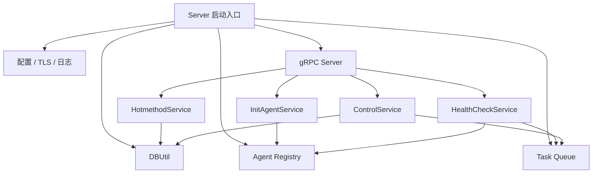
```mermaid
flowchart TD
    MAIN["Server 启动入口"] --> CFG["配置 / TLS / 日志"]
    MAIN --> DB["DBUtil"]
    MAIN --> REG["Agent Registry"]
    MAIN --> Q["Task Queue"]
    MAIN --> GRPC["gRPC Server"]

    GRPC --> INIT["InitAgentService"]
    GRPC --> HC["HealthCheckService"]
    GRPC --> HM["HotmethodService"]
    GRPC --> CTL["ControlService"]

    INIT --> REG
    HC --> REG
    HC --> Q
    CTL --> Q
    HM --> DB
    CTL --> DB
```

#### 5.2.1 InitAgentService

负责：

- 校验 Agent 身份；
- 创建或更新 Agent 信息；
- 返回 Server 端配置；
- 返回对象存储临时凭证或上传策略；
- 建立 Agent 与资源组/标签的关联；
- 记录注册事件。

#### 5.2.2 HealthCheckService

负责：

- 更新 Agent `last_seen`；
- 接收 Agent 版本、负载和运行任务；
- 计算 online/offline；
- 从目标队列取出下一项任务；
- 下发配置刷新、日志上传等轻量指令；
- 对账 Server 和 Agent 的任务视图。

#### 5.2.3 ControlService

这是 API 调用 Server 的控制入口：

- `CreateTask`：校验目标并入队；
- `StatAgent`：读取 Agent 与采样子进程的资源统计；
- `FetchData`：用于小型调试数据或兼容读取。

CreateTask 只表示任务进入调度域，不等待采样完成。

#### 5.2.4 HotmethodService

负责采样任务交互：

- 向 Agent 提供任务；
- 接收 `NotifyResult`；
- 验证 task_id、attempt_id 与目标；
- 更新采集状态；
- 保存 Artifact 元数据；
- 触发后续 AnalysisJob。

### 5.3 Server 核心数据结构

#### 5.3.1 Agent Registry

```text
agent_id / target
├── last_seen
├── version / protocol_version
├── capabilities
├── labels / group
├── current_tasks
├── resource_snapshot
└── channel/session metadata
```

注册表适合快速读写，但权威状态仍在数据库。Server 重启后可以重建。

#### 5.3.2 待下发队列

逻辑结构：

```text
target -> priority queue of TaskEntry

TaskEntry
├── task_id
├── attempt_id
├── created_at
├── deadline
├── priority
└── TaskDesc
```

同一 Agent 默认串行执行高开销采样器；低开销任务是否并行由 capability 元数据决定。

队列必须支持：

- FIFO + priority；
- 最大长度；
- deadline；
- 去重；
- 取消；
- 重启恢复；
- 指标暴露。

#### 5.3.3 运行中任务表

索引 task_id/attempt_id 到：

- Agent；
- Runner；
- 开始时间和 deadline；
- 当前阶段；
- 子进程 PID；
- 已上传 Artifact；
- 最后事件；
- 取消标志。

### 5.4 Server 启动流程

1. 解析配置与日志；
2. 读取 TLS 证书；
3. 初始化数据库连接；
4. 恢复 Agent 和待调度任务；
5. 初始化对象存储授权客户端；
6. 创建四类 gRPC service；
7. 注册健康检查；
8. 启动 Agent 离线扫描和任务超时扫描；
9. 监听 gRPC；
10. readiness 通过后接收流量。

readiness 应检查数据库和任务恢复是否完成，不能只检查端口。

### 5.5 Agent 内部组件

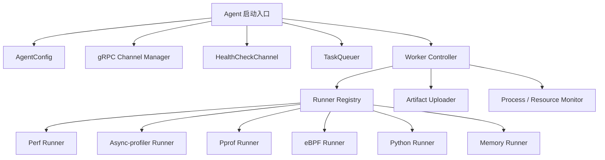
```mermaid
flowchart TD
    MAIN["Agent 启动入口"] --> CONFIG["AgentConfig"]
    MAIN --> CH["gRPC Channel Manager"]
    MAIN --> HC["HealthCheckChannel"]
    MAIN --> TQ["TaskQueuer"]
    MAIN --> WC["Worker Controller"]
    WC --> RUN["Runner Registry"]
    RUN --> PERF["Perf Runner"]
    RUN --> JAVA["Async-profiler Runner"]
    RUN --> PPROF["Pprof Runner"]
    RUN --> EBPF["eBPF Runner"]
    RUN --> PY["Python Runner"]
    RUN --> MEM["Memory Runner"]
    WC --> COS["Artifact Uploader"]
    WC --> PROC["Process / Resource Monitor"]
```

### 5.6 Agent 启动流程

1. 加载 Agent ID、Server 列表、TLS 和工作目录；
2. 初始化日志与信号处理；
3. 探测系统环境；
4. 检查随包工具和 Runner；
5. 连接首选 Server，失败时切换备用地址；
6. 完成 InitAgent；
7. 获取心跳周期与对象存储授权；
8. 启动心跳线程；
9. 启动任务队列和 worker；
10. 执行本地孤儿进程/临时目录恢复。

### 5.7 Agent 线程与队列

| 执行单元 | 职责 |
|---|---|
| Heartbeat Thread | 心跳、拉取任务、上报资源、接收配置 |
| Task Queue | 缓冲已接收任务、处理取消和优先级 |
| Worker Thread/Process | 执行 Runner 生命周期 |
| Upload Worker | 分片上传和重试 |
| Cleanup Worker | 清理超时目录、孤儿进程和过期凭证 |

任务队列需要 mutex/condition variable，避免忙轮询。高风险采样建议 fork 独立子进程，Agent 主进程只做监控和收割。

### 5.8 Runner 接口

推荐抽象：

```cpp
class Runner {
public:
  virtual ValidationResult Validate(const TaskContext&) = 0;
  virtual PrepareResult Prepare(TaskContext&) = 0;
  virtual StartResult Start(TaskContext&) = 0;
  virtual PollResult Poll(TaskContext&) = 0;
  virtual StopResult Stop(TaskContext&, StopReason) = 0;
  virtual CollectResult Collect(TaskContext&) = 0;
  virtual CleanupResult Cleanup(TaskContext&) = 0;
  virtual ~Runner() = default;
};
```

TaskContext 只暴露任务目录、受限配置、ProcessExecutor、Clock、ObjectStore 和 Logger，避免 Runner 任意访问 Agent 全局状态。

### 5.9 采样器能力

| 领域 | 工具/方式 | 原始数据 | 典型分析结果 |
|---|---|---|---|
| 通用 CPU | perf record/script | perf.data、折叠栈 | CPU 火焰图、TopN |
| Java CPU | async-profiler | collapsed/JFR | Java 火焰图 |
| Go CPU/Heap | pprof | protobuf profile | 调用图、heap |
| Python CPU | py-spy | raw/collapsed | Python 火焰图 |
| Python 内存 | memray | memray 文件 | 分配热点 |
| I/O | BCC/eBPF | block/file events | 延迟、吞吐、热点设备 |
| 虚拟内存 | page fault/memleak | fault/alloc/free events | 泄漏线索 |
| Java Heap | HPROF | heap dump | 支配树、泄漏路径 |
| gperftools | CPU/Heap profile | profile | 火焰图、分配统计 |
| BOLT | perf + binary metadata | profile/binary | 二进制优化报告 |
| Script | 固定模板脚本 | 受限输出 | 自定义诊断 |

每个 Runner 必须声明 capability、权限、支持平台、输入 Schema、默认/最大时长、最大并发、最大文件和分析 pipeline。

### 5.10 外部进程执行

安全执行规则：

- 使用 `fork/execve` 或等价 argv API；
- 不使用 shell 拼接用户参数；
- 工作目录按 task_id/attempt_id 隔离；
- 设置 rlimit、CPU affinity 和环境白名单；
- 管理整个进程组；
- 捕获退出码和终止信号；
- stdout/stderr 有长度上限；
- 超时分两阶段终止；
- 工具路径和 hash 固定；
- 清理只作用于已记录 PID 和任务目录。

### 5.11 容器目标解析

容器采样比主机 PID 多一层映射：

1. 解析容器 ID；
2. 查询容器 runtime；
3. 获得宿主 PID；
4. 校验容器和 PID 归属；
5. 进入目标 pid/mount/net namespace；
6. 解析容器内路径与宿主路径；
7. 执行采样；
8. 退出 namespace 并清理。

容器信息必须在任务开始前重新确认，避免 PID 重用。

### 5.12 对象存储

Agent 只获得任务前缀的短期上传权限。权限范围示例：

```text
允许：PutObject tenant/T/tasks/123/attempts/1/*
拒绝：ListBucket、GetObject 其他任务、DeleteObject
有效期：任务最大时长 + 上传宽限
```

长期 Secret 不下发到 Agent。上传完成后记录 ETag、size、hash 和 object key。

### 5.13 核心采集模块验收

- [ ] Agent 注册和心跳稳定；
- [ ] 离线状态在阈值内更新；
- [ ] 目标队列支持 deadline、去重和取消；
- [ ] Server 重启后 queued 任务可恢复；
- [ ] Runner 参数不经过 shell；
- [ ] 子进程超时可被完整清理；
- [ ] Artifact 上传后 hash 一致；
- [ ] NotifyResult 重放不会重复写记录；
- [ ] Agent 仅持有最小对象权限；
- [ ] 采样失败能定位到稳定错误码。

**实现定位：** `drop/server/main.cpp`、`drop/server/HealthCheckService.cpp`、`drop/server/ControlService.cpp`、`drop/agent/HotmethodChannel.cpp`、`drop/common/Process.cpp`。

---

## 6. API 编排模块

API 模块将浏览器中的用户意图转换为受约束的任务，并协调数据库、drop_server、对象存储和分析结果。

### 6.1 模块输入输出

| 输入 | 处理 | 输出 |
|---|---|---|
| 用户身份/Cookie | 鉴权、用户归一 | UserContext |
| 创建任务 JSON/Form | Schema、权限、配额、领域转换 | Task + TaskDesc |
| 查询参数 | 过滤、分页、资源范围 | Task/Agent 列表 |
| Artifact 请求 | 权限、保留期校验 | 短期预签名 URL |
| SSE 请求 | 权限、事件游标 | TaskEvent/AI 流 |

### 6.2 内部结构

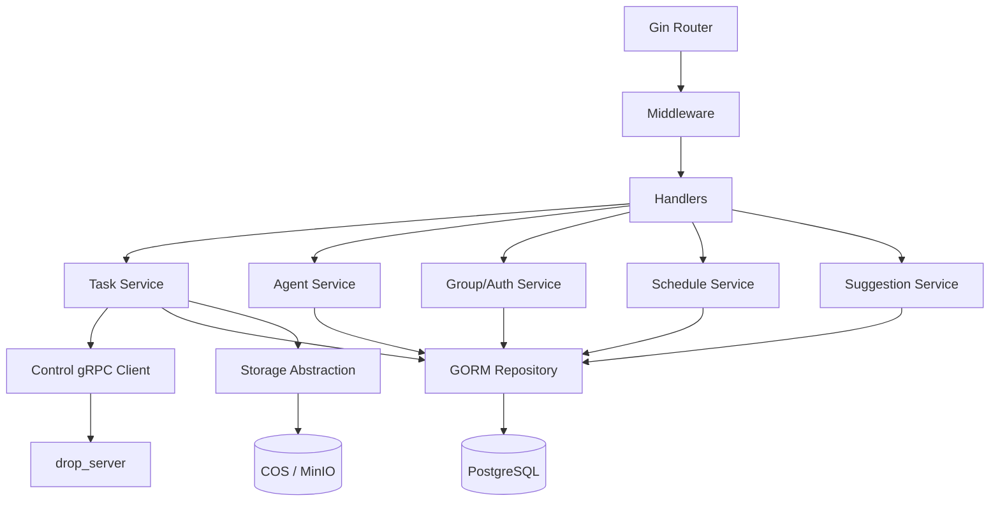
```mermaid
flowchart TD
    HTTP["Gin Router"] --> MW["Middleware"]
    MW --> H["Handlers"]
    H --> TS["Task Service"]
    H --> AS["Agent Service"]
    H --> GS["Group/Auth Service"]
    H --> SS["Schedule Service"]
    H --> SG["Suggestion Service"]

    TS --> GRPC["Control gRPC Client"]
    TS --> REPO["GORM Repository"]
    AS --> REPO
    GS --> REPO
    SS --> REPO
    SG --> REPO

    TS --> ST["Storage Abstraction"]
    GRPC --> DS["drop_server"]
    REPO --> DB[("PostgreSQL")]
    ST --> OS[("COS / MinIO")]
```

### 6.3 启动流程

1. 加载配置并做范围校验；
2. 初始化结构化日志；
3. 初始化身份验证；
4. 连接数据库并检查 schema version；
5. 创建 gRPC Control Client；
6. 初始化对象存储；
7. 初始化 Cron/调度 leader；
8. 注册 middleware；
9. 注册主站、管理和 OpenAPI 路由；
10. 启动 HTTP；
11. readiness 检查 DB、gRPC 和存储。

数据库迁移建议由独立 migration job 执行，API 启动只检查版本。

### 6.4 Middleware

推荐顺序：

```text
RequestID
→ Recovery
→ AccessLog
→ TrustedProxy
→ CORS
→ Authentication
→ RateLimit
→ ResourceScope
→ Handler
→ ErrorMapper
```

Middleware 只处理横切能力，业务权限仍在 service 层检查。

### 6.5 创建任务 Handler

Handler 的职责：

- 解析 HTTP；
- 限制 body 大小；
- 绑定 DTO；
- 调用 TaskService；
- 映射领域错误；
- 返回统一响应。

Handler 不应直接操作 GORM 或拼装复杂 Proto。

### 6.6 TaskService

TaskService 完成：

1. 查询 TaskKind 定义；
2. 校验目标 Agent；
3. 校验用户资源范围；
4. 校验 JSON Schema；
5. 计算资源预算；
6. 处理幂等键；
7. 构造 Task/Attempt/Event/Outbox；
8. 生成 TaskDesc；
9. 分发到 drop_server；
10. 更新 dispatch 状态。

推荐返回领域结果：

```go
type CreateTaskResult struct {
    TaskID         int64
    CollectionState string
    DispatchState   string
    Replayed        bool
}
```

### 6.7 REST API 分组

| 资源 | 典型接口 | 功能 |
|---|---|---|
| Auth/User | `/api/v1/auth/*`、`/users` | 登录检查、当前用户 |
| Agents | `/api/v1/agents` | 列表、标签、资源统计 |
| Tasks | `/api/v1/tasks` | 创建、列表、分页、删除、重试 |
| Task Result | `/api/v1/tasks/:id` | 状态、日志、结果、子任务 |
| Artifacts | `/api/v1/tasks/:id/artifacts` | 列表、上传/下载授权 |
| Groups | `/api/v1/groups` | 用户组、成员、Agent 授权 |
| Schedules | `/api/v1/schedules` | 创建、启停、历史 |
| Suggestions | `/api/v1/tasks/:id/suggestions` | 规则/AI 建议和反馈 |
| Admin | `/admin/api/v1/*` | 规则、全局统计、重分析 |
| OpenAPI | `/openapi/v1/*` | 外部系统集成 |

### 6.8 统一响应和错误

```json
{
  "request_id": "req-...",
  "data": {},
  "error": null
}
```

失败：

```json
{
  "request_id": "req-...",
  "data": null,
  "error": {
    "code": "AGENT_OFFLINE",
    "message": "目标 Agent 当前离线",
    "retryable": true,
    "details": {}
  }
}
```

内部堆栈、DSN、object key 和凭据不进入用户响应。

### 6.9 鉴权与资源范围

授权对象包括：

- Agent；
- Task；
- Artifact；
- Group；
- Schedule；
- 管理规则。

最小角色：

| 角色 | 权限 |
|---|---|
| Viewer | 查看授权 Agent、任务和结果 |
| Operator | 创建、取消和重试任务 |
| GroupAdmin | 管理组成员和 Agent |
| PlatformAdmin | 全局配置、规则和审计 |

Task 的可见性不能只依赖 creator；还要考虑所属组、共享策略和管理员范围。

### 6.10 Artifact 访问

下载流程：

1. 用户请求 Artifact；
2. API 查询 Task 和 Artifact；
3. 校验用户范围；
4. 检查 Artifact 状态和保留期；
5. 生成 1～5 分钟预签名 URL；
6. 记录下载审计；
7. 返回 URL，不代理大文件。

上传 URL 仅用于受控文件分析场景，并限制前缀、大小、Content-Type 和有效期。

### 6.11 定时任务

ScheduleService 负责模板、Cron、时区、启停和历史。触发器只创建普通 Task，不绕过普通权限与校验。

多 API 实例部署时使用：

- 数据库 advisory lock；
- 唯一约束；
- 或独立 scheduler leader。

### 6.12 API 模块验收

- [ ] CreateTask 有幂等键；
- [ ] DTO 与 TaskKind Schema 一致；
- [ ] Agent/Task/Artifact 均执行资源权限检查；
- [ ] gRPC 失败进入可见状态；
- [ ] 分页查询有稳定排序和索引；
- [ ] 预签名 URL 短期有效；
- [ ] 计划任务不会重复触发；
- [ ] 错误响应不泄露内部信息；
- [ ] readiness 与 liveness 分离；
- [ ] request_id 可贯穿 gRPC 和日志。

**实现定位：** `apiserver/main.go`、`apiserver/server/server.go`、`apiserver/server/task.go`、`apiserver/model/dbModel.go`、`apiserver/pkg/storage/storage.go`。

---

## 7. 离线分析模块

Analyzer 是常驻后台进程。它从数据库领取待分析任务，通过对象存储获取原始文件，再将结果写回数据库和对象存储。

### 7.1 模块输入输出

| 输入 | 输出 |
|---|---|
| TaskKind、Task 参数 | AnalysisJob 状态 |
| RAW Artifact manifest | RESULT Artifact manifest |
| perf/pprof/hprof/eBPF 等文件 | 火焰图、TopN、调用图 |
| 分析规则 | 诊断建议 |
| worker 配置 | 指标、日志、租约 |

### 7.2 Worker 主循环

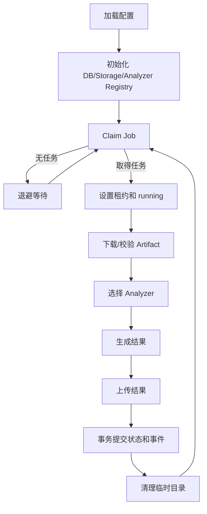
```mermaid
flowchart TD
    L["加载配置"] --> P["初始化 DB/Storage/Analyzer Registry"]
    P --> C["Claim Job"]
    C -->|无任务| W["退避等待"]
    W --> C
    C -->|取得任务| R["设置租约和 running"]
    R --> D["下载/校验 Artifact"]
    D --> A["选择 Analyzer"]
    A --> G["生成结果"]
    G --> U["上传结果"]
    U --> T["事务提交状态和事件"]
    T --> X["清理临时目录"]
    X --> C
```

Worker 池可为短任务保留容量，避免一个大型 HPROF 分析占满全部进程。

### 7.3 领取与租约

推荐 SQL：

```sql
UPDATE analysis_jobs
SET status = 'running',
    lease_owner = :worker_id,
    lease_expires_at = now() + interval '5 minutes',
    attempt = attempt + 1
WHERE id = (
    SELECT id
    FROM analysis_jobs
    WHERE status IN ('pending', 'retry')
       OR (status = 'running' AND lease_expires_at < now())
    ORDER BY priority DESC, created_at
    FOR UPDATE SKIP LOCKED
    LIMIT 1
)
RETURNING *;
```

续租间隔必须小于 lease TTL。处理时间不可预估的任务需要持续 heartbeat。

### 7.4 Analyzer Registry

```python
ANALYZERS = {
    "PERF_CPU": PerfFlamegraphAnalyzer,
    "JAVA_CPU": AsyncProfilerAnalyzer,
    "GO_CPU": PprofCPUAnalyzer,
    "GO_HEAP": PprofHeapAnalyzer,
    "JAVA_HEAP": JavaHeapAnalyzer,
    "PYTHON_MEMORY": MemrayAnalyzer,
    "IO_TRACE": BIOTraceAnalyzer,
}
```

每个 Analyzer 声明：

- 支持的 input format/version；
- 最大输入大小；
- 预估内存和临时磁盘；
- timeout；
- 输出 Artifact；
- 是否可重试；
- analyzer version。

### 7.5 统一分析接口

```python
class Analyzer:
    def validate(self, context, artifacts): ...
    def prepare(self, context): ...
    def analyze(self, context): ...
    def build_manifest(self, context): ...
    def cleanup(self, context): ...
```

所有外部工具调用使用 argv 数组和超时，不使用 shell 拼接路径。

### 7.6 perf 火焰图流水线

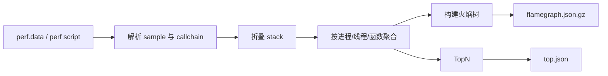
```mermaid
flowchart LR
    RAW["perf.data / perf script"] --> PARSE["解析 sample 与 callchain"]
    PARSE --> FOLD["折叠 stack"]
    FOLD --> AGG["按进程/线程/函数聚合"]
    AGG --> TREE["构建火焰树"]
    AGG --> TOP["TopN"]
    TREE --> GZIP["flamegraph.json.gz"]
    TOP --> JSON["top.json"]
```

火焰树节点建议：

```json
{
  "name": "function_name",
  "value": 123,
  "self": 17,
  "module": "libexample.so",
  "children": []
}
```

聚合必须保存总 sample 数、丢失 sample 数、过滤规则、线程和时间范围。

### 7.7 pprof 流水线

pprof Analyzer：

1. 解码 profile protobuf；
2. 展开 string/function/location/sample 表；
3. 根据 sample_type 选择 CPU、alloc、inuse；
4. 应用 label/filter；
5. 重建调用栈；
6. 输出火焰图和 TopN；
7. 保存 profile 元数据。

### 7.8 Java Heap 流水线

Java Heap 分析是高内存任务：

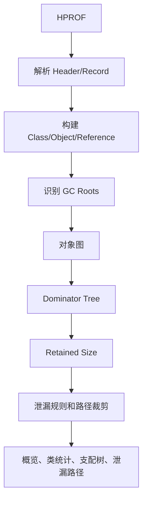
```mermaid
flowchart TD
    H["HPROF"] --> HEADER["解析 Header/Record"]
    HEADER --> OBJ["构建 Class/Object/Reference"]
    OBJ --> ROOT["识别 GC Roots"]
    ROOT --> GRAPH["对象图"]
    GRAPH --> DOM["Dominator Tree"]
    DOM --> RET["Retained Size"]
    RET --> LEAK["泄漏规则和路径裁剪"]
    LEAK --> REPORT["概览、类统计、支配树、泄漏路径"]
```

需要：

- 输入大小上限；
- 独立进程；
- 内存 limit；
- 进度事件；
- 中间文件；
- 超时和可恢复边界。

### 7.9 I/O 与资源分析

I/O Analyzer 处理 block/file 事件，输出：

- 读写吞吐；
- P50/P95/P99 延迟；
- 设备、进程、文件热点；
- 队列深度；
- 时间序列。

资源 Analyzer 处理 Agent/Runner 的 CPU、内存、上下文切换、I/O、网络和 dmesg，用于判断采样行为本身的开销。

### 7.10 建议生成

规则引擎输入结构化指标，不直接解析 HTML：

```text
if top_function.ratio > threshold
and module matches rule
and sample_count >= minimum
then suggestion(code, severity, evidence, action)
```

建议包含证据、阈值、规则版本、可操作动作和置信度。

### 7.11 临时目录与资源隔离

- 每个 job 独立目录；
- 限制总下载和解压大小；
- 文件路径 resolve 后必须仍位于 job 目录；
- 大任务独立进程；
- 临时盘使用量指标；
- 完成和失败都清理；
- 崩溃后由 scavenger 清理过期目录。

### 7.12 分析模块验收

- [ ] 多 worker 不会领取同一有效租约；
- [ ] worker 崩溃后任务可恢复；
- [ ] 迟到提交不会覆盖新 owner；
- [ ] hash/格式/大小均校验；
- [ ] Analyzer 版本进入 manifest；
- [ ] 大文件有内存和磁盘上限；
- [ ] 损坏输入不会无限重试；
- [ ] 结果上传和 success 状态保持一致；
- [ ] 黄金样本输出稳定；
- [ ] 外部命令不使用 shell 拼接。

**实现定位：** `analysis/hotmethod_analyzer.py`、`analysis/data_parser/collapsed_data_parser.py`、`analysis/flamegraph.py`、`analysis/storage.py`、`analysis/java_heap_analyzer/main.go`。

---

## 8. Web 展示模块

Web 模块负责把复杂任务生命周期转化为可理解的操作和可视化。

### 8.1 模块输入输出

| 输入 | 处理 | 输出 |
|---|---|---|
| 运行时 config | 初始化 API Host、环境和公开参数 | 应用配置 |
| Agent/Task API | Redux/页面状态 | 列表和详情 |
| TaskEvent/SSE | 状态归并 | 实时进度 |
| gzip flamegraph JSON | 解压、聚合、布局 | 交互火焰图 |
| Suggestion SSE | Markdown 清洗、分段渲染 | 建议卡片 |

### 8.2 应用结构

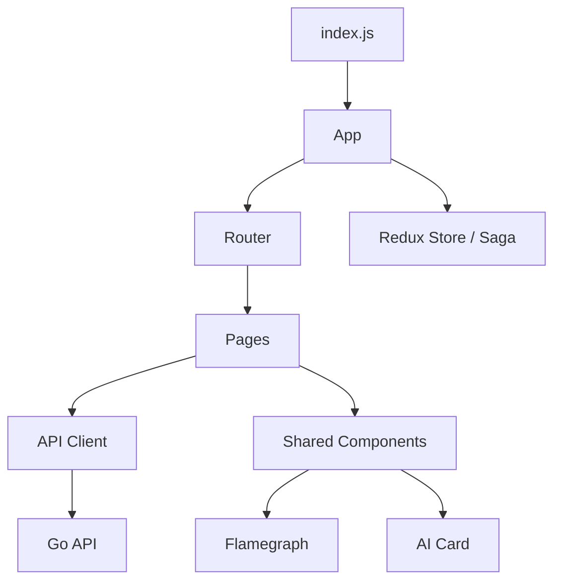
```mermaid
flowchart TD
    INDEX["index.js"] --> APP["App"]
    APP --> ROUTER["Router"]
    APP --> STORE["Redux Store / Saga"]
    ROUTER --> PAGES["Pages"]
    PAGES --> API["API Client"]
    PAGES --> COMP["Shared Components"]
    API --> BACKEND["Go API"]
    COMP --> FG["Flamegraph"]
    COMP --> AI["AI Card"]
```

### 8.3 路由与页面

| 页面 | 功能 |
|---|---|
| 首页 | Agent/任务概览、快速入口 |
| Agent 列表 | 在线状态、版本、标签、资源 |
| 任务列表 | 分页、筛选、状态、批量操作 |
| 创建任务 | 目标、TaskKind、参数和预算 |
| 任务详情 | 事件时间线、日志、Artifact、结果 |
| 通用/Java/时序/I/O 页面 | 领域化表单和结果 |
| 用户组 | 成员和 Agent 授权 |
| 计划任务 | 模板、Cron、执行历史 |
| 文件分析 | 上传已有 profile 后分析 |
| 任务对比 | 火焰图、TopN 或指标变化 |

### 8.4 API Client

统一客户端负责：

- base URL；
- credentials；
- request_id；
- 身份 header/cookie；
- 超时；
- 重复请求取消；
- 错误转换；
- 二进制响应；
- 401/403 处理。

组件不直接拼 URL 或自行复制鉴权逻辑。

### 8.5 创建任务表单

表单根据 TaskKind 元数据生成：

```text
TaskKind metadata
├── display_name
├── parameter_schema
├── defaults
├── min/max
├── help
├── capability requirements
└── permission requirements
```

选择 Agent 后，前端只显示该 Agent 支持的 TaskKind。前端校验用于用户体验，API 仍执行完整校验。

### 8.6 任务状态展示

推荐用阶段时间线：

```text
已创建 → 等待下发 → Agent 已接收 → 采集中
→ 原始数据已保存 → 分析中 → 结果可用
```

失败显示：

- 失败阶段；
- 错误码和简短说明；
- 是否可重试；
- 建议动作；
- request_id/task_id；
- 可查看的 partial result。

### 8.7 轮询与事件

优先使用 SSE。无法使用时采用退避轮询：

```javascript
useEffect(() => {
  if (isTerminal(task)) return undefined;
  const timer = setInterval(refresh, interval);
  return () => clearInterval(timer);
}, [task.id, task.status, task.analysisStatus, interval]);
```

规则：

- 页面隐藏时降低频率；
- 同一请求未完成时不再发送；
- 连续失败指数退避；
- terminal 自动停止；
- 组件卸载清理 timer/AbortController；
- SSE 使用 event ID 断点恢复。

### 8.8 火焰图组件

处理链：


```mermaid
flowchart LR
    URL["预签名 URL"] --> DL["下载 ArrayBuffer"]
    DL --> GZ["pako 解压"]
    GZ --> JSON["解析 JSON"]
    JSON --> WK["Web Worker 聚合/裁剪"]
    WK --> D3["D3 布局"]
    D3 --> UI["缩放、搜索、聚焦、Tooltip"]
```

交互能力：

- 搜索和高亮；
- 隐藏系统栈；
- 聚焦子树；
- callers/callees；
- self/total 切换；
- 线程筛选；
- 排序；
- 颜色方案；
- TopN 联动；
- 两任务对比。

保护措施：

- 最大下载大小；
- 最大节点数和深度；
- 解析错误边界；
- Web Worker；
- 渐进渲染或主动采样；
- 不执行节点中的 HTML。

### 8.9 AI/规则建议组件

SSE 事件可分为：

```text
status
reasoning_summary
suggestion
evidence
done
error
```

Markdown 使用 DOMPurify 清洗；代码高亮不能绕过清洗；链接增加安全属性；模型输出不能成为可信 HTML。

### 8.10 运行时配置

浏览器可见配置只包含：

- API public URL；
- 环境名；
- 公开的 Agent 接入说明；
- 功能开关；
- 帮助链接；
- 错误码文案。

对象存储 Secret、数据库地址口令和 TLS 私钥不能进入 `config.js` 或 bundle。

### 8.11 Web 模块验收

- [ ] 只展示用户有权访问的 Agent/Task；
- [ ] 表单由 TaskKind 元数据驱动；
- [ ] 重复点击不会创建多个任务；
- [ ] 状态时间线覆盖全部阶段；
- [ ] 终态停止轮询；
- [ ] SSE 断线可以恢复；
- [ ] 预签名 URL 过期可以刷新；
- [ ] 大火焰图不会永久阻塞主线程；
- [ ] Markdown/HTML 均经过清洗；
- [ ] 错误页面包含可追踪 ID。

**实现定位：** `web_frontend/src/index.js`、`web_frontend/src/router/index.js`、`web_frontend/src/api/index.js`、`web_frontend/src/pages/taskResult/index.js`、`web_frontend/src/components/flamegraph/flamegraph.js`。

---

## 9. 数据库与对象存储

### 9.1 数据关系

```mermaid
erDiagram
    USERS ||--o{ TASKS : creates
    GROUPS ||--o{ GROUP_MEMBERS : contains
    GROUPS ||--o{ GROUP_AGENTS : authorizes
    AGENTS ||--o{ TASKS : targets
    TASKS ||--o{ TASK_ATTEMPTS : executes
    TASKS ||--o{ TASK_EVENTS : emits
    TASKS ||--o{ ARTIFACTS : produces
    TASKS ||--o{ ANALYSIS_JOBS : analyzes
    ANALYSIS_JOBS ||--o{ ARTIFACTS : generates
    SCHEDULES ||--o{ TASKS : triggers
    TASKS ||--o{ SUGGESTIONS : recommends
    TASKS ||--o{ TASKS : parent_child
```

### 9.2 核心表

| 表 | 关键字段 | 写入方 | 读取方 |
|---|---|---|---|
| `agents` | identity、platform、capabilities、last_seen、status | Server | API、Server |
| `tasks` | kind、target、params、双状态、creator、parent | API、Server、Analyzer | 全部控制面 |
| `task_attempts` | attempt、runner、时间、错误、资源 | Server/Agent 上报 | API、运维 |
| `task_events` | sequence、type、source、payload | API/Server/Analyzer | Web、审计 |
| `artifacts` | kind、object_key、size、sha256、status | Server/Analyzer | API、Analyzer |
| `analysis_jobs` | pipeline、lease、attempt、status | Server/Analyzer | Analyzer、API |
| `users` | identity、display_name、status | Auth/API | API |
| `groups` | owner、name、policy | API | API |
| `group_members` | group_id、user_id、role | API | API |
| `group_agents` | group_id、agent_id | API | API |
| `schedules` | cron、timezone、template、enabled | API/Scheduler | Scheduler、Web |
| `schedule_records` | scheduled_at、task_id、status | Scheduler | Web |
| `suggestions` | engine、version、evidence、content、feedback | Analyzer/API | Web |
| `outbox` | aggregate、event、payload、published_at | API/Server | Dispatcher |

### 9.3 Task 表

```sql
CREATE TABLE tasks (
    id                  BIGSERIAL PRIMARY KEY,
    kind                INTEGER NOT NULL,
    target_agent_id     TEXT NOT NULL,
    params              JSONB NOT NULL,
    collection_status   SMALLINT NOT NULL,
    analysis_status     SMALLINT NOT NULL,
    creator_id          TEXT NOT NULL,
    request_id          TEXT NOT NULL,
    idempotency_key     TEXT,
    parent_task_id      BIGINT REFERENCES tasks(id),
    collection_deadline TIMESTAMPTZ,
    error_code          TEXT,
    error_message       TEXT,
    version             BIGINT NOT NULL DEFAULT 0,
    created_at          TIMESTAMPTZ NOT NULL DEFAULT now(),
    updated_at          TIMESTAMPTZ NOT NULL DEFAULT now(),
    UNIQUE (creator_id, idempotency_key)
);
```

`version` 用于乐观锁。状态更新示例：

```sql
UPDATE tasks
SET collection_status = :next_status,
    version = version + 1,
    updated_at = now()
WHERE id = :task_id
  AND version = :expected_version
  AND collection_status = :expected_status;
```

更新行数为 0 表示状态已经被其他事件推进，调用方应重新读取而不是强制覆盖。

### 9.4 索引

至少需要：

```sql
CREATE INDEX idx_tasks_creator_created
    ON tasks (creator_id, created_at DESC);

CREATE INDEX idx_tasks_target_status
    ON tasks (target_agent_id, collection_status, created_at);

CREATE INDEX idx_analysis_jobs_claim
    ON analysis_jobs (status, priority DESC, created_at);

CREATE INDEX idx_task_events_task_sequence
    ON task_events (task_id, sequence);

CREATE INDEX idx_artifacts_task_kind
    ON artifacts (task_id, kind);
```

任务列表的过滤字段和排序字段必须有匹配索引。对 JSONB 参数的检索应使用有明确场景的表达式索引，避免无边界 GIN。

### 9.5 事务边界

需要原子提交的组合：

- Task + 初始 TaskEvent + Outbox；
- TaskAttempt 状态 + TaskEvent；
- Artifact 元数据 + collection success + AnalysisJob；
- Analysis result Artifact + analysis success + TaskEvent；
- ScheduleRecord + Task；
- Suggestion + 生成完成事件。

数据库事务不能覆盖对象存储上传，所以采用：

1. 对象先上传到 temporary key；
2. 校验完成；
3. 数据库事务写 Artifact 为 ready；
4. 通过 copy/rename 或 lifecycle 形成正式 key；
5. 对账器处理悬空对象与缺失对象。

### 9.6 Transactional Outbox

```mermaid
sequenceDiagram
    participant S as Service
    participant DB as PostgreSQL
    participant D as Dispatcher
    participant X as Downstream

    S->>DB: Transaction: Domain record + Outbox
    DB-->>S: Commit
    D->>DB: Claim unpublished outbox
    D->>X: Publish/Call
    X-->>D: Ack
    D->>DB: Mark published
```

下游调用必须幂等，因为 Dispatcher 可能在 Ack 后、mark published 前崩溃。

### 9.7 对象分类与生命周期

| 前缀 | 内容 | 建议保留 |
|---|---|---|
| `raw/` | 原始采样文件 | 7～30 天 |
| `intermediate/` | 折叠栈、索引、中间图 | 1～7 天 |
| `result/` | 火焰图、TopN、报告 | 30～90 天 |
| `logs/` | 受限任务日志 | 7～30 天 |
| `manifest/` | 制品清单 | 与任务元数据一致 |

生命周期策略由对象存储执行，数据库对账任务负责：

- 已过期对象的元数据；
- 无数据库记录的孤儿对象；
- ready Artifact 对应对象缺失；
- multipart upload 未完成；
- hash/size 不一致。

### 9.8 数据隐私

采样文件可能包含：

- 函数和类名；
- 路径和命令行；
- 容器/主机信息；
- Java heap 中的业务对象；
- 脚本输出。

需要按高敏诊断数据管理：租户隔离、服务端加密、短期 URL、访问审计、最小保留和可验证删除。

---

## 10. 配置与部署

### 10.1 进程布局

| 进程 | 推荐部署 | 扩缩容方式 |
|---|---|---|
| PostgreSQL | 托管数据库或高可用集群 | 主从/连接池 |
| 对象存储 | COS/MinIO 集群 | 存储服务自身扩展 |
| drop_server | Linux 容器/VM | 按 Agent 分片或持久化队列后多副本 |
| API | 无状态容器 | 水平扩容 |
| Analyzer | Worker 容器 | 按 pending 数水平扩容 |
| Web | Nginx/CDN | 静态扩展 |
| Agent | 每台目标机的 systemd/DaemonSet | 随节点部署 |

### 10.2 启动顺序

1. PostgreSQL；
2. 对象存储与 bucket；
3. 数据库 migration；
4. drop_server；
5. API；
6. Analyzer；
7. Web；
8. Agent；
9. smoke test。

### 10.3 健康检查

| 模块 | Liveness | Readiness |
|---|---|---|
| drop_server | 事件循环存活 | DB 可用、队列恢复、gRPC 可服务 |
| API | HTTP 进程存活 | DB、gRPC、Storage 可用 |
| Analyzer | worker 主循环存活 | DB、Storage、临时目录可用 |
| Web | Nginx 存活 | index/config 可读取 |
| Agent | 主进程存活 | 注册成功、Runner 自检完成 |

### 10.4 配置优先级

```text
命令行参数
  > 环境变量
    > 配置文件
      > 安全默认值
```

所有模块启动时输出脱敏后的有效配置和 config hash。

### 10.5 配置域

| 域 | 关键配置 |
|---|---|
| Database | Secret 引用、连接池、TLS、statement timeout |
| gRPC | address、mTLS、message limit、keepalive、deadline |
| HTTP | listen、public URL、CORS allowlist、trusted proxies |
| Storage | endpoint、region、bucket、path style、Secret 引用 |
| Agent | Server 列表、心跳、工作目录、并发、Runner allowlist |
| Analyzer | worker ID、并发、lease、timeout、临时盘配额 |
| Web | public API URL、功能开关、帮助链接 |
| Observability | log level、metrics、OTLP、service name |

### 10.6 Compose 级联调拓扑

```yaml
services:
  postgres:
    image: postgres:<pinned-version>
    healthcheck:
      test: ["CMD-SHELL", "pg_isready -U drop -d drop"]
    volumes:
      - pg_data:/var/lib/postgresql/data
    secrets:
      - database_password

  minio:
    image: minio/minio:<pinned-version>
    command: server /data --console-address ":9001"
    volumes:
      - object_data:/data
    secrets:
      - object_storage_credentials

  migration:
    image: drop-api:<build-id>
    command: ["drop-api", "migrate", "up"]
    depends_on:
      postgres:
        condition: service_healthy

  drop-server:
    image: drop-server:<build-id>
    depends_on:
      migration:
        condition: service_completed_successfully

  api:
    image: drop-api:<build-id>
    depends_on:
      migration:
        condition: service_completed_successfully
      drop-server:
        condition: service_started

  analyzer:
    image: drop-analyzer:<build-id>
    depends_on:
      migration:
        condition: service_completed_successfully

  web:
    image: drop-web:<build-id>
    ports: ["8080:80"]

volumes:
  pg_data:
  object_data:

secrets:
  database_password:
    file: ./secrets/database_password
  object_storage_credentials:
    file: ./secrets/object_storage_credentials
```

真实采样需要 Linux 内核能力。业务联调可以使用 fake-agent 上传固定小样本；内核采样验收必须在受控 Linux 节点进行。

### 10.7 多副本注意事项

#### API

API 可无状态扩容，但：

- Cron 需要 leader/lock；
- SSE 需要共享事件源或粘性连接；
- rate limit 需要共享存储；
- gRPC 连接池在每个实例独立维护。

#### drop_server

如果任务队列在进程内，不能直接无状态多副本。可选方案：

1. 按 Agent ID 一致性分片；
2. 将队列放入 PostgreSQL/Redis；
3. Agent 心跳通过路由层固定到 owner Server；
4. 由 leader 统一调度，其他副本热备。

#### Analyzer

使用 `FOR UPDATE SKIP LOCKED` 和 lease 后可以水平扩容。大型任务和短任务应使用不同队列或资源池。

### 10.8 Kubernetes

- API、Server、Analyzer、Web 独立 Deployment；
- Agent 在 K8s 节点上可用 DaemonSet；
- 普通主机 Agent 用 systemd；
- ConfigMap 保存公开配置；
- Secret 保存证书、DSN 和对象凭据；
- Analyzer 设置 ephemeral-storage request/limit；
- 高内存 Java Heap 使用专用队列/节点池；
- Agent 不默认使用整个容器 `privileged`；
- PodDisruptionBudget 与任务幂等同时配置；
- 滚动升级期间保持 N/N-1 协议兼容。

### 10.9 版本协商

Agent 注册上报：

- 产品版本；
- 协议版本；
- build commit；
- OS/架构/内核；
- Runner/tool 版本；
- capability；
- 证书到期时间。

Server 返回最低兼容版本、心跳周期、配置版本和升级提示。主协议版本不兼容时拒绝任务执行。

---

## 11. 安全与可观测性

### 11.1 安全边界

Drop 具备执行系统采样、观察进程和读取诊断文件的能力。主要威胁包括：

- 未授权用户对生产进程采样；
- 用户参数进入命令导致注入；
- 高权限 Agent 被利用；
- HPROF/profile 泄露业务数据；
- 对象 URL 或 Secret 泄露；
- 超大输入耗尽 Analyzer/Web 资源；
- Server 被滥用向大量 Agent 下发任务。

### 11.2 身份与授权链

```mermaid
flowchart LR
    U["用户 OIDC 身份"] --> A["API UserContext"]
    A --> RBAC["角色 + 资源组"]
    RBAC --> T["创建/查看 Task"]
    T --> ART["访问 Artifact"]

    AG["Agent mTLS 身份"] --> S["Server Agent Registry"]
    S --> CAP["Capability / Policy"]
    CAP --> RUN["允许执行 Runner"]
```

用户身份和 Agent 身份是两条独立信任链。

### 11.3 Agent 最小权限

- Agent 主进程使用专用用户；
- Runner 声明所需 Linux capability；
- 优先使用 `CAP_PERFMON`、`CAP_BPF` 等最小权限；
- root helper 独立且接口极小；
- Script Runner 使用模板白名单；
- namespace 操作限制目标；
- 工作目录权限 `0700`；
- 子进程设置 CPU、内存、文件、进程数和时间上限；
- 使用 seccomp/AppArmor/SELinux；
- Agent 配置和工具目录不可由普通用户写入。

### 11.4 命令与路径安全

- argv 数组，不拼 shell；
- PID 必须为正整数并校验归属；
- 容器 ID 使用格式和 runtime 校验；
- `realpath` 后必须仍在任务目录；
- 禁止 `..`、符号链接逃逸和任意绝对路径；
- 可执行文件来自固定目录；
- 环境变量白名单；
- 解压限制文件数、深度和总大小；
- 日志和错误消息脱敏。

### 11.5 Secret 管理

- 证书、DSN、对象凭据通过 Secret 文件或 workload identity；
- 配置只引用 Secret，不包含值；
- 日志不输出 Secret；
- 浏览器不接触长期凭据；
- Agent 只获得任务前缀临时权限；
- 证书和凭据定期轮换；
- 轮换过程支持双证书窗口。

### 11.6 结构化日志

统一字段：

```json
{
  "time": "2026-07-15T10:00:00Z",
  "level": "INFO",
  "service": "drop-agent",
  "version": "1.0.0",
  "request_id": "req-...",
  "task_id": "123",
  "attempt_id": "1",
  "agent_id": "agent-123",
  "stage": "artifact_upload",
  "duration_ms": 1200,
  "error_code": null,
  "message": "artifact uploaded"
}
```

禁止记录：

- Cookie/Token；
- 数据库 DSN；
- Secret；
- 私钥/证书正文；
- 完整用户 argv；
- 大段采样数据；
- 未脱敏 AI 输入。

### 11.7 指标

**Agent/Server**

```text
drop_agents_online
drop_agent_heartbeat_age_seconds
drop_task_queue_depth
drop_tasks_dispatched_total
drop_runner_duration_seconds
drop_runner_failures_total{kind,code}
drop_artifact_upload_bytes_total
```

**API**

```text
http_requests_total
http_request_duration_seconds
grpc_client_requests_total
db_pool_wait_seconds
task_create_total{result}
idempotency_replay_total
artifact_presign_total{result}
```

**Analyzer**

```text
analysis_jobs{status,pipeline}
analysis_claim_latency_seconds
analysis_duration_seconds{pipeline}
analysis_failures_total{pipeline,code}
analysis_lease_expired_total
analysis_temp_disk_bytes
```

### 11.8 Trace

request_id/task_id 是基础关联标识；OpenTelemetry trace 可覆盖：

```text
Web request
  └─ API CreateTask
      ├─ DB transaction
      ├─ gRPC CreateTask
      └─ Outbox dispatch

Agent execution（通过 task_id link）
  ├─ Runner start
  ├─ Artifact upload
  └─ NotifyResult

Analyzer（通过 task_id link）
  ├─ Artifact download
  ├─ Parse/Aggregate
  └─ Result upload
```

异步流程使用 span link，不强行维持一个数小时不结束的父 span。

### 11.9 告警

- Agent 在线数异常下降；
- 心跳 P95 延迟过高；
- queued 最老任务超过 SLA；
- running 超过 deadline；
- Artifact 上传失败率上升；
- analysis pending 堆积；
- lease 过期率上升；
- DB 连接池耗尽；
- 对象存储 5xx；
- Analyzer 临时盘 > 80%；
- 证书 30/14/7 天到期；
- 单用户/Agent 创建速率异常；
- Web 火焰图解析失败率上升。

### 11.10 审计

审计事件包括：

- 登录和身份切换；
- 创建、取消、重试任务；
- 查看/下载 Artifact；
- 分享任务；
- 修改组权限；
- 启停计划任务；
- 修改规则；
- Agent 注册、禁用和证书轮换；
- 管理员重分析。

审计日志不可被普通业务用户修改。

---

## 12. 测试与验收

### 12.1 契约测试

- Proto format/lint/breaking check；
- C++/Go 序列化往返；
- TaskKind、Status、ErrorCode 多语言生成结果；
- OpenAPI request/response；
- JSON Schema 正反例；
- 数据库约束与 enum；
- Web client 与 API smoke test。

### 12.2 核心采集单元测试

使用可替换 ProcessExecutor、Filesystem、Clock 和 ObjectStore：

- 参数到 argv；
- 正常退出和非零退出；
- SIGTERM/SIGKILL；
- 超时；
- 取消；
- 磁盘不足；
- 上传重试；
- NotifyResult 重放；
- 队列满；
- Agent 重启恢复；
- 路径逃逸；
- capability 不足。

### 12.3 API 单元测试

- 身份缺失；
- 资源越权；
- Agent 离线；
- TaskKind 不支持；
- Schema 错误；
- 配额超限；
- 幂等并发；
- gRPC 超时；
- 分页和稳定排序；
- 预签名权限；
- Schedule 去重；
- 主/子任务聚合。

### 12.4 Analyzer 单元测试

每个 Analyzer 准备：

- 最小合法样本；
- 标准黄金样本；
- 大样本；
- 空文件；
- 截断文件；
- hash 错误；
- 不支持版本；
- 压缩炸弹；
- 特殊路径；
- timeout；
- 期望节点数、sample 数和 TopN；
- 产物 schema 快照。

### 12.5 Web 测试

- 路由和鉴权；
- 表单 schema；
- 请求取消；
- terminal 停止轮询；
- SSE 断线重连；
- 错误边界；
- 预签名 URL 刷新；
- gzip 解压失败；
- 10k/50k/100k 节点火焰图；
- XSS/恶意 Markdown；
- 无障碍键盘操作。

### 12.6 集成矩阵

| 场景 | 操作 | 期望 |
|---|---|---|
| 正常 CPU | 创建 5 秒 perf 任务 | 采集和分析成功 |
| Agent 离线 | 向 offline Agent 创建 | 立即拒绝或有期限排队 |
| 心跳中断 | running 时断网 | 进入 uncertain/timeout，可对账 |
| Server 重启 | queued 时重启 | 队列恢复且不重复执行 |
| API 重启 | outbox 未发布时重启 | 继续分发 |
| Analyzer 崩溃 | running 时 kill | lease 到期后接手 |
| Storage 5xx | 上传过程失败 | 有限重试并可恢复 |
| 重复 HTTP | 相同幂等键并发 | 只有一个 Task |
| 重复 Notify | 相同 attempt/artifact | 只有一份记录 |
| 越权下载 | 用户访问其他组 Artifact | 403，无 object key |
| 大火焰图 | 加载 100k 节点 | 可交互或明确降级 |
| 证书过期 | Agent 用过期证书 | 拒绝并告警 |

### 12.7 端到端验收

- [ ] Web 创建任务；
- [ ] API 返回 task_id；
- [ ] Task/Event/Outbox 原子写入；
- [ ] Server 将任务交给正确 Agent；
- [ ] Agent 执行正确 Runner；
- [ ] 原始文件上传并记录 hash；
- [ ] NotifyResult 幂等；
- [ ] Analyzer 自动领取；
- [ ] 结果 Artifact 上传；
- [ ] Web 展示火焰图/TopN；
- [ ] 全链路可由 task_id 关联；
- [ ] 任一步失败有稳定错误码；
- [ ] 进程重启后任务仍可查询和恢复。

### 12.8 性能基线

需要记录：

- Server 支持的 Agent 心跳数和 P99；
- 每秒任务创建/查询；
- 队列入队/出队延迟；
- Agent 空闲 RSS/CPU；
- 各 Runner 额外开销；
- 原始文件大小/分钟；
- Artifact 上传吞吐；
- Analyzer 单核吞吐和峰值内存；
- 10k/50k/100k 火焰图首屏时间；
- 100 万 Task 行时的查询计划；
- SSE 连接数。

---

## 13. 分阶段复刻路线

### 13.1 阶段一：契约与基础设施

交付：

- TaskKind、状态和错误码；
- Proto/OpenAPI/JSON Schema；
- PostgreSQL migration；
- MinIO/COS 抽象；
- Task/Event/Artifact/AnalysisJob；
- mTLS 开发证书；
- fake-agent 和黄金样本。

退出条件：

- 多语言契约测试通过；
- fake-agent 可注册、心跳和上传；
- Task 状态可查询；
- 示例不包含真实 Secret。

### 13.2 阶段二：perf CPU 闭环

交付：

- 真实 Linux Agent；
- perf Runner；
- Server 调度；
- API CreateTask；
- 原始 Artifact；
- perf Analyzer；
- 火焰图和 TopN；
- Web 任务详情。

退出条件：一个 10 秒 CPU 任务完成“创建 → 下发 → 采集 → 上传 → 分析 → 展示”。

### 13.3 阶段三：可靠性

交付：

- 持久化队列/outbox；
- TaskAttempt；
- lease；
- 取消和重试；
- Agent/Server/Analyzer 重启恢复；
- 限流和配额；
- 结构化日志、指标和告警。

退出条件：关键进程在任务各阶段被终止后，系统可以恢复或给出明确终态。

### 13.4 阶段四：权限和多用户

交付：

- OIDC；
- 用户组和 Agent 授权；
- Artifact 下载审计；
- Schedule；
- 分享策略；
- 管理面。

退出条件：所有列表、详情、下载和操作均通过资源范围测试。

### 13.5 阶段五：扩展采样器

建议按价值增加：

1. Java CPU；
2. Go pprof；
3. Python CPU；
4. Java Heap；
5. Python Memory；
6. I/O/eBPF；
7. gperftools/jeprof；
8. BOLT；
9. 复合任务；
10. AI 建议。

每个采样器必须同步增加 capability、Schema、Runner、Analyzer、黄金样本、错误码和 Web 展示。

### 13.6 14 天演示闭环

| 天 | 工作 |
|---:|---|
| 1 | 冻结 TaskKind、Proto、状态和表 |
| 2 | PostgreSQL、MinIO、migration |
| 3 | Server 注册/心跳、fake-agent |
| 4 | C++ Agent 注册和任务拉取 |
| 5 | perf Runner |
| 6 | Artifact 上传和 NotifyResult |
| 7 | API CreateTask/查询 |
| 8 | Analyzer 领取和租约 |
| 9 | perf 解析和结果产物 |
| 10 | Web Agent/Task 列表 |
| 11 | 创建任务和详情页 |
| 12 | 火焰图、错误态 |
| 13 | E2E、断网、超时和重启 |
| 14 | 安全检查、演示脚本和限制说明 |

### 13.7 最终交付

**代码与契约**

- [ ] 四个模块独立构建；
- [ ] 单一 Proto/TaskKind 真源；
- [ ] OpenAPI 与 JSON Schema；
- [ ] 数据库 migration；
- [ ] fake-agent 和黄金样本；
- [ ] 联调与部署配置。

**质量**

- [ ] 单元、契约、集成、E2E；
- [ ] 安全扫描；
- [ ] 性能基线；
- [ ] 故障注入；
- [ ] 备份恢复；
- [ ] 多架构构建；
- [ ] SBOM 和镜像签名。

**运维**

- [ ] Dashboard；
- [ ] 告警；
- [ ] Runbook；
- [ ] 证书轮换；
- [ ] 数据保留；
- [ ] 灰度和回滚；
- [ ] 审计查询。

---

## 附录 A：接口示例

### A.1 创建任务

```http
POST /api/v1/tasks
Idempotency-Key: <uuid>
Content-Type: application/json
```

```json
{
  "kind": "PERF_CPU",
  "target": "agent-123",
  "parameters": {
    "pid": 4567,
    "duration_seconds": 30,
    "frequency_hz": 99,
    "scope": "process"
  }
}
```

响应：

```json
{
  "request_id": "req-123",
  "data": {
    "task_id": "10001",
    "collection_status": "QUEUED",
    "analysis_status": "PENDING"
  },
  "error": null
}
```

### A.2 任务详情

```json
{
  "id": "10001",
  "kind": "PERF_CPU",
  "target": {
    "agent_id": "agent-123",
    "pid": 4567
  },
  "collection_status": "COLLECTED",
  "analysis_status": "RUNNING",
  "created_at": "2026-07-15T10:00:00Z",
  "status_updated_at": "2026-07-15T10:00:42Z",
  "error": null,
  "artifacts": [
    {
      "id": "artifact-1",
      "kind": "RAW_PERF_DATA",
      "size": 1048576,
      "sha256": "<hex>",
      "downloadable": true
    }
  ]
}
```

### A.3 事件流

```text
GET /api/v1/tasks/10001/events/stream
Last-Event-ID: 42
```

```text
id: 43
event: task_status
data: {"collection_status":"COLLECTED","analysis_status":"PENDING"}
```

---

## 附录 B：配置模板

```yaml
service:
  name: drop-api
  environment: development

database:
  dsn_secret_file: /run/secrets/database_dsn
  max_open_connections: 30
  statement_timeout: 10s

grpc:
  drop_server_address: drop-server:50051
  tls:
    ca_file: /etc/drop/tls/ca.crt
    cert_file: /etc/drop/tls/client.crt
    key_file: /etc/drop/tls/client.key

object_storage:
  endpoint: http://minio:9000
  region: local
  bucket: drop-artifacts
  credentials_secret_file: /run/secrets/object_storage
  presign_ttl: 5m

analyzer:
  worker_id: analyzer-1
  concurrency: 5
  lease_ttl: 5m
  temp_dir: /var/lib/drop-analyzer
  temp_disk_limit: 20GiB

observability:
  log_format: json
  metrics_address: 0.0.0.0:9090
  otlp_endpoint: http://otel-collector:4317
```

配置只保存 Secret 文件引用。

---

## 附录 C：关键源码定位

源码路径只用于快速定位模块入口。

### C.1 核心采集

| 文件 | 作用 |
|---|---|
| `drop/server/main.cpp` | Server 启动与 gRPC 注册 |
| `drop/server/HealthCheckService.cpp` | Agent 心跳与任务拉取 |
| `drop/server/ControlService.cpp` | API 控制调用 |
| `drop/agent/main.cpp` | Agent 启动 |
| `drop/agent/HotmethodChannel.cpp` | 任务执行和结果交互 |
| `drop/common/Process.cpp` | 外部进程管理 |

### C.2 API

| 文件 | 作用 |
|---|---|
| `apiserver/main.go` | Gin 路由入口 |
| `apiserver/server/server.go` | 服务初始化、DB/gRPC |
| `apiserver/server/task.go` | 任务 API 和编排 |
| `apiserver/model/dbModel.go` | 数据模型 |
| `apiserver/pkg/storage/storage.go` | 对象存储接口 |

### C.3 Analyzer

| 文件 | 作用 |
|---|---|
| `analysis/hotmethod_analyzer.py` | Worker 主循环和分发 |
| `analysis/data_parser/collapsed_data_parser.py` | 折叠调用栈解析 |
| `analysis/flamegraph.py` | 火焰图树 |
| `analysis/storage.py` | COS/MinIO 抽象 |
| `analysis/java_heap_analyzer/main.go` | Java Heap 分析入口 |

### C.4 Web

| 文件 | 作用 |
|---|---|
| `web_frontend/src/index.js` | 应用入口 |
| `web_frontend/src/router/index.js` | 路由 |
| `web_frontend/src/api/index.js` | HTTP Client |
| `web_frontend/src/pages/taskResult/index.js` | 结果页 |
| `web_frontend/src/components/flamegraph/flamegraph.js` | 火焰图组件 |

---

## 附录 D：术语

| 术语 | 含义 |
|---|---|
| Agent | 部署在目标节点、主动连接 Server 并执行采样的进程 |
| drop_server | Agent 控制面和任务调度 gRPC Server |
| Runner | 对一种采样工具生命周期的封装 |
| TaskKind | 任务类型及其 capability、参数和分析元数据 |
| TaskAttempt | Task 的一次实际执行 |
| Artifact | 原始采样文件、中间文件或分析产物 |
| AnalysisJob | 一次有租约的异步分析工作 |
| TaskEvent | 可审计、可推送的任务状态事件 |
| Lease | Worker 对任务的有期限所有权 |
| Outbox | 与领域记录同事务保存的待发布事件 |
| Capability | Agent 能够安全执行的 Runner 集合 |
| Golden Sample | 输入和期望输出固定的回归样本 |
| Contract Test | 验证不同模块对协议理解一致的测试 |

---

## 结语

Drop 的核心不是采样工具数量，而是把“用户意图、远程执行、大文件传递、异步分析和可视化”组织成一条可靠的数据链：

```text
创建任务
→ 持久化
→ 调度
→ Agent 拉取
→ Runner 采集
→ Artifact 上传
→ 状态上报
→ Analyzer 领取
→ 结果生成
→ Web 展示
```

复刻时应先保证这条链在超时、断网、重启、重复请求和越权访问下仍然可解释，再逐步增加采样器和高级分析能力。稳定的契约、独立的双状态机、幂等事件、受限的执行环境和可验证的 Artifact，是整个系统可以持续扩展的基础。
