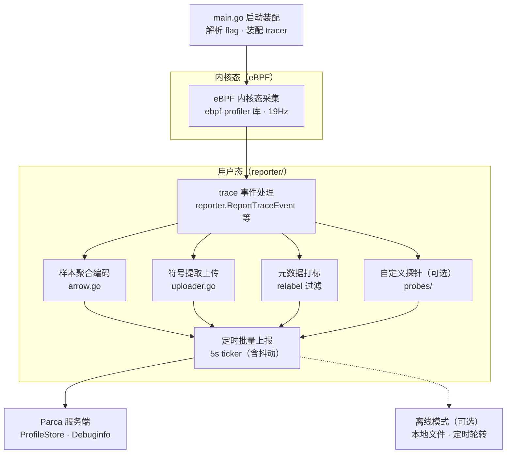

# Parca Agent 介绍

> 调研对象：`parca-agent-main`（导师推荐）
> 定位：作为 Mini-Drop 的架构参照系，重点关注它与 Mini-Drop "任务驱动式采集"完全不同的"常驻推送式采集"模式，尤其对应题目里的 Continuous Profiling 扩展项。

---

## 1. 一句话概括

Parca Agent 是 [Parca](https://github.com/parca-dev/parca) 项目的采集端，一个**常驻不间断的 eBPF 采样剖析器**：以 19 次/秒的频率持续采集所有进程的用户态+内核态调用栈，聚合成 pprof 语义的数据，每 5 秒批量通过 gRPC 推送给 Parca 服务端。

关键事实：

| 项 | 内容 |
|---|---|
| 许可 | 用户态代码 Apache 2；内核态 eBPF 代码 GPL 2（eBPF 项目标配的双许可） |
| 运行要求 | Linux 内核 5.3+ 且开启 BTF；必须 root 或 `CAP_SYS_ADMIN` |
| 语言支持 | C/C++/Go/Rust/.NET/Deno/Erlang/Java/Julia/Node.js/PHP 8+/Ruby/Python — **一个采集器覆盖全部语言** |
| Profile 类型 | On-CPU（主）；off-CPU、内存(OOMProf)、GPU(CUDA) 为可选路径 |

---

## 2. 最重要的一个认知：真正的 eBPF 内核在仓库外

`go.mod` 最后一行：

```
replace go.opentelemetry.io/ebpf-profiler => github.com/parca-dev/opentelemetry-ebpf-profiler
```

**eBPF 探针、栈回溯（DWARF/frame pointer/各语言解释器 unwinder）、perf_event 挂载、进程发现——全部在 `go.opentelemetry.io/ebpf-profiler` 这个上游库里**，parca-agent 只是引入它作为依赖。这个库是 Elastic 捐给 OpenTelemetry 的通用剖析器，现在是行业共建的公共基建。

本仓库自己的代码（约 1 万行）其实是**"上报层"**：把上游库吐出来的 trace 事件，翻译成 Parca 服务端要的格式并送过去。

对复刻类项目的启发：**工业界现在做 eBPF profiling 已经不再从零写 unwinder**，都在复用这类公共库；从零实现的价值更多在于理解链路，而不是重造轮子。

---

## 3. 数据流程图



---

## 4. 仓库结构与职责

| 目录 | 规模量级 | 职责 |
|---|---|---|
| `main.go` | 749 行 | 装配：解析 flag → 建 tracer → 挂载 → 启动 reporter |
| `reporter/` | ~5000 行 | **本仓库的心脏**：trace 事件 → Arrow 列存 → gRPC 推送；符号上传；标签元数据 |
| `reporter/metadata/` | ~1600 行 | 进程/容器/K8s 元数据采集，产出 `__meta_*` 标签 |
| `reporter/elfwriter/` | ~600 行 | ELF 裁剪：只保留符号化需要的 section 再上传 |
| `probes/` | ~700 行 | 自定义 uprobe（成对 entry/exit），产出 OTel span |
| `uploader/` | 723 行 | 离线模式的日志上传器 |
| `flags/`, `config/` | ~1000 行 | Kong 命令行 + YAML 配置 + relabel 配置 |
| `oom/`, `parcagpu/` | ~300 行 | OOM 剖析、CUDA GPU 剖析集成 |
| `deploy/` | — | jsonnet 生成的 K8s DaemonSet 部署清单 |

`reporter/parca_reporter.go`（2190 行）是全仓最大的文件，核心类型 `arrowReporter` 实现上游库的 `TraceReporter` 接口，入口方法 `ReportTraceEvent`（第 322 行）——每一条采样栈都从这里进入。

---

## 5. 功能模块与对应代码

### 5.1 启动装配 — `main.go`

`mainWithExitCode()`（main.go:118）：解析 Kong 风格命令行参数、建立 Prometheus/OTel 指标注册、按需连接 OTLP tracing、调用 `tracer.NewTracer()` 装配 eBPF tracer 并 `AttachTracer()` 挂载 perf event。

有个细节：进程会把自己 fork 成子进程运行（main.go:230-315），父进程只用环形缓冲区接子进程 stderr，一旦崩溃就通过 `ReportPanic` gRPC 把崩溃现场（含 stderr）送回服务端——这是它自己的故障上报机制。启用 OOMProf 时，父进程还会写 `/proc/self/oom_score_adj = -100`，尽量保证自己不被 OOM killer 先杀掉。

### 5.2 eBPF 内核态采集 — 外部依赖 `go.opentelemetry.io/ebpf-profiler`

以 **19Hz**（质数，避免和应用周期性行为如定时器/GC 产生拍频共振）的频率对每个 CPU 核心挂 perf_event，内核态用 eBPF 回溯用户态+内核态调用栈，支持 DWARF/frame pointer 混合展开及多语言解释器专用 unwinder。通过 `StartMapMonitors()`（main.go:588）把 eBPF map 数据搬到用户态 channel。

### 5.3 trace 事件处理 — `reporter/parca_reporter.go`

`ReportTraceEvent()`（parca_reporter.go:322）按 `meta.Origin` 分发到 6 种类型：CPU 采样、off-CPU、内存（oomprof）、CUDA 内核耗时、CUDA PC 采样。同文件的 `ReportExecutable()`（第 865 行）在追踪到未见过的可执行文件时触发，是符号上传和探针挂载两条支线的共同入口。

### 5.4 样本聚合编码 — `reporter/arrow.go`

把标签、栈哈希、时间戳写进 Apache Arrow 列式结构，用 `StringRunEndBuilder`/`BinaryDictionaryRunEndBuilder` 做游程编码+字典编码——连续样本里 `node`/`comm` 等标签值几乎不变，压缩后传输量接近零。

### 5.5 符号提取上传 — `reporter/parca_uploader.go` + `reporter/elfwriter/`

`ParcaSymbolUploader.Upload()`（parca_uploader.go:181）：先用 `inProgressTracker` 按 FileID（内容哈希）去重，避免同一二进制被并发重复上传；再用 `elfwriter.OnlyKeepDebug()`（extract.go:15）只保留 DWARF/符号表段、清零代码段；最后走签名 URL 上传。**符号化因此发生在服务端**，Agent 只负责"瘦身 + 去重 + 上传"——和 Mini-Drop"Agent 采完整 perf.data、Analyzer 端解析函数名"的分工思路一致，只是原始产物体积压得更小。

### 5.6 元数据打标与 relabel — `reporter/metadata/`

`process.go`、`containermetadata.go`、`cri_client.go`、`system.go` 四个 provider 分别产出进程/容器/CRI/系统层面的 `__meta_*` 标签（README 列了 40 多个，如 `__meta_process_cgroup`、`__meta_kubernetes_pod_name`）。标签随后经过用户在 `config.yaml` 里配置的 **Prometheus 风格 `relabel_configs`** 过滤，决定保留、改名还是整条样本丢弃（`skippedByRelabeling` 计数器，parca_reporter.go:762）。

```yaml
relabel_configs:
- source_labels: [__meta_process_executable_name]
  target_label: exec
  action: replace
```

### 5.7 自定义探针 — `probes/`（可选功能）

和采样式剖析完全不同的机制：用户在 YAML 里声明一对 entry/exit 符号名（`probes/config.go` 的 `ProbeSpec`），`probes.Start()`（service.go:62）在观测到匹配的可执行文件时动态挂 uprobe，测量这两个符号间的精确耗时，产出 OTel span 而非采样点。适合"这个函数具体耗时多少"这类采样频率覆盖不到的精确计时需求。

### 5.8 定时批量上报 — `reporter/parca_reporter.go` `Start()`

5 秒 ticker（parca_reporter.go:1440），用 `libpf.AddJitter` 加 20% 抖动避免大量 Agent 同时打点造成雷群效应；到点调 `reportDataToBackend()` 把当前缓冲的 Arrow record 通过 gRPC `ProfileStoreServiceClient` 推给服务端。

### 5.9 离线模式（可选分支）

配置 `--offline-mode-storage-path` 后，同一个 ticker 分支转而调用 `logDataForOfflineMode()`，把数据写本地文件并定期轮转压缩；之后可单独用 `uploader/log_uploader.go` 批量上传。适合完全无网络环境下先落盘、事后统一上传的场景。

### 5.10 其他可选能力

- **概率性剖析**（`--profiling-probabilistic-threshold`）：每个周期掷骰子决定这台机器这一轮采不采，用于大规模集群整体降低开销。
- **OOMProf**（`oom/`）：集成 `parca-dev/oomprof`，在进程被 OOM Kill 前捕获内存剖析快照。
- **GPU/CUDA 剖析**（`parcagpu/`）：`--instrument-cuda-launch` 开启后，插桩 `cudaLaunchKernel` 调用，产出内核耗时与 PC 采样两类 GPU profile。

---

## 6. 六个值得借鉴的设计细节

1. **19Hz 采样率**：低频满足 7×24 常驻的开销要求；选质数避免和应用自身周期性行为产生拍频共振，导致采样系统性偏向某些代码路径。对比 Drop 里 `perf -F 99`，99 也是同理。
2. **没有任务、没有状态机、没有队列**：启动即采集，采到就推。用"永远不会错过现场"换取"无法针对某个 PID 按需采一次"的能力。
3. **符号化放在服务端**：Agent 只传裸地址 + 一次性上传去除代码段的 ELF 调试信息，配合 FileID 去重，同一二进制在上万台机器上只需上传一次。
4. **Prometheus relabel 模型复用**：元数据先打成临时标签，再用和 Prometheus 完全一致的语法做保留/改名/丢弃，比"表里固定几个字段"灵活得多。
5. **Apache Arrow 列式传输 + 游程/字典编码**：适合"高频小数据持续上报"场景，和 Drop"低频大文件走对象存储"是两个方向的正确答案。
6. **自己 fork 自己捕获 panic**：父进程专职守护，子进程崩溃时把 stderr 通过 RPC 报告给服务端，并主动调低自己的 OOM 优先级以求"活下来汇报"。

---

## 7. 与 Mini-Drop 的核心差异

| 维度 | Mini-Drop（Drop 复刻） | Parca Agent |
|---|---|---|
| 触发方式 | 用户按需下发任务（Web → apiserver → drop_server → drop_agent） | 常驻自动采集，无需下发 |
| 状态机 | `PENDING→RUNNING→UPLOADING→DONE/FAILED`，任务级 | 无任务概念，无状态机 |
| 采集频率 | 短时高频（perf -F 99，采集数秒到数十秒） | 长期低频（19Hz，持续运行） |
| 符号化位置 | Analyzer 端（`perf script` 等） | Parca 服务端 |
| 产物传递 | 大文件走对象存储（MinIO/COS） | 小批量列式数据走 gRPC 直传 |
| Continuous Profiling 实现 | 定时任务切割：`schedule_task → cron → 普通 hotmethod_task` | 原生常驻，无需切割 |
| 语言�covered 方式 | 每种语言配专用采集器（perf/async-profiler/pprof） | 一个采集器覆盖多语言 |

**对 Mini-Drop 设计文档/答辩的启发**：现有的 Continuous Profiling 是"定时切割"模式（复用了任务链路，代价是窗口间存在采集空隙）；parca-agent 代表的是"真正常驻"模式。在设计文档的"关键决策与取舍"或"如果再有 7 天我会做什么"部分，可以明确点出这个对比——说明为什么选择了任务驱动模型（复用同一套状态机和链路，工程量可控），以及如果要向 parca-agent 的模式演进，需要补齐哪些能力（服务端符号化、build-id 去重、relabel 式元数据、列式增量上报）。

---

## 8. 参考

- 官方文档：https://www.parca.dev/docs/parca-agent-design
- 安全说明：https://www.parca.dev/docs/parca-agent-security
- 语言支持列表：https://www.parca.dev/docs/parca-agent-language-support
- 上游 eBPF 剖析库（OpenTelemetry）：`go.opentelemetry.io/ebpf-profiler`（fork：`github.com/parca-dev/opentelemetry-ebpf-profiler`）
